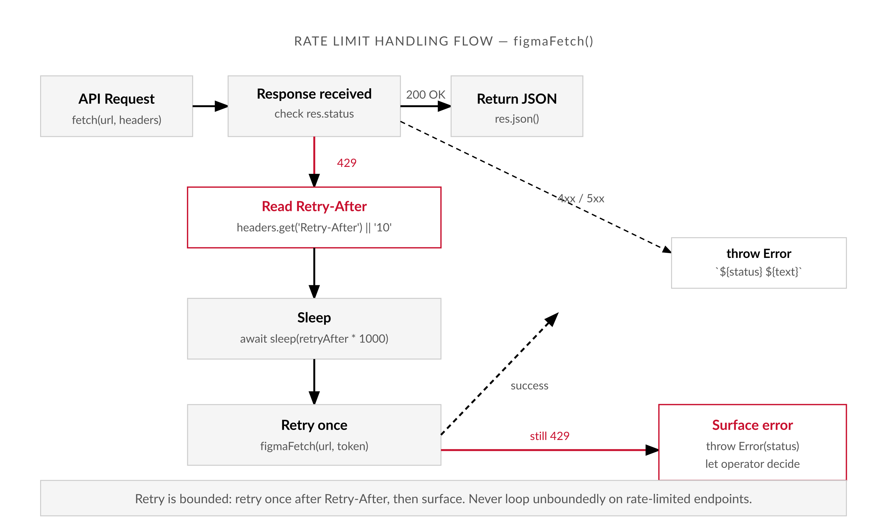

# Chapter 2 — What the API Actually Exposes

*The API does not export your design. It exposes a document graph. Understanding the difference is the prerequisite for everything else.*

---

It is 11 AM on a Tuesday. You have a Figma file key, a Personal Access Token, and ten lines of Node.js that should — by every reasonable expectation — print a JSON response. You run the script.

```
HTTP 403 Forbidden
{"status":403,"err":"Invalid token"}
```

The token looks right. You rotate it. Same result. You try curl. Same result. Thirty minutes disappear into the authentication docs before you notice the actual problem: the token belongs to your personal account. The Figma file belongs to the client's organization. Your account has never been added to that workspace. The API did not reject your token because it was invalid — it rejected it because the token was yours, and you were not authorized.

Or the token is fine and the file access is fine, and the response is three thousand lines of nested JSON with no variables in it anywhere. You search the docs. You find it: the Variables API requires an Enterprise plan. The client is on Professional. The response was not broken. It was correct. The endpoint simply does not exist for you.

Both failures share a cause: not understanding what the API actually exposes before you try to use it. This chapter fixes that.

---

## Figma Is Not a Single API

The first thing to understand is that there is no single "Figma API." There are five overlapping programmatic surfaces, each with different permissions, plan requirements, rate limits, and read/write behavior. Most pipeline failures at the start of a project come from using the wrong surface — or from not knowing which surface gates the thing you need.

| Surface | What it exposes | Read/write | Auth method | Plan gate | Primary use case |
|---|---|---|---|---|---|
| REST API | Full document node tree, component/style metadata, image exports, variables (Enterprise) | Read-only | `X-Figma-Token` header (PAT or OAuth 2.0) | Variables endpoint requires Enterprise | CLI pipelines, batch extraction, token export |
| Plugin API | Live canvas — full document access including variable write | Read and write | Runs in-app; no external auth required | No plan gate at Plugin level | Canvas automation, in-app token export, writing to nodes |
| Variables API | Variable collections, individual variables with mode-scoped values, alias chains | Read (REST); write (REST, Enterprise) | `X-Figma-Token` header | Enterprise plan required | Design token extraction via REST |
| Webhooks | Event subscriptions: `LIBRARY_PUBLISH`, `FILE_UPDATE`, and others | N/A — inbound event push | HMAC passcode on received payload | Some events may be plan-gated | Triggering CI pipeline on library publish |
| MCP Server | File content, component descriptions, variant properties, Code Connect annotations | Read | Figma desktop app integration | Beta / requires MCP-capable agent | AI coding agent context (Claude Code, Cursor, Copilot) |

**The REST API** is the conventional HTTP interface at `https://api.figma.com`. [verify — current as of writing] It is what most people mean when they say "the Figma API." It takes a token in a header, returns JSON, and is read-only. It exposes the full document node tree, component and style metadata, image exports, and — on Enterprise plans — the variable graph. It cannot write to a file. It cannot run inside Figma. It is a query interface, not an automation interface.

**The Plugin API** is a JavaScript sandbox that runs inside the Figma application. The `figma` global object gives a plugin direct access to the document without making network requests. This is the only surface that can write to the canvas — rename nodes, update properties, create or delete objects. It runs in a QuickJS WebAssembly sandbox with a postMessage bridge between plugin code and any plugin UI. It cannot run in CI. It cannot run on a schedule without someone opening Figma. Those constraints matter enormously for pipeline design, and they are why REST and Plugin are complements rather than alternatives.

**The Variables API** is technically part of REST — same base URL, same auth header — but it deserves its own category because of what gates it. The endpoint `GET /v1/files/:key/variables/local` exposes Figma's design tokens infrastructure: variable collections, individual variables with their types and mode-scoped values, alias chains between variables. [verify — current as of writing] The plan gate is the thing to know. On Professional or Starter, this endpoint returns a 403 or an empty collection. On Enterprise, it returns data. This is the most common plan-gate surprise in practice, and it is binary — there is no partial access.

**Webhooks** are an event subscription system. You register a URL; Figma sends HTTP POST requests to that URL when things happen in a file or team. The events that matter most for pipeline work are `LIBRARY_PUBLISH` — a component library was published — and `FILE_UPDATE` — a file was modified. The canonical pattern is: designer publishes the component library → Figma fires `LIBRARY_PUBLISH` → your server receives the webhook → your server enqueues a pipeline run → the pipeline reads the updated file and produces updated artifacts. Webhooks are not real-time sync. They have delivery latency and are not guaranteed-once. Build your handlers to be idempotent.

**The MCP Server** is a Model Context Protocol server operated by Figma that gives AI coding agents — Claude Code, Cursor, Copilot — structured access to Figma data in their context window. [verify — MCP server active as of writing; beta status may have changed] It exposes file content, component descriptions, variant properties, Code Connect annotations, and Dev Mode inspection data. It is designed for interactive agent sessions, not for CLI pipelines or batch extraction. Do not use it as a REST API substitute. Chapter 13 covers it in depth.

The decision rule is simpler than the surface list suggests. If you are building a CLI that reads design data and runs outside Figma: REST API. If you need to write to the canvas, or need variable access on a non-Enterprise plan: Plugin API. If you want a pipeline triggered by Figma events: webhooks. If you are feeding design context to an AI coding agent: MCP server.

| Task | Use this surface |
|---|---|
| Read file graph, components, styles from CLI or CI | REST API |
| Read variable collections and values (Enterprise plan) | REST API — Variables endpoint |
| Read variable collections and values (non-Enterprise) | Plugin API (in-app) or Tokens Studio plugin export |
| Write to the canvas — rename nodes, update fills, create objects | Plugin API |
| Trigger a pipeline when a library is published | Webhooks (`LIBRARY_PUBLISH` event) |
| Export image assets (PNG, SVG, PDF) in batch | REST API — Image export endpoint |
| Provide design context to an AI coding agent (Claude Code, Cursor) | MCP Server |
| Develop and test extraction logic without hammering the API | Local fixture from a prior REST fetch |

---

## Authentication and What It Actually Controls

Every REST call requires an `X-Figma-Token` header. [verify — header name current as of writing] The value can be a Personal Access Token or an OAuth 2.0 token.

Personal Access Tokens are the simpler path. Generated in Figma account settings under Security, they carry exactly the permissions of the user who generated them. The token can access files the user can access. It cannot access files the user cannot. A token for a personal account does not reach into an organization's workspace unless that account has been explicitly added. This is not a bug — it is the access control model working as designed. The failure case at the start of this chapter was not an API failure. It was a permission failure that surfaced as a 403.

For CLI tools, PATs should be treated as secrets. Store them in environment variables. Never hardcode them. Never commit them to a repository.

```bash
# In your .env file — never committed
export FIGMA_TOKEN="figd_..."
```

Every CLI tool in this book reads `FIGMA_TOKEN` from the environment. That name is the stable convention. You will set it once and every tool picks it up.

The limitation worth knowing: PATs are per-user. A CI pipeline running with a PAT runs as that user. If the user loses access to the file — leaves the organization, has permissions revised — the pipeline breaks. For production pipelines, consider a dedicated Figma "bot" account. OAuth 2.0 is the alternative when you need tools that act on behalf of multiple users, but for single-team pipelines a PAT is simpler and sufficient.

Plan access is a second layer of authentication that operates independently of token validity. A valid token for a user on a Professional plan will be rejected by the Variables API endpoint regardless of token correctness. The 403 does not mean the token is wrong. It means the plan does not include access to that endpoint. These look identical in the response. `figma-ping.js`, which this chapter introduces shortly, distinguishes them.

---

## The Rate Limit Architecture

Rate limits are the most common reason a working script stops working at scale.

The documentation states that limits are applied per token, vary by endpoint, and vary by plan tier. [verify — all figures below against current docs before production use] A `429 Too Many Requests` response includes a `Retry-After` header indicating how many seconds to wait before retrying.


*Figure 2.1 — Rate limit response flow: read Retry-After, sleep, retry once, surface.*

The plan-tier trap is the one that bites unexpectedly. On the Starter (free) tier, rate limits are significantly lower than on Professional or Enterprise. [verify — current Starter limits] A script that works cleanly against a small test file may hammer into rate limits against a large production file on a Starter plan. The correct handling pattern is not complex:

```javascript
async function figmaFetch(url, token) {
  const res = await fetch(url, {
    headers: { 'X-Figma-Token': token }
  });

  if (res.status === 429) {
    const retryAfter = parseInt(res.headers.get('Retry-After') || '10', 10);
    console.warn(`Rate limited. Retrying after ${retryAfter}s`);
    await sleep(retryAfter * 1000);
    return figmaFetch(url, token); // retry once
  }

  if (!res.ok) {
    throw new Error(`Figma API error: ${res.status} ${await res.text()}`);
  }

  return res.json();
}
```

Every API call in this book's CLI tools uses a variant of this pattern. The important detail is that the retry is bounded — retry once, not infinitely. Unbounded retry loops on rate-limited endpoints can worsen the situation. If a single retry after the `Retry-After` window still returns a 429, surface the error and let the operator decide.

---

## The Enterprise Gate

The Enterprise gate deserves its own treatment because it shapes the entire architecture of non-Enterprise pipeline design. This is not a complaint about pricing. It is a design constraint, and design constraints require design responses.

What requires Enterprise, to the best of current knowledge [verify — all items against current Figma pricing and docs]:

- REST API read access to local variable collections
- REST API write access to variables
- Certain webhook event types may be plan-gated

What is available on Professional and below:

- Full file graph read access
- Component and style metadata
- Image and asset export
- Basic webhook events
- Plugin API (runs in-app, no plan gate at the Plugin level)

If a pipeline is built against `GET /v1/files/:key/variables/local` and the team is on Professional, the pipeline will silently return no variables — or a 403 — without any indication that the missing data is by design rather than a bug. You need to know this before you build, not after you have shipped a pipeline that produces empty token files.

The non-Enterprise paths are real and usable. **Tokens Studio** is a plugin that exports variables to JSON from inside Figma, where the Plugin API has access to variable data regardless of plan. The export can be committed to a repository and consumed by downstream pipeline steps without any REST API access to variables at all. Chapter 8 covers this path in full. **The Plugin API** can also read local variables and post them to an external endpoint, but it requires someone to manually trigger the plugin — not fully automated, but sometimes sufficient. **Style-based extraction** is available if the design system uses Figma styles rather than variables for token management; color styles, text styles, and effect styles are accessible via REST on all plans.

Neither path is a workaround. They are design decisions appropriate to the plan tier. The book covers both with equal depth.

---

## The CLI Environment Contract

Every CLI tool in this book reads configuration from the environment. The contract is fixed and consistent:

```bash
# Required
FIGMA_TOKEN=figd_...              # Personal Access Token
FIGMA_FILE_KEY=abc123XYZ...       # File key from the Figma URL

# Optional, used by team and library operations
FIGMA_TEAM_ID=12345678
FIGMA_PROJECT_ID=87654321

# Optional, used by webhook handlers
FIGMA_WEBHOOK_PASSCODE=your-passcode-here
```

The file key comes from the Figma file URL. For a URL like `https://www.figma.com/file/abc123XYZdef456/My-Design-File`, the key is `abc123XYZdef456`. [verify — URL structure current as of writing; Figma has been migrating to a new URL format]

Local development uses a `.env` file at the project root. The file must never be committed. Add it to `.gitignore` before anything else:

```
# .gitignore
.env
.env.local
.env.*.local
```

In CI, inject `FIGMA_TOKEN` and `FIGMA_FILE_KEY` as environment secrets through your CI system's secret management. A `403` or `429` in CI almost always means the token or file key is misconfigured — not a code error.

---

## `figma-ping.js`

`figma-ping.js` is a session health check. The premise is simple: before you write any extraction code, before you run any pipeline, you want to know definitively whether your authentication is valid, your file is accessible, your plan permits the endpoints you need, and your rate-limit headroom is acceptable. Discovering a stale token twenty minutes into a debugging session is expensive. Discovering it in ten seconds before you start is not.

What the ping checks, in order:

1. `FIGMA_TOKEN` and `FIGMA_FILE_KEY` are present in the environment
2. Auth validity — `GET /v1/me` succeeds [verify — endpoint current as of writing]
3. File accessibility — a shallow `GET /v1/files/:key?depth=1` without pulling the full tree [verify — `?depth=1` supported]
4. Variables API access — `GET /v1/files/:key/variables/local` and whether the response is a 403 (plan gate) or data [verify — endpoint current]
5. Rate limit headroom from the response headers of the file ping [verify — which headers Figma returns for rate limit state]
6. Clear next-action output for every failure


*Figure 2.2 — figma-ping.js output for a healthy non-Enterprise session. Auth PASS, file PASS, variables WARN (expected).*

```javascript
#!/usr/bin/env node
// figma-ping.js — Figma session health check
// Illustrative. Review and adapt before production use.

import 'dotenv/config';

const FIGMA_TOKEN = process.env.FIGMA_TOKEN;
const FIGMA_FILE_KEY = process.env.FIGMA_FILE_KEY;
const BASE_URL = 'https://api.figma.com'; // [verify — current base URL]

const PASS = '  PASS';
const FAIL = '  FAIL';
const WARN = '  WARN';

async function ping(label, url, { expectStatus = 200, warnOn = [] } = {}) {
  console.log(`\nChecking: ${label}`);
  try {
    const res = await fetch(url, {
      headers: { 'X-Figma-Token': FIGMA_TOKEN }, // [verify — header name]
    });

    if (res.status === expectStatus) {
      console.log(`${PASS} ${label} (${res.status})`);
      return { ok: true, status: res.status, res };
    }

    if (warnOn.includes(res.status)) {
      const body = await res.json().catch(() => ({}));
      console.warn(`${WARN} ${label}: HTTP ${res.status}`, body.err || '');
      return { ok: false, warn: true, status: res.status };
    }

    const body = await res.json().catch(() => ({}));
    console.error(`${FAIL} ${label}: HTTP ${res.status}`, body.err || '');
    return { ok: false, status: res.status };
  } catch (err) {
    console.error(`${FAIL} ${label}: ${err.message}`);
    return { ok: false, error: err.message };
  }
}

async function main() {
  console.log('=== figma-ping: session health check ===');

  // 1. Environment
  console.log('\nChecking: environment');
  let envOk = true;
  if (!FIGMA_TOKEN) {
    console.error(`${FAIL} FIGMA_TOKEN not set`);
    envOk = false;
  } else {
    console.log(`${PASS} FIGMA_TOKEN is set (${FIGMA_TOKEN.slice(0, 6)}...)`);
  }
  if (!FIGMA_FILE_KEY) {
    console.error(`${FAIL} FIGMA_FILE_KEY not set`);
    envOk = false;
  } else {
    console.log(`${PASS} FIGMA_FILE_KEY is set (${FIGMA_FILE_KEY})`);
  }
  if (!envOk) {
    console.error('\nSet missing environment variables and retry.');
    process.exit(1);
  }

  // 2. Auth — GET /v1/me [verify — endpoint current]
  const meResult = await ping(
    'auth: GET /v1/me',
    `${BASE_URL}/v1/me`
  );
  if (!meResult.ok) {
    console.error('\nAuth failed. Check your FIGMA_TOKEN and retry.');
    process.exit(1);
  }

  // 3. File access — shallow fetch [verify — ?depth=1 supported]
  const fileResult = await ping(
    `file access: GET /v1/files/${FIGMA_FILE_KEY}?depth=1`,
    `${BASE_URL}/v1/files/${FIGMA_FILE_KEY}?depth=1`
  );
  if (!fileResult.ok) {
    console.error('\nFile access failed. Check FIGMA_FILE_KEY and account access.');
    process.exit(1);
  }

  // 4. Variables API — Enterprise gate check [verify — endpoint and gate current]
  const varsResult = await ping(
    'variables API: GET /v1/files/:key/variables/local',
    `${BASE_URL}/v1/files/${FIGMA_FILE_KEY}/variables/local`,
    { warnOn: [403] }
  );
  if (varsResult.warn || !varsResult.ok) {
    console.warn(`\n  Variables API not available (HTTP ${varsResult.status}).`);
    console.warn('  This usually means your plan is not Enterprise.');
    console.warn('  Token extraction via REST Variables API will not work.');
    console.warn('  Use the Tokens Studio plugin path instead (Chapter 8).');
  }

  // 5. Rate limit headers [verify — which headers Figma exposes]
  if (fileResult.res) {
    const remaining = fileResult.res.headers.get('X-RateLimit-Remaining');
    const limit = fileResult.res.headers.get('X-RateLimit-Limit');
    if (remaining !== null) {
      console.log(`\n  Rate limit: ${remaining} / ${limit} requests remaining`);
      if (parseInt(remaining, 10) < 10) {
        console.warn(`${WARN} Rate limit headroom is low. Wait before running pipeline.`);
      }
    } else {
      console.log('\n  Rate limit headers not present in response. [verify — expected header names]');
    }
  }

  console.log('\n=== figma-ping complete ===');
  console.log('Your session is healthy. Proceed with confidence.');
}

main().catch((err) => {
  console.error('Unexpected error:', err);
  process.exit(1);
});
```

Running it:

```bash
npm install dotenv
echo "FIGMA_TOKEN=figd_your_token_here" >> .env
echo "FIGMA_FILE_KEY=your_file_key_here" >> .env
node figma-ping.js
```

Expected output for a healthy non-Enterprise session:

```
=== figma-ping: session health check ===

Checking: environment
  PASS FIGMA_TOKEN is set (figd_a...)
  PASS FIGMA_FILE_KEY is set (abc123XYZdef456)

Checking: auth: GET /v1/me
  PASS auth: GET /v1/me (200)

Checking: file access: GET /v1/files/abc123XYZdef456?depth=1
  PASS file access: GET /v1/files/abc123XYZdef456?depth=1 (200)

Checking: variables API: GET /v1/files/:key/variables/local
  WARN variables API: GET /v1/files/:key/variables/local: HTTP 403

  Variables API not available (HTTP 403).
  This usually means your plan is not Enterprise.
  Token extraction via REST Variables API will not work.
  Use the Tokens Studio plugin path instead (Chapter 8).

  Rate limit headers not present in response. [verify — expected header names]

=== figma-ping complete ===
Your session is healthy. Proceed with confidence.
```

The variables warning is informational, not fatal. A healthy non-Enterprise session looks exactly like this: auth passes, file access passes, variables endpoint declines with a clear message about which extraction path to use instead.

---

## What the Ping Cannot Tell You

The ping is a health check at a moment in time. It has failure modes worth knowing.

A shallow file fetch with `?depth=1` succeeds even on files that are too large to fully fetch without timing out. The ping does not simulate a real pipeline load — it checks access, not capacity. A very large file may still fail on a full `GET /v1/files/:key` even after a passing ping.

Rate limit state changes. If another process is hitting the same token concurrently, the pipeline may hit rate limits immediately after a clean ping. Use a dedicated token for each pipeline, not a shared one.

The variables endpoint can return a 200 with an empty payload rather than a 403. This happens when the file has no published variables, or in some permission configurations. Empty variables and no access look different in the response body but feel identical when your pipeline produces no output. `figma-ping.js` should ideally distinguish between "403 — access denied" and "200 — empty collection." [verify — current API behavior for empty variable sets]

Token expiry during a long pipeline run is real. PATs do not expire on a short schedule, but if a PAT is rotated or the user account loses file access mid-run, the pipeline fails with a mid-run 403. The ping catches the state before the run starts. It cannot catch changes during the run.

---

## The Document Graph Model

When Figma launched their API in 2019 [verify — launch year and initial capabilities], it exposed the file graph for reading: document structure, component metadata, styles. This was a departure from the design tool APIs that preceded it, which were primarily export-oriented — give me a PNG of this artboard.

The document graph model was borrowed from an older tradition: the DOM. Web browsers had long represented HTML documents as traversable trees where any node could be inspected programmatically. Figma applied the same model to design files. The implication — that a design file is a data structure, not just a picture — was not obvious to most practitioners at the time.

The Variables API and the MCP server, added in the 2023–2024 period, extended the query model to include design tokens and AI agent context. The direction of travel is consistent: Figma is becoming more queryable. The specific endpoints and rate limits will change — flag everything with [verify] — but "Figma as a queryable document graph" is stable enough to build on.

The failure at the start of this chapter — the 403, the missing variables, the thirty minutes of confused debugging — was not a failure of the API. It was a failure to understand what the API is. It is not an exporter. It is not a mirror of the design tool's interface. It is a document graph with access controls, plan gates, and a surface map that rewards the engineer who studies it before writing a single line of production code.

---

## What Comes Next

Chapter 3 goes inside the file response: the document graph in detail, what the node types mean, how to find variables, components, and styles, and how to build a local fixture so you can develop and test extraction code without hammering the API. The first real reading tool, `figma-read.mjs`, is built there.

You have a healthy session. Let's read a file.

---

## Chapter 2 Exercises: What the API Actually Exposes
**Project:** figma-tools — Your Design System Extraction Toolkit
**This chapter adds:** `figma-ping.js` — a session health check script that verifies auth, file access, Variables API plan-gate status, and rate-limit headroom before any extraction code runs — plus `.env` setup and the no-secrets convention.

---

### Exercise 1 — When to Use AI

Three tasks in this chapter's setup work are well-suited to AI assistance.

**Generating the .env setup for a new environment.** Once you understand the environment contract — which variables are required, which are optional, what they represent — AI can produce the exact `.env` template and the corresponding `.gitignore` entries for a given project structure. You already know what the variables mean; the model saves you the boilerplate of writing it out.
*Why AI works here:* boilerplate — producing correctly formatted configuration file templates for a known variable set is a pattern-completion task with no judgment required.

**Explaining a specific HTTP error response.** You paste a `figma-ping.js` failure output — a 403, a 401, a 429 — and ask the model to explain what the status code means in the context of the Figma API and what the most likely causes are. The model can enumerate the possibilities efficiently.
*Why AI works here:* pattern — HTTP status codes in the context of REST APIs have well-established meanings, and the Figma API's specific behavior for each is documented. A model trained on API documentation and developer discussions can produce accurate troubleshooting guides for common cases.

**Drafting the rate-limit retry handler for a different language.** The chapter provides a JavaScript retry handler. If your team also has a Python or Ruby script that calls the Figma API, AI can translate the same logic — bounded retry, read `Retry-After`, surface the error after one retry — to another language. You review it against the original.
*Why AI works here:* reformatting — translating a specific algorithmic pattern from one language to another with identical semantics is a transformation task where the correctness criterion is clear.

**The tell:** you can run `figma-ping.js` against a real session and compare its output to what the model described. The ping produces ground truth; any discrepancy between the model's explanation and the actual output is immediately visible.

---

### Exercise 2 — When NOT to Use AI

Three things about this chapter's work require your verification, not a model's assertion.

**The current rate limits and plan gates for your Figma subscription.** The chapter includes [verify] markers on every rate limit figure and plan-gate claim. A model's training data contains Figma API documentation that was current at some point. If that documentation has changed — and Figma has changed these limits and plan requirements over time — the model's answer is outdated without knowing it is outdated. Rate limit figures and plan-gate information must be verified against current Figma documentation before you build a production pipeline around them.
*Why AI fails here:* hallucination — a model will state a specific rate limit figure with the same confidence whether it is quoting current documentation or documentation from two years ago. There is no uncertainty signal.

**Whether a specific endpoint exists and returns the response shape you expect.** The model may describe an endpoint, its parameters, and its response structure in detail. That description may be accurate for the API version in the model's training data. The endpoint may have been deprecated, moved, or its response shape may have changed. `figma-ping.js` tests actual endpoints against your actual session. The model describes what it remembers.
*Why AI fails here:* missing ground truth — the model has no access to the current state of Figma's API. Only running the ping does.

**Diagnosing why your specific token is being rejected.** A 403 on a real session may mean the token is invalid, the user account lacks access, the plan does not permit the endpoint, or the file key is wrong. The model can list these possibilities. It cannot tell you which one applies to your session because it cannot make a network request. Only running the ping — and reading its specific output — tells you which case you are in.
*Why AI fails here:* missing ground truth — the model does not have access to your Figma account, your token's validity, or your organization's plan tier.

**The tell:** the output sounds like troubleshooting advice from someone who knows the Figma API well. It may be correct. It may also be correct for an older API version or an incorrect plan assumption. The ping is the arbiter, not the model.

**Series connection:** Chapter 2 operates at Tier 4 — evaluating against criteria where the criteria are technically specific and verifiable. The key failure mode is AI asserting outdated or invented rate limits and endpoint details that have not been confirmed by actually running `figma-ping.js`.

---

### Exercise 3 — LLM Exercise

**What you're building:** A structured troubleshooting guide for `figma-ping.js` — a reference you can paste into a `CONTRIBUTING.md` or share with a teammate who hits a session problem before their first pipeline run.

**Tool:** Claude (claude.ai or API). The task is drafting structured documentation from a codebase excerpt and chapter content — a good fit for a single context window with both the code and the chapter pasted in.

**The Prompt:**

```
I have built a Figma API session health check script called figma-ping.js. It runs five checks in sequence: environment variables, auth (GET /v1/me), file access (GET /v1/files/:key?depth=1), Variables API plan-gate (GET /v1/files/:key/variables/local), and rate limit headroom from response headers.

Here is the script's terminal output structure:
- Each check prints "Checking: [label]"
- Results are prefixed: PASS, FAIL, or WARN
- FAIL on auth or file access causes process.exit(1)
- WARN on variables (403) is informational — the session is healthy; the plan does not include Variables API

Here are the checks and their possible failure outputs:

1. Environment: "FAIL FIGMA_TOKEN not set" or "FAIL FIGMA_FILE_KEY not set"
2. Auth: "FAIL auth: GET /v1/me: HTTP 401" or "FAIL auth: GET /v1/me: HTTP 403"
3. File access: "FAIL file access: HTTP 403" or "FAIL file access: HTTP 404"
4. Variables API: "WARN variables API: HTTP 403" (expected on non-Enterprise) or "PASS" (Enterprise)
5. Rate limit: "WARN Rate limit headroom is low" or no rate limit headers present

Please produce a structured troubleshooting table with these columns:
- Output seen
- Most likely cause
- Fix

Cover: FIGMA_TOKEN not set, FIGMA_FILE_KEY not set, auth 401, auth 403, file access 403, file access 404, variables WARN (non-Enterprise), rate limit low.

Keep each "Fix" entry to one concrete action. Do not include rate limit figures — I will verify those against current Figma documentation separately.

Format as a markdown table.
```

**What this produces:** A troubleshooting reference table you can add to the project's `README.md` or `CONTRIBUTING.md`. The table maps specific ping outputs to specific causes and fixes — exactly the information a new team member needs when they run the ping for the first time and see an unexpected result.

**How to adapt this prompt:**
- *For your own project:* if your ping produces different output labels or additional checks, paste the actual output format instead of the described structure. The model will adapt the table to your real output.
- *For ChatGPT or Gemini:* the prompt works as written. Compare whether different models produce different "Most likely cause" entries for the same output — divergence is a signal to verify against the actual API documentation.
- *For a Claude Project:* set a system prompt that includes the `figma-ping.js` source code so the model always has the actual implementation when answering follow-up troubleshooting questions.

**Connection to previous chapters:** The charter from Chapter 1 named which Figma file you are targeting. This exercise documents the health check for that file's session. The troubleshooting table belongs in the README you created in Chapter 1's CLI exercise.

**Preview of next chapter:** Chapter 3 introduces `figma-read.mjs`, which calls `GET /v1/files/:key` without the `?depth=1` limit. Any rate-limit or timeout failures during that full fetch will be easier to diagnose with this troubleshooting table in hand.

---

### Exercise 4 — CLI Exercise

**What you're building:** `figma-ping.js` — the session health check — added to the figma-tools repository, wired to `.env`, and confirmed passing against a real Figma session.

**Tool:** Claude Code

**Skill level:** Beginner-intermediate — you are creating a file in an existing repo and running it. The complexity is in the `.env` setup and reading the output correctly.

**Setup:**
- [ ] The figma-tools repo from Chapter 1's CLI exercise exists with `scripts/`, `.gitignore` (with `.env` excluded), and `CLAUDE.md`
- [ ] You have a Figma Personal Access Token (from Figma → Account Settings → Security → Personal access tokens)
- [ ] You have a Figma file key (from any Figma file URL: `figma.com/file/[THIS-PART]/...`)
- [ ] Node 18 or later is installed

**The Task:**

```
In the figma-tools project, do the following:

1. Create a `.env` file at the project root (if one does not already exist) with these entries:
   FIGMA_TOKEN=figd_your_token_here
   FIGMA_FILE_KEY=your_file_key_here
   Leave the placeholder values as-is — I will fill them in manually.

2. Create `scripts/figma-ping.js` using the figma-ping.js implementation from Chapter 2 of the textbook. The script should:
   - Use `import 'dotenv/config'` to load the .env file
   - Read FIGMA_TOKEN and FIGMA_FILE_KEY from process.env
   - Run five checks in sequence: environment, auth (GET /v1/me), file access (?depth=1), Variables API plan-gate, rate limit headers
   - Print PASS / FAIL / WARN prefixed output for each check
   - Exit with code 1 on auth or file access failure
   - Never hardcode any token or file key value — all values must come from process.env

3. Install the dotenv package:
   Run: npm init -y (if no package.json exists) then npm install dotenv

4. Add a "ping" script to package.json:
   "scripts": { "ping": "node scripts/figma-ping.js" }

5. Add to README.md under the CLI tools table:
   | npm run ping | Session health check — verifies auth, file access, plan tier | Chapter 2 |

Do NOT modify .gitignore (it already excludes .env). Do NOT commit the .env file. Do NOT hardcode the token or file key anywhere in the script.

Stop after completing these steps. I will fill in the .env values and run the ping myself.
```

**Expected output:** A `scripts/figma-ping.js` file, a `.env` with placeholder values, a `package.json` with dotenv installed and a ping script, and a README update. When you fill in the `.env` values and run `npm run ping`, you should see five check results with the Variables API showing WARN (if on a non-Enterprise plan) or PASS (if Enterprise).

**What to inspect:**
- Confirm `scripts/figma-ping.js` has no hardcoded strings for token or file key
- Confirm `.env` is listed in `.gitignore` before filling in real values
- Read the ping output: PASS on auth and file access means the session is healthy; WARN on variables is expected and informational

**If it goes wrong:**
- *"FAIL FIGMA_TOKEN not set":* the `.env` file is not being loaded. Check that `import 'dotenv/config'` is at the top of the script and `dotenv` is installed.
- *"FAIL auth: HTTP 403" on /v1/me:* the token is invalid or expired. Generate a new Personal Access Token in Figma account settings.
- *"FAIL file access: HTTP 403":* your account does not have access to the file. Confirm the file is shared with your account.

**CLAUDE.md / AGENTS.md note:** The standing rule added to `CLAUDE.md` in Chapter 1 — "Never hardcode credentials or tokens in any script file. All secrets must be read from environment variables." — applies directly to this task. After the task completes, open `scripts/figma-ping.js` and confirm `FIGMA_TOKEN` is read from `process.env`, not hardcoded. If it is hardcoded, the CLAUDE.md rule was not followed — correct it before moving on. This rule applies to every subsequent chapter.

---

### Exercise 5 — AI Validation Exercise

**What you're validating:** The `figma-ping.js` output from Exercise 4 — specifically, whether the ping's interpretation of API responses is correct for your session state.

**Validation type:** Output correctness — checking whether the ping's PASS/WARN/FAIL classifications match what the API actually returned and whether the diagnostic messages are accurate.

**Risk level:** High — if `figma-ping.js` incorrectly classifies a failure as a pass, or misdiagnoses the cause of a failure, you will build extraction pipelines on a session that is not healthy. A false-positive health check is more dangerous than a false-negative.

**Setup:** Run `npm run ping` and copy the full terminal output. You will paste this into the validation prompt.

**The Validation Task:**

```
I ran a Figma session health check script (figma-ping.js) and got this output:

[PASTE YOUR FULL PING OUTPUT HERE]

Please validate this output against these criteria. Respond with PASS, FAIL, or FLAG for each:

CORRECTNESS
[ ] The PASS / WARN / FAIL classification for each check is consistent with what the HTTP status code means. For example, a 403 on the Variables API endpoint should be WARN (plan gate, not an error), not FAIL.
[ ] If the output shows "your session is healthy" but any check returned FAIL, flag it — the summary is inconsistent with the detail.

COMPLETENESS
[ ] All five checks ran and produced output: environment, auth, file access, variables API, rate limit headers.
[ ] The variables API check output distinguishes between "403 — plan gate (expected)" and "403 — access denied (problem)." If the output treats both identically, flag it.

SCOPE
[ ] The ping output does not claim to have verified anything it did not check — for example, it should not claim to have validated the full file response if it only ran a depth=1 fetch.

CHAPTER-SPECIFIC CRITERIA
[ ] The rate limit output (if present) reports actual header values from the response, not hardcoded estimates. If the script printed specific remaining/limit numbers, those should come from response headers, not from the script's own constants.
[ ] The Variables API WARN message (if present) correctly directs you to an alternative path (Tokens Studio or Plugin API) rather than treating the situation as a dead end.

FAILURE MODE CHECK
[ ] "Fluent but wrong": Does the output sound authoritative but misclassify a status code? For example, treating a 404 on file access as a rate limit issue, or treating a 429 as an auth failure.
[ ] "Outdated or invented endpoint behavior": Does the script's output assert specific rate limit figures (e.g., "you have 100 requests remaining per minute") without getting those numbers from the actual response headers? If so, those figures may be invented — the script should only report what the API actually returned.
[ ] "Schema-valid but wrong interpretation": Does the ping report a clean session but the Variables check returned a 200 with an empty body rather than a 403? An empty-collection response and a plan-gate 403 look different in the raw response but produce identical results in your pipeline. Flag if the ping does not distinguish these cases.
```

**What to do with your findings:** Any FAIL or FLAG on the correctness checks means `figma-ping.js` needs adjustment before you rely on it. The most critical flag is a false-positive healthy signal when an underlying check actually failed. The most common flag is the rate limit figures issue — if the script is printing numbers it got from documentation rather than from the response headers, fix that before moving on.

**AI Use Disclosure prompt:** Add these two sentences to any internal documentation or PR where you share the ping script: "The figma-ping.js script and its validation were developed with AI assistance. The session output has been manually verified against a live Figma session using the credentials for this project."

**Series connection:** The specific failure mode this exercise guards against — AI asserting outdated or invented rate limits or endpoint details not confirmed by the actual ping response — is the Tier 4 validation failure for Chapter 2. Every subsequent chapter introduces new endpoints and response structures; the habit of running the tool first and validating the model's claims against actual output is the core practice this exercise is establishing.
