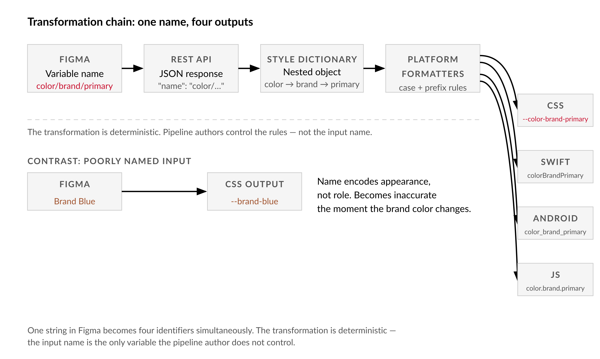
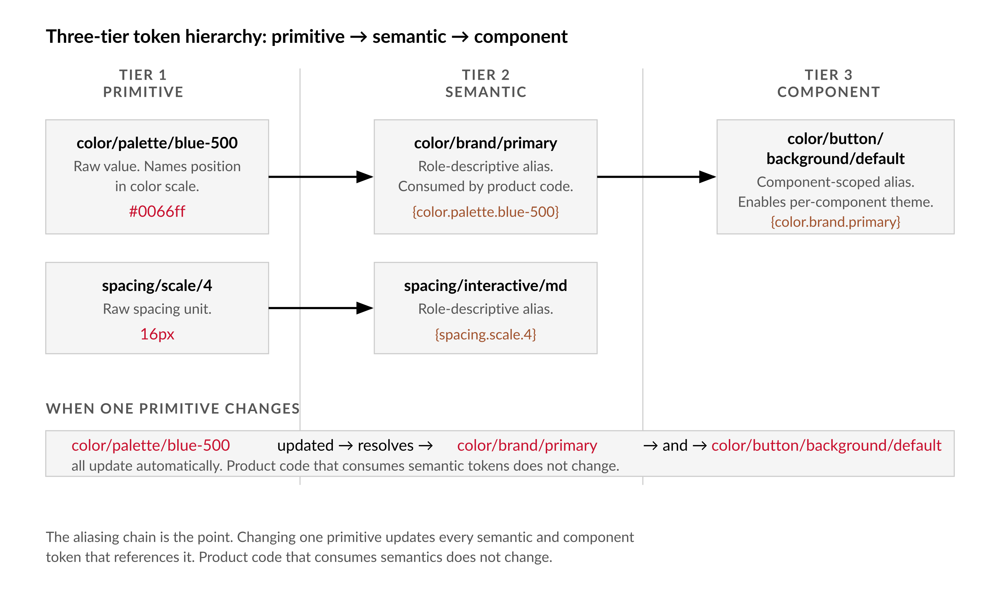

# Chapter 4 — Naming as an API Contract

*The designer's string in Figma is the engineer's identifier in six platforms simultaneously — and nobody told the designer.*

---

Here is a failure that happened on release day. The token pipeline ran, the CI deployed, and the stylesheet that landed in production looked like this:

```css
:root {
  --color-3: #0066ff;
  --text-1: #1a1a1a;
  --spacing-2: 8px;
  --button-: ;
  --/brand/accent: #ff3300;
}
```

Nobody touched the pipeline. Nobody changed the transformation config. Two weeks earlier, the design team had renamed some variables — tidying up, they said — and the pipeline swallowed whatever names came through, applied its rules mechanically, and wrote those identifiers into the generated stylesheet. `--button-` is not a valid CSS custom property. `--/brand/accent` is worse. `--color-3` is meaningless to every engineer who has to consume it.

The pipeline did exactly what it was told. The names were the bug.

This is where the chapter's central idea comes from, and I want to state it plainly before explaining why it's true: when a designer names a variable in Figma, they are not labeling an object for their own organizational convenience. They are writing the first character of an identifier that will be transformed, concatenated, and emitted into CSS, Swift, Android XML, and JavaScript — often automatically, without any human reviewing the result. The name is not a label. It is the source code.

---

## What Happens to a Name

Follow one variable name from Figma to CSS. The name is `color/brand/primary`. The value is `#0066ff`.

The Figma REST API returns this variable as a JSON object. The `name` property is the string `color/brand/primary` — exactly as the designer typed it. Nothing in the API interprets or transforms it. It arrives at the extraction script verbatim.

The token extractor — Style Dictionary, or an equivalent transformer — reads the slash-separated path as a hierarchy. It parses `color/brand/primary` into a nested object: `color → brand → primary`. This parsing is mechanical: split on `/`, build the object recursively, assign the value at the leaf. No judgment about whether `brand` is a meaningful subcategory. No check that `primary` is a sensible terminal name. It parses whatever it receives.

The platform formatter then converts that nested path into a platform-specific identifier. For CSS, the path becomes `--color-brand-primary`. For Swift, `colorBrandPrimary`. For Android XML, `color_brand_primary`. For JavaScript, `color.brand.primary`. The transformation rules are simple string operations: replace slashes with the platform's separator, apply the platform's case convention, prepend any required prefix.


*Figure 4.1 — Transformation chain: one name, four outputs*

The point I want you to hold in mind is that this chain is deterministic. Given an input name, the output identifiers are fixed. The pipeline author controls the transformation rules. They do not control the input. A name like `Color 3` produces `--color-3` in CSS. A name like `Button / hover` — with spaces around the slash — may produce `--button---hover` or fail silently with an empty string, depending on how strictly the transformer handles whitespace. A name like `🎨 Brand Primary` causes most transformers to drop the non-ASCII character and produce something malformed.

The designer made these outputs. They did not know they were making them. That gap — between the act of naming and the consequence of the name — is where the failure lives.

---

## Why the Name Is the Contract

The word "contract" has a specific meaning in software: a stable interface between a producer and a consumer that both parties can depend on. A CSS custom property name is a contract between the token pipeline (producer) and the component stylesheet that references it (consumer). The component stylesheet writes `var(--color-brand-primary)`. It does not care where that value comes from — whether it was defined in a hand-written CSS file or generated by a pipeline from a Figma variable. It only cares that the name is stable and present.

When a designer renames `color/brand/primary` to `color/brand/blue` — perhaps because the palette subcategory was reorganized — the pipeline regenerates `--color-brand-blue`. The old identifier `--color-brand-primary` disappears from the stylesheet. Every component that referenced `var(--color-brand-primary)` now resolves to nothing, or to the browser's default, depending on whether a fallback was specified. The visual change may be invisible in development if the same value is hardcoded somewhere in the component. It surfaces in production, at scale, when the generated stylesheet is the only source of the value.

This is the contract violation. The consumer was depending on `--color-brand-primary` as a stable identifier. The producer changed it. Neither party may have understood that a rename was a breaking change.

| API concept | Token naming equivalent | Example of violation |
|---|---|---|
| Endpoint path | Figma variable name (`color/brand/primary`) | Renaming `color/brand/primary` to `color/brand/blue` without updating consumers |
| Breaking change | Name change that deletes the old identifier from generated output | `--color-brand-primary` disappears from CSS; all `var(--color-brand-primary)` references resolve to nothing |
| Major version bump | Explicit deprecation period + consumer migration | Renaming a variable with 47 consumers requires updating every CSS, Swift, and Android reference before the old name is retired |
| Stable interface | Semantic token name (`color/brand/primary`) that survives a value change | Token name holds even when `#0066ff` changes to `#0055ee`; consuming code never changes |
| Implementation detail | Primitive token value (the hex code) | Changing `#0066ff` to `#0055ee` in the primitive is invisible to every consumer of the semantic alias |
| Consumer contract | Component stylesheet writing `var(--color-brand-primary)` | The component does not care where the value comes from — only that the name is stable and present |

The analogy to software APIs is not decorative. In a versioned REST API, renaming an endpoint path is a breaking change that requires a major version bump, migration documentation, and a deprecation period. In a token pipeline, renaming a Figma variable is a breaking change that requires updating every consumer — every component stylesheet, every Swift constant, every Android resource reference — before the old name can be retired. The difference is that most teams treat the Figma rename as a cosmetic operation and find out it was breaking when the build fails or, worse, when it doesn't fail and the wrong value silently takes over.

---

## The Three-Tier Hierarchy

Before specifying naming rules, there is a structural question to answer: what does the name's hierarchy actually represent? The design tokens community has converged on three tiers, and understanding the tiers is necessary to understand why the naming rules are what they are.

The first tier is **primitive tokens**. These are raw values with names that describe what they are, not what they mean. `color/palette/blue-500` is a primitive: it names a position in the color scale. The value is `#0066ff`. This token is never consumed directly by product code. It exists as a vocabulary that the second tier references.

The second tier is **semantic tokens**. These are decision tokens — aliases that point into the primitive tier and carry names that describe a role, not a value. `color/brand/primary` is a semantic token. Its value is not a hex code; it is a reference: `{color.palette.blue-500}`. When the primitive resolves, the semantic resolves with it. The product code consumes semantic tokens. When the brand blue changes from `#0066ff` to `#0055ee`, one primitive is updated. Every semantic token that aliases it updates automatically. The consuming code does not change.

The third tier is **component tokens**. These are component-scoped aliases into the semantic tier. `color/button/background/default` is a component token. Its value references `{color.brand.primary}`. Component tokens allow per-component customization without breaking the semantic layer. Small design systems often skip Tier 3; large systems with per-component theming requirements benefit from it.


*Figure 4.2 — Three-tier token hierarchy: primitive → semantic → component*

The naming convention has to encode tier membership. The way it does this is through segment depth: three-segment names are semantic tokens, four-segment names are component tokens, two-segment names are primitives. The first segment — always — is the category: `color`, `spacing`, `typography`, `radius`, `shadow`, `motion`. The remaining segments specify subcategory and name.

This means the name `color/brand/primary` tells you, without any other documentation, that this is a semantic token in the color category, representing the primary brand role. The name `color/palette/blue-500` tells you it is a primitive in the color category, at position 500 in the blue scale. The name `color/button/background/default` tells you it is a component token scoped to the button, specifying its default background. The name is the documentation. It is the only documentation that survives the transformation chain and appears in the browser's computed styles inspector.

---

## The Convention

A naming convention is only as useful as its enforcement. I will give you the concrete rules first, then the enforcement code.

Every Figma variable name must satisfy these conditions:

**One: lowercase segments, hyphens only.** Each path segment uses lowercase letters, digits, and hyphens. No uppercase, no underscores, no spaces, no Unicode outside ASCII. `blue-500` is valid. `Blue500` is not. `blue_500` is not. The reason is that transformers apply case conversions during formatting. If the source name already has mixed case, the output is unpredictable — the formatter may double-apply a conversion or leave the source casing in place, depending on implementation.

**Two: three or four segments.** Two segments (`color/primary`) is too shallow — it collapses the subcategory and makes grouping impossible. Five segments is too deep — it signals that either the hierarchy is wrong or a concern is being over-specified that belongs in component logic. Three segments for semantic tokens, four for component tokens.

**Three: approved first segment.** The category must be from the controlled vocabulary: `color`, `spacing`, `typography`, `radius`, `shadow`, `motion`, `opacity`, `z-index`. New categories require a deliberate decision, not a unilateral addition.

**Four: no platform syntax in the name.** Do not include `--`, `$`, or any platform-specific prefix in the Figma name. The platform prefix is added by the formatter. `--color-brand-primary` as a Figma name produces `----color-brand-primary` in CSS. The source name is the path; the platform format is the output.

**Five: semantic tokens alias primitives; component tokens alias semantics.** This is a structural rule, not a naming rule, but it belongs in the same enforcement layer. A semantic token that hardcodes a hex value instead of aliasing a primitive has collapsed the tier structure. When the primitive value changes, the semantic will not update.

Here is the validation function:

```js
// lib/validate-name.js
// Validates a single Figma variable name against the naming contract.
// Returns: { valid: boolean, errors: string[] }

import { NAMING_RULES } from '../naming.config.js';

export function validateTokenName(name) {
  const errors = [];
  const segments = name.split(NAMING_RULES.separator);

  if (segments.length < NAMING_RULES.minDepth) {
    errors.push(
      `Too shallow: "${name}" has ${segments.length} segment(s), minimum is ${NAMING_RULES.minDepth}.`
    );
  }
  if (segments.length > NAMING_RULES.maxDepth) {
    errors.push(
      `Too deep: "${name}" has ${segments.length} segment(s), maximum is ${NAMING_RULES.maxDepth}.`
    );
  }

  const category = segments[0];
  if (!NAMING_RULES.categories.includes(category)) {
    errors.push(
      `Unknown category: "${category}". Allowed: ${NAMING_RULES.categories.join(', ')}.`
    );
  }

  for (const segment of segments) {
    if (!NAMING_RULES.segmentPattern.test(segment)) {
      errors.push(
        `Invalid characters in segment "${segment}". Use lowercase letters, digits, and hyphens only.`
      );
    }
  }

  return { valid: errors.length === 0, errors };
}
```

And the script that runs it against the full variable set:

```js
// scripts/validate-names.js
// Run: npm run figma:validate-names
// Exits 1 if any naming violations exist — blocks CI.

import { readFileSync } from 'fs';
import { validateTokenName } from '../lib/validate-name.js';

const fixture = JSON.parse(readFileSync('./fixtures/variables.json', 'utf8'));
const allVariables = Object.values(fixture.meta.variables);

let errorCount = 0;

for (const variable of allVariables) {
  const result = validateTokenName(variable.name);
  if (!result.valid) {
    console.log(`\n[ERROR] ${variable.name}`);
    for (const err of result.errors) {
      console.log(`  - ${err}`);
    }
    errorCount++;
  }
}

console.log(
  `\n${allVariables.length} variables checked. ${errorCount} with naming errors.`
);
if (errorCount > 0) process.exit(1);
```

| Failure mode | Example name | CSS output | What breaks | When it breaks |
|---|---|---|---|---|
| Spaces in segment | `Button / hover` | `--button---hover` or empty string | CSS custom property is invalid or missing; `var()` resolves to nothing | At CI, or silently in production if a fallback value is present |
| Non-ASCII character | `🎨 Brand Primary` | `--brand-primary` or malformed | Transformer drops the emoji; output may be unparseable or collide with another token | During Style Dictionary transform step |
| Uppercase letters | `BrandPrimary` | `--brandprimary` (lowercased) or `--BrandPrimary` | If formatter applies its own case conversion, output doubles the casing or produces unexpected identifiers | At extraction; discovered when consuming code references the expected name and finds nothing |
| Platform prefix in source | `--color-brand-primary` | `----color-brand-primary` | Double-prefixed property is invalid CSS; all consumers that reference the expected name break | At CSS generation step; fails silently if the stylesheet still loads |
| Two-segment name (too shallow) | `color/primary` | `--color-primary` | Subcategory collapse makes grouping impossible; tier membership is ambiguous; bulk rename tools cannot distinguish primitives from semantics | During audit; escalates to pipeline confusion when the token set grows |
| Five-segment name (too deep) | `color/brand/button/hover/pressed` | `--color-brand-button-hover-pressed` | Signals over-specification; usually means component logic has leaked into the token layer; hard to maintain as variants multiply | Immediately visible in `validate-names.js` output; structural debt accumulates |

This script reads the variables fixture written by `figma-read.mjs` from Chapter 3. It does not call the API — it validates the local snapshot. If it exits with code 1, CI stops. That is the enforcement: the pipeline cannot run on a file with naming violations, because the pipeline's output is only as useful as the names it transforms.

---

## Component and Layer Names

Variables are not the only names the pipeline consumes. Component names, style names, and export layer names all become identifiers downstream.

Component names in Figma become documentation paths, Code Connect mappings, and AI agent context. The convention here differs from variable names because component names appear as display strings in the Figma layer panel — they are seen by designers in their natural working environment and need to be legible there. The convention is `Category/Variant/State`, title-cased, slash-separated, no spaces around slashes: `Button/Primary/Default`, `Card/Product/With-Image`, `Input/Text/Error`. The transformer will convert these to whatever the consumer requires — `ButtonPrimaryDefault` for a Swift enum, `button-primary-default` for a CSS class.

Export layer names — layers the asset pipeline extracts as SVG or PNG — have the strictest stability requirement of any name in the system, because they map directly to repository file paths. A designer who renames `icons/arrow-right` to `icons/arrow-right-v2` has not renamed a layer; they have deleted a file from the asset pipeline's output and created a new one. Every codebase reference to `icons/arrow-right.svg` now points to a missing file. The rename looks cosmetic in Figma. It is a breaking change in production.

The convention for export targets: lowercase, slash-separated, no version suffixes, unique across the file. `icons/arrow-right`, `icons/check-circle`, `illustrations/empty-state/no-results`. These names should be treated as permanent. Retiring an asset requires explicit deprecation, not a quiet rename.

---

## The Transformation Chain: One Name, Four Outputs

I want to make the determinism concrete by tracing one name all the way through.

Input: Figma variable `color/brand/primary`, value `#0066ff`.

Style Dictionary parses the slash path into a nested object:

```json
{
  "color": {
    "brand": {
      "primary": {
        "$value": "#0066ff",
        "$type": "color"
      }
    }
  }
}
```

The CSS formatter converts `color → brand → primary` to `color-brand-primary`, prepends `--`:

```css
:root {
  --color-brand-primary: #0066ff;
}
```

The Swift formatter converts to lowerCamelCase:

```swift
public extension Color {
  static let colorBrandPrimary = Color(hex: "#0066ff")
}
```

The Android formatter converts to snake_case:

```xml
<resources>
  <color name="color_brand_primary">#0066ff</color>
</resources>
```

Now run the same chain on `Brand Blue`, the common alternative — a name that describes appearance rather than role.

CSS: `--brand-blue`. Swift: `Color.brandBlue`. Android: `color_brand_blue`.

The values are correct. The names are wrong in a way that accumulates silently. Six months from now the brand updates to navy. The name `brand-blue` is now inaccurate. Every engineer who searches the codebase for `brand-blue` is consuming an identifier that describes a color that no longer exists. Updating the name requires finding and replacing every consumer — every `var(--brand-blue)`, every `Color.brandBlue`, every `color_brand_blue` — across all platforms, which is the kind of work that takes a sprint and produces regressions.

| Platform | Well-named: `color/brand/primary` | Poorly named: `Brand Blue` | Consequence of brand color update |
|---|---|---|---|
| CSS | `--color-brand-primary` | `--brand-blue` | Semantic name survives: rename primitive only. Descriptive name fails: every `var(--brand-blue)` reference must be found and replaced across all stylesheets. |
| Swift | `Color.colorBrandPrimary` | `Color.brandBlue` | Semantic name survives: one constant update. Descriptive name fails: every `Color.brandBlue` call in every view file requires a rename and recompile. |
| Android XML | `color_brand_primary` | `color_brand_blue` | Semantic name survives: one resource update. Descriptive name fails: every `@color/color_brand_blue` reference in layouts and drawables requires a manual find-and-replace. |
| JavaScript | `color.brand.primary` | `color.brand.blue` | Semantic name survives: one object property update. Descriptive name fails: every `color.brand.blue` access in component code and theme files must be audited for the change. |
| Documentation | Role is legible from name: primary brand color | Role is ambiguous: which blue? Is it still blue? | Semantic name is self-documenting. Descriptive name produces stale documentation the moment the palette is updated. |
| Time cost of rebrand | One primitive updated, all semantic and component tokens resolve automatically | One sprint minimum: find and replace across four platforms, regression-test all consumers, update documentation | Accumulates with every palette cycle; descriptive naming debt compounds over the lifetime of the product. |

The semantic name survives the rebrand. The descriptive name does not. That is the whole argument for semantic naming, stated as a concrete outcome.

---

## Migrating a Messy File

The more common situation is not building a naming system from scratch. It is inheriting a file with 300 variables, half of them named `Color 1` through `Color 47` and the other half named things like `Brand Blue`, `Action Green`, and `Dark Gray Hover`. The migration path is predictable, and there is a specific order that prevents alias breakage.

Step one: run the validator against the current fixture. Get the count and categorize the violations. More than 100 violations means bulk tooling — the Plugin API rename tool from Chapter 6 — is necessary. Fewer than 20 means hand-fixing is tractable.

Step two: generate a rename mapping in a spreadsheet or script. Old name to new name. Do not rename in Figma yet. Review the mapping with the design team and flag any rename that changes semantic meaning — a rename from `Color 3` to `color/brand/primary` is not just a naming fix if `Color 3` was actually used as a neutral background somewhere. The audit has to verify role before the name can be corrected.

Step three: check alias chains before renaming. A Figma variable rename does not automatically update alias references that point to the old name. [verify — current as of writing, alias behavior under renames] If `color/button/background/default` aliases `Color 3`, and you rename `Color 3` to `color/palette/blue-500`, the alias will break. Aliases must be updated in the same operation as the rename, or updated immediately after.

Step four: apply bulk renames using the Plugin API tool, with a staging review before committing. Re-run the validator. Fix any remaining violations. Only then run the token extractor and downstream pipeline.

The order matters because the validator catches naming violations but not alias breakage. Those are different checks, both necessary, and the alias check must come after renames are staged but before they are applied.

---

## What the Convention Cannot Fix

I want to be honest about the limits of naming discipline, because I have seen teams treat naming rules as a complete solution to token governance and discover the gaps expensively.

The naming convention ensures that names are machine-readable and semantically descriptive. It does not ensure that the names are correct — that `color/brand/primary` actually represents the primary brand color and not an accent or an error state that was mislabeled at creation. Correctness is a semantic audit problem, not a naming problem. The naming rules verify form; only a human reviewing the name-to-value mapping can verify intent.

The convention also does not prevent tier collapse, the failure where semantic tokens alias other semantic tokens rather than primitives. `color/brand/primary → {color.interactive.default}` where `color/interactive/default → {color.palette.blue-500}` is technically valid naming but structurally wrong: the semantic tier now has variable-length alias chains that are hard to trace and break unpredictably when intermediate tokens are renamed. The validator catches this if it includes alias resolution checking; a naming-only check does not.

Finally, the convention does not solve the communication problem of who owns the naming decision. The answer is that both design and engineering own it jointly, because the name has to serve both Figma's organizational needs and the pipeline's technical requirements. The practical resolution is to put the naming contract in a version-controlled file — `naming.config.js` — where it is legible to engineers, and to present a summary of it to designers in the form they can absorb: a short Notion doc, a plugin that flags violations in the Figma editor, a training session when a new designer joins the team. The contract lives in code. The communication of the contract is a separate, ongoing responsibility.

---

## The History Behind the Convention

Long before design tokens existed, the front-end community was learning the same lesson through CSS architecture. In 2009, Yandex engineers published the Block-Element-Modifier methodology — BEM. The insight was identical to what design tokens formalized a decade later: if you name HTML class attributes by semantic role rather than visual appearance, the name survives reskinning. `.button--primary` survives a color change. `.blue-button` does not. The class name is a contract between the HTML structure and the CSS rule that styles it. Change the visual representation; the contract holds.

The same lesson emerged independently in CSS architecture frameworks — OOCSS, SMACSS — and in API design, where the semantic versioning specification codified the intuition that a stable interface name is not the same as a stable implementation. In database schema design, meaningful column names over positional indexing was a hard-won lesson that predates relational databases. Every domain that had to maintain code across time arrived at the same conclusion: names are stable interfaces, not labels.

Design tokens extended this insight from two parties — HTML and CSS — to an arbitrary number: a Figma variable consumed simultaneously by CSS, iOS, Android, documentation generators, AI agents, and code generators. The consequence of a bad name multiplied with the number of consumers. The discipline required multiplied with it.

Teams that had internalized BEM in the 2010s had a head start when design tokens arrived. Teams that had named everything by appearance — `.blue-button`, `.large-card`, `.dark-header` — had migration debt that cost sprints to resolve. The lesson is not new. The surface where it applies keeps expanding.

---

**LLM Exercises**

*Use these with Claude or any capable language model to deepen your understanding of the concepts in this chapter.*

**1. Generate and examine.** Give the model a set of ten real variable names from your Figma file — whatever names are currently there, good or bad. Ask it to evaluate each name against the three-tier hierarchy and the naming rules from this chapter, explain what each name would produce in CSS and Swift, and flag any that would cause downstream failures. Then run the actual transformer and compare.

**2. Apply to known context.** Describe a design system you have worked with — the domain (e-commerce, enterprise SaaS, consumer mobile, whatever it is), the rough scale (number of variables, number of platforms), and the current naming approach. Ask the model to generate a naming convention proposal tailored to that context: the tier structure, the approved category list, the depth rules, and three example token names for each tier. Evaluate whether the proposal is more or less strict than what this chapter recommends and why.

**3. Stress-test a specific claim.** This chapter argues that a name like `Brand Blue` fails because it describes appearance rather than role, and will produce naming debt when the brand color changes. Present this claim to the model and ask it to construct the strongest counterargument: a scenario where appearance-descriptive names are actually more stable, more useful, or more maintainable than role-descriptive names. Then evaluate whether the counterargument changes your view of when descriptive naming is acceptable.

**4. Draft or audit a professional deliverable.** Write a one-page naming convention document for your design team — the kind of document you would put in Notion or Confluence and reference in onboarding. It should cover the tier hierarchy, the segment rules, three or four concrete examples, and the migration path for non-conforming names. Ask the model to critique it for completeness, clarity, and enforceability. Then ask it to identify the single most common violation it would expect a new designer to make and whether your document addresses it.

---

## Chapter 4 Exercises: Naming as an API Contract
**Project:** figma-tools — Your Design System Extraction Toolkit
**This chapter adds:** A versioned `naming.config.js` contract document plus `scripts/validate-names.js`, the naming-audit check that enforces the three-tier token hierarchy (primitive → semantic → component) and blocks CI on violations.

---

### Exercise 1 — When to Use AI

You have a set of real Figma variable names and need to evaluate whether they conform to the naming contract this chapter defines. AI is well-suited to several tasks here.

**Task 1: Bulk naming classification.** Paste a list of variable names and ask an AI to classify each one as primitive, semantic, or component-tier, flag violations against the five rules, and predict the CSS/Swift/Android output. This is pattern-matching on unambiguous structural rules — the same kind of work a linter does, but with natural-language explanation of why each name fails.

*Why AI works here:* Structured rule-application. The five naming rules are precise and machine-checkable. AI can apply them rapidly across hundreds of names and explain the violation in terms a designer can act on, which a raw linter output cannot do.

**Task 2: Generating a rename mapping.** Given a list of non-conforming names (e.g., `Brand Blue`, `Action Green`, `Color 3`), ask an AI to draft candidate new names under the convention. You will review and correct each one — AI is generating hypotheses, not final decisions.

*Why AI works here:* Generative enumeration. There are many plausible conforming names for any given violation; AI can draft a starting list quickly. The human review step (Exercise 2) catches the cases where the proposal is structurally valid but semantically wrong.

**Task 3: Explaining the transformation chain to stakeholders.** Ask an AI to write a two-paragraph explanation — suitable for a designer Slack message — of why renaming `color/brand/primary` to `color/brand/blue` is a breaking change across four platforms. Technical reasoning translated into stakeholder-legible language is something AI does well.

*Why AI works here:* Translation. The reasoning is precise and contained. AI can convert it into the register a specific audience needs without losing accuracy.

**The tell:** Run `scripts/validate-names.js` against your fixture after applying any AI-proposed renames. If the script exits 0 and you can explain why each renamed token lands in the correct tier, the output is trustworthy. If a name passes the validator but you cannot explain which tier it belongs to, the proposal needs review.

---

### Exercise 2 — When NOT to Use AI

Some naming decisions look like pattern-matching problems but are actually semantic claims about the design system. AI cannot make these correctly.

**Task 1: Determining the correct tier for an ambiguous token.** `Color 3` is a naming violation. But the correct replacement depends on what `Color 3` actually represents in the system — it might be `color/palette/blue-500` (primitive) or `color/brand/primary` (semantic) or `color/button/background/default` (component). These are three different structural positions with different downstream pipeline behaviors. AI will produce a plausible-sounding name for whichever one it guesses is likely. Only someone who knows the system knows which is correct.

*Why AI fails here:* Semantic reasoning from incomplete context. AI does not know what the token represents; it infers from the name and surrounding names. The inference will often be wrong for ambiguous cases, and the error is silent — the AI's proposed name will pass the validator.

**Task 2: Deciding when to retire a token name.** A token named `color/brand/primary` has 47 consumers across three platforms. The design team wants to rename it to `color/brand/action`. AI can explain the consequences of a rename. It cannot tell you whether the migration cost — updating 47 consumers — is justified by the naming improvement, whether now is the right moment given the upcoming rebrand, or whether the two names actually represent the same semantic role or subtly different ones.

*Why AI fails here:* Judgment under organizational context. This is a business and coordination decision, not a technical one.

**Task 3: Reviewing a migration mapping before bulk rename.** The step-by-step migration process in this chapter requires a human to review the rename mapping before applying it. An AI's review of the same mapping will identify obvious violations but will not catch cases where a rename changes semantic meaning — where, for instance, `Color 3` was actually used as a neutral background in one context and as a brand accent in another. AI has no access to how the token is actually used in designs.

*Why AI fails here:* Usage-context blindness. AI can only see the name and the convention. It cannot see the 300 frames where the token is applied and whether the proposed new name accurately describes its role in all of them.

**The tell:** If you are about to apply a bulk rename based on AI proposals without having reviewed each proposal against actual token usage in the Figma file, stop. The validator will pass names that are wrong. Only a human with the file open can confirm intent.

**Series connection:** This exercise sits at Tier 4 (metacognitive — knowing what you don't know) and Tier 6 (collective intelligence — naming decisions require design-engineering alignment that no individual AI session can replicate). The naming contract is a team agreement, not a technical optimization.

---

### Exercise 3 — LLM Exercise

**What you're building:** A naming-audit report for your existing Figma variable set, with per-violation explanations and a starter rename mapping.

**Tool:** Claude (single conversation — no persistent context needed; the fixture is self-contained). Claude is appropriate here because the task involves applying structured rules to structured data and producing structured output. A general-purpose conversation model handles this well without project memory.

**The Prompt:**

```
I'm working through "The Figma API: From Canvas to Production" and building figma-tools, a CLI design system extraction toolkit.

Chapter 4 defines a naming contract for Figma variables. Here are the five rules:
1. Lowercase segments, hyphens only — no uppercase, underscores, spaces, or non-ASCII.
2. Three segments for semantic tokens, four for component tokens (minimum 3, maximum 4).
3. First segment must be from: color, spacing, typography, radius, shadow, motion, opacity, z-index.
4. No platform prefixes (no --, $, etc.) in the Figma name.
5. Semantic tokens must alias primitives; component tokens must alias semantics (no tier skipping).

Three-tier hierarchy:
- Primitive: color/palette/blue-500 (raw value, never consumed by product code)
- Semantic: color/brand/primary (role-descriptive, aliases a primitive)
- Component: color/button/background/default (component-scoped, aliases a semantic)

Here are the variable names from my Figma file fixture:

[PASTE YOUR variables.json OR A LIST OF 10-30 VARIABLE NAMES HERE]

For each variable name, produce:
1. Whether it passes or fails the naming contract, with the specific rule(s) violated.
2. Which tier it belongs to (primitive / semantic / component / unclear).
3. What it would generate in CSS (e.g., --color-brand-primary).
4. If it fails, one candidate conforming replacement name, with a note that I must verify the semantic meaning before applying it.

Format the output as a markdown table with columns: Name | Pass/Fail | Tier | CSS Output | Proposed Replacement | Notes.

At the end, add a short paragraph summarizing the most common violation type in this set.
```

**What this produces:** A per-name audit table you can paste into a Notion page or review meeting, a draft rename mapping to validate against actual token usage, and a plain-English summary of your file's naming debt by violation type.

**How to adapt this prompt:**
- *Own project:* Replace the variable list with your actual `fixtures/variables.json` content. Paste the full JSON or extract just the `name` fields with `jq '.meta.variables | to_entries[] | .value.name' fixtures/variables.json`.
- *ChatGPT or Gemini:* The prompt works as written. Both models handle structured rule-application on tabular data. Gemini may produce slightly different table formatting.
- *Claude Project:* If you have a Claude Project for figma-tools, paste your `naming.config.js` into the project context so the model reads the actual approved category list rather than the hardcoded list in the prompt.

**Connection to previous chapters:** The `fixtures/variables.json` this prompt reads is the file written by `figma-read.mjs` from Chapter 3. You're running the same data through a natural-language rule engine before wiring it into the automated `validate-names.js` script from this chapter.

**Preview of next chapter:** Chapter 5 builds `figma-audit.js`, which runs `validateTokenName()` automatically against the fixture and produces a severity-classified JSON report. The table this prompt generates is a human-readable preview of what `figma-audit.js` will classify as `NAME001` errors.

---

### Exercise 4 — CLI Exercise

**What you're building:** `scripts/validate-names.js` wired into your figma-tools project as `npm run figma:validate-names`, reading from your committed fixture and exiting 1 on violations.

**Tool:** Claude Code

**Skill level:** Beginner — Claude Code will scaffold the file; your job is to verify its output against the rules in this chapter.

**Setup:**
- [ ] `figma-read.mjs` from Chapter 3 has been run and `fixtures/variables.json` exists
- [ ] `naming.config.js` exists at the project root (or Claude Code will create it)
- [ ] `package.json` exists with a `scripts` section

**The Task:**

```
Read the following files in my figma-tools project to understand the existing structure:
- package.json (scripts section)
- fixtures/variables.json (first 20 entries of meta.variables are enough)
- naming.config.js (if it exists; if not, note that it needs to be created)

Do NOT read or modify any chapter files, research files, or planning documents.

Then do the following:

1. If naming.config.js does not exist, create it with:
   - NAMING_RULES.separator = '/'
   - NAMING_RULES.minDepth = 3
   - NAMING_RULES.maxDepth = 4
   - NAMING_RULES.categories = ['color', 'spacing', 'typography', 'radius', 'shadow', 'motion', 'opacity', 'z-index']
   - NAMING_RULES.segmentPattern = /^[a-z0-9-]+$/

2. Create lib/validate-name.js implementing the validateTokenName(name) function from Chapter 4.
   The function returns { valid: boolean, errors: string[] }.
   Implement all five rules: depth, category, segment pattern, no platform prefix, no Unicode outside ASCII.

3. Create scripts/validate-names.js that:
   - Reads fixtures/variables.json
   - Calls validateTokenName() on every variable name
   - Logs each violation in the format: [ERROR] <name> / - <reason>
   - Logs a summary: "N variables checked. M with naming errors."
   - Exits process.exit(1) if errorCount > 0

4. Add "figma:validate-names": "node scripts/validate-names.js" to package.json scripts.

Stop after these four steps. Do not modify figma-read.mjs, do not delete any existing fixtures.

Verification step: After creating the files, run `node scripts/validate-names.js` and show me the output. If the script exits 1, that is expected if the fixture contains violations — show me the first 5 violations found.
```

**Expected output:** `scripts/validate-names.js` runs cleanly, outputs a violation count, and exits 1 if naming errors exist. If your fixture has zero violations, verify by temporarily introducing a bad name.

**What to inspect:** Check that `lib/validate-name.js` tests all five rules, not just the segment pattern. Ask Claude Code to show you one test case for each rule.

**If it goes wrong:** If the script crashes on `fixtures/variables.json`, run `node -e "const d = require('./fixtures/variables.json'); console.log(Object.keys(d.meta.variables).slice(0,3))"` to confirm the fixture shape. If it finds zero violations on a file you know has naming problems, add a console.log to validate-name.js to print the first name it processes and confirm the fixture is being read.

**CLAUDE.md / AGENTS.md note:** Add this rule to your project's CLAUDE.md:

```
## figma-tools: Naming Validation
validate-names.js reads fixtures/variables.json and validates against naming.config.js.
Never modify naming.config.js without explicit instruction — the approved category list
is a team contract, not a configuration preference.
```

---

### Exercise 5 — AI Validation Exercise

**What you're validating:** The naming-audit table produced by Exercise 3 (preferred), or a pre-generated table provided below if you do not have a Figma fixture.

**Validation type:** Structured output correctness check — verifying that AI applied the naming rules accurately and that its rename proposals are structurally valid and semantically honest.

**Risk level:** Medium. The failure mode specific to this chapter is that AI proposes a rename that is structurally conforming but semantically wrong — the name passes `validate-names.js` but misrepresents what the token actually does. This is the hardest failure to catch without human review against the actual file.

**Setup:** Use the output table from Exercise 3. If you do not have a fixture, use this pre-generated sample for the validation task:

| Name | Pass/Fail | Tier | CSS Output | Proposed Replacement |
|---|---|---|---|---|
| Brand Blue | Fail | unclear | --brand-blue | color/brand/primary |
| color/palette/blue-500 | Pass | primitive | --color-palette-blue-500 | — |
| Color 3 | Fail | unclear | --color-3 | color/brand/secondary |
| button/hover | Fail | unclear | --button-hover | color/button/background/hover |
| color/interactive/default | Pass | semantic | --color-interactive-default | — |
| spacing/4 | Fail | primitive | --spacing-4 | spacing/scale/4 |
| typography/size/lg | Pass | primitive | --typography-size-lg | — |

**The Validation Task:**

```
Checklist — apply each criterion to the AI-generated naming audit table:

CORRECTNESS
[ ] Each "Pass" entry genuinely satisfies all five naming rules from Chapter 4 (depth, category, segment pattern, no platform prefix, ASCII only). Pick two "Pass" entries and manually verify.
[ ] Each "Fail" entry has the specific rule cited, not a generic "naming violation" note. If the rule is missing, the output is incomplete.
[ ] The CSS Output column is mechanically correct: slash-separated path with -- prefix, hyphens replacing slashes. Spot-check three entries.

COMPLETENESS
[ ] Every variable from the input list appears in the table. Count the rows.
[ ] The summary paragraph names the most common violation type with a count.

SCOPE
[ ] The table contains only analysis and proposals — no variables were silently renamed or modified.
[ ] Proposed replacements are marked as candidates requiring human review, not as final answers.

CHAPTER-SPECIFIC: TIER ACCURACY
[ ] Every proposed replacement lands in the correct tier: three segments = semantic, four = component, two = primitive. Count the segments in each proposed replacement.
[ ] No proposed replacement merges two semantically distinct roles. Check: does "color/brand/primary" as a replacement for both "Brand Blue" and "Color 3" mean those tokens are identical? If the AI proposed the same name for two different source tokens, flag it.

CHAPTER-SPECIFIC: SEMANTIC HONESTY
[ ] The AI's "Tier" classification for ambiguous tokens (like "Color 3") is labeled "unclear" or qualified — not confidently assigned to a tier without evidence.
[ ] At least one proposal is accompanied by a note that the correct name requires verifying actual usage in the Figma file.

FAILURE-MODE CHECK
[ ] "Fluent but wrong" check: identify one proposed replacement that is syntactically valid (passes the validator) but that you suspect may misrepresent the token's actual role. Note it as unverified.
[ ] Contract-violation check: did the AI propose a "cleaner" replacement that subtly merges two semantically distinct tokens into one name? For example, proposing "color/brand/primary" for tokens that actually serve two different roles in the system (accent vs. action). If found, this is a naming-contract violation even though the name itself conforms.

What to do with your findings:
- Any failing checklist item = revise the prompt in Exercise 3 to add the missing constraint and re-run.
- Any "contract-violation" finding = add a note to your project CLAUDE.md: "AI rename proposals require human review against actual token usage before applying to figma-tools fixtures."
- Proposals marked "unverified" = open the Figma file and confirm the token's role before adding to the rename mapping.

AI Use Disclosure (mandatory — copy this into your project log):
"Exercise 3 used Claude to generate a naming audit table from Figma variable names. Exercise 5 used a manual checklist to verify the output. I identified [N] items that required correction before using the table as a rename mapping."

Series connection: The "fluent but wrong" failure — a conforming name that misrepresents semantic meaning — is the central Tier 4 metacognitive risk of this chapter. The naming convention catches form; only human review catches intent. This failure mode reappears in Chapter 5 as audit false positives (AI calling designer intent a violation) and in Chapter 6 as unsafe bulk renames that the approval gate lets through under fatigue.
```

---

## Prompts

*Load NEU/CLAUDE.md and NEU/DESIGN.md before generating any figure from this section.*

### Figure 4.1 — Transformation chain: one name, four outputs

Horizontal flow diagram. Five stages left to right: Figma variable name box → REST API JSON box → Style Dictionary nested object box → Platform Formatters box → four output boxes fanning right (CSS, Swift, Android, JS). Each stage box: fill #F5F5F5, border #CCCCCC/0.75, label in #555555 ALLCAPS 10px, content in #000000 11px. The input name `color/brand/primary` in #C8102E (primary data). Arrows #000000/1.5 with arrowhead marker. Below the chain a dashed reference line #CCCCCC with annotation in #555555 10px: "The transformation is deterministic. Pipeline authors control the rules — not the input name." Add a second row showing a poorly-named input (`Brand Blue`) → CSS output (`--brand-blue`) with text annotation in #555555 explaining the appearance-vs-role failure. viewBox 700×420. Deliverable: single HTML, inline CSS, D3 v7 CDN, responsive via ResizeObserver, dark mode via CSS custom properties, ARIA role="img".

> Reference implementation: `../d3/04-naming-as-an-api-contract-fig-01.html`

### Figure 4.2 — Three-tier token hierarchy

Three-column diagram. Column 1 (Tier 1 — Primitive): two token boxes showing `color/palette/blue-500` (#C8102E label) and `spacing/scale/4`, each with name, role description, and raw value. Column 2 (Tier 2 — Semantic): two token boxes showing `color/brand/primary` (#A0522D label) and `spacing/interactive/md`, each with alias reference in #A0522D. Column 3 (Tier 3 — Component): one token box showing `color/button/background/default` (#000000 label) with alias reference. Horizontal arrows #000000/1.5 from Tier 1 to Tier 2 and Tier 2 to Tier 3. Vertical dividers #CCCCCC/0.75. Below all columns: a full-width bar (#F5F5F5, border #CCCCCC/0.75) showing the cascade: "color/palette/blue-500 updated → color/brand/primary resolves → color/button/background/default resolves — all update automatically." Annotation in #555555. viewBox 700×420. Deliverable: single HTML, inline CSS, D3 v7 CDN, responsive, dark mode, ARIA.

> Reference implementation: `../d3/04-naming-as-an-api-contract-fig-02.html`
