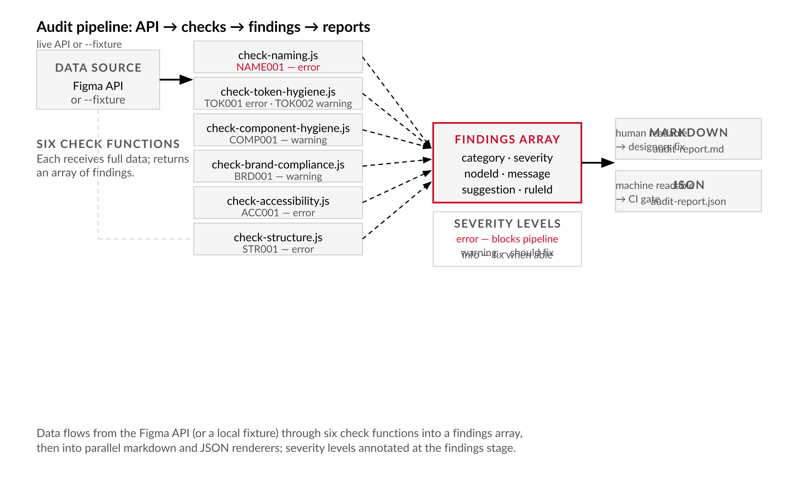
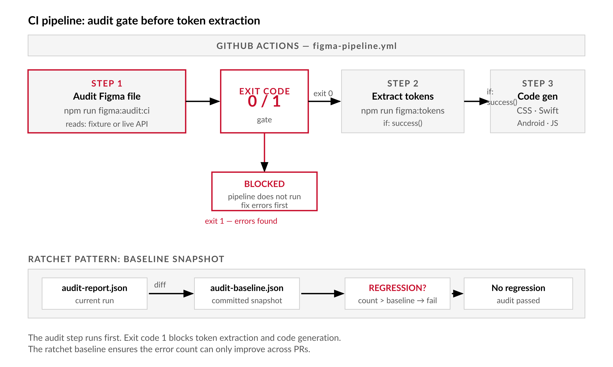

# Chapter 5 — The Figma Audit

*Run this before building anything on top of a file. It tells you exactly what is broken before it becomes a pipeline problem.*

---

The design system team spent three sprints building a token extraction pipeline. It runs cleanly in CI. It generates CSS variables, Swift constants, and Android XML on every merge to main. Then a new engineer points it at the marketing team's Figma file — two years old, three designers, none of whom knew the pipeline was coming. The pipeline runs. No errors. The output CSS has 847 variables. About 200 of them are named `--fill-2`, `--text`, `--color-17`. Forty-three resolve to `undefined` because they alias variables deleted six months ago. Twelve carry hardcoded hex values where references should be. Sixteen text/background pairs fail WCAG contrast minimums, and now that failure is enforced in the codebase.

The pipeline did not break. The file was never ready for the pipeline. Nobody checked.

This is the central problem with building on top of Figma data: the API has no concept of correctness. It returns what is in the file. A variable named `Color 3` comes back as `Color 3`. An alias chain that points to a deleted variable returns whatever the current resolution state happens to be — a fallback, an empty value, a missing key. [verify — current alias resolution behavior for deleted references] The API makes no assertions. The pipeline makes no assertions unless you write them. The file makes no assertions at all. Assertions are your job, and the audit is where you write them down.

---

## What the Audit Is Actually Doing

Before writing any code, it helps to understand the structure of what you are building. The audit has three stages: fetch the file data, apply a rule set to it, and emit findings. Each finding has a category, a severity, a reference to the Figma object that triggered it, and a suggestion for what to do.

The severity levels matter and they are not decorative. An **error** breaks or corrupts the pipeline — an orphaned alias, a naming violation severe enough to produce unparseable output, a structural piece that downstream code depends on and cannot find. These must be fixed before extraction runs. A **warning** deviates from brand or convention but does not stop the pipeline — a missing token description, an undocumented component, an off-brand hardcoded color that bypasses the token system. These should be fixed. **Info** is an improvement opportunity — fix it when bandwidth allows.

The categories cover six kinds of assertion:

**Naming** — do variable, component, style, and layer names conform to the convention from Chapter 4? A variable named `Color 3` fails this check. A variable named `color/palette/blue-500` passes.

**Token hygiene** — are alias chains intact? A semantic token that references a deleted primitive is an orphaned alias. A semantic token with a hardcoded hex value is a bypass of the entire token system. Both are errors.

**Component hygiene** — do components have descriptions? Are they published to the library? Component descriptions become searchable metadata and, critically, MCP context for AI coding agents. Missing them is a warning now and a problem later.

**Brand compliance** — are hardcoded fill values present on nodes that should reference tokens? Any solid fill that carries no `boundVariables` reference has escaped the token system entirely.

**Accessibility** — do text/background pairings meet WCAG contrast minimums? WCAG AA requires 4.5:1 for normal text and 3:1 for large text (18pt or larger, or 14pt bold). [Source: w3.org/WAI/standards-guidelines/wcag/] A design that ships failing contrast is not a design system — it is a liability.

**Structural completeness** — are required pages present? Required variable collections? Export layers named? These are the load-bearing expectations your pipeline has about the file's shape.

| Category | What it checks | Example error | Example warning | Example info |
|---|---|---|---|---|
| Naming | Variable, component, style, and layer names conform to the three-tier convention from Chapter 4 | `Color 3` fails segment pattern and category rules; ruleId NAME001 | Component named `Button hover` uses spaces around the slash — technically parseable but inconsistent | Variable description is empty on a passing name — readable but undocumented |
| Token hygiene | Alias chains intact; no hardcoded values on semantic tokens | Semantic token aliases a deleted variable (orphaned alias); ruleId TOK001 | Semantic token has no description field; ruleId TOK002 | Primitive token description is absent — low priority since primitives are not consumed directly |
| Component hygiene | Components have descriptions; components are published to the library | — | Component has no description field; ruleId COMP001 — missing description degrades searchability and AI agent context | Component description exists but is fewer than ten words — technically present, worth expanding |
| Brand compliance | Solid fill nodes have a `boundVariables` reference; no hardcoded hex values bypassing the token system | — | Node fill is `#0066ff` with no `boundVariables` entry — hardcoded hex bypasses token system; ruleId BRD001 | Fill matches a token value but is not bound to it — likely a copy-paste remnant |
| Accessibility | Text/background pairings meet WCAG contrast minimums: 4.5:1 for normal text, 3:1 for large text | Text `#555555` on `#777777` background — contrast ratio ~1.8:1, well below AA minimum; ruleId ACC001 | Large text (18pt) at 2.8:1 — below the 3:1 large-text threshold | Small text at exactly 4.5:1 — passing, but zero margin for value drift |
| Structural completeness | Required pages, variable collections, and export layer names are present | Variable collection `Brand` missing — pipeline expects it; ruleId STR001 | Export layer `icons/arrow-right` renamed to `icons/arrow-right-v2` — breaks all codebase references | Page `_Archive` present but not excluded from audit — produces noise in findings |

---

## Building `figma-audit.js`

The architecture follows directly from the three-stage model. A main script fetches data and wires together check functions. Each check function receives the full data and returns an array of findings. A renderer emits the findings as both a human-readable markdown report and a machine-readable JSON file.

```
figma-audit.js
├── fetch (GET /v1/files/:key + GET /v1/files/:key/variables/local)
├── checks/
│   ├── check-naming.js
│   ├── check-token-hygiene.js
│   ├── check-component-hygiene.js
│   ├── check-brand-compliance.js
│   ├── check-accessibility.js
│   └── check-structure.js
└── report (markdown + JSON output)
```


*Figure 5.1 — Audit pipeline: API → six checks → findings → reports*

The main script takes either a live API call or a local fixture via `--fixture`. The fixture path is not optional ceremony — it is how you run the audit in CI without hammering the rate limits on every pull request. Updating the fixture is a separate scheduled step; the audit itself runs against the committed fixture on every PR.

```js
// figma-audit.js
// Usage: node figma-audit.js [--fixture=./fixtures/file.json] [--output=./reports/]
// Requires: FIGMA_TOKEN and FIGMA_FILE_KEY in environment, or --fixture for offline mode.
// Illustrative code — error handling and retry logic omitted for clarity.

import { readFileSync, writeFileSync, mkdirSync } from 'fs';
import { checkNaming } from './checks/check-naming.js';
import { checkTokenHygiene } from './checks/check-token-hygiene.js';
import { checkComponentHygiene } from './checks/check-component-hygiene.js';
import { checkBrandCompliance } from './checks/check-brand-compliance.js';
import { checkAccessibility } from './checks/check-accessibility.js';
import { checkStructure } from './checks/check-structure.js';
import { renderMarkdown, renderJSON } from './lib/render.js';

const FIGMA_TOKEN = process.env.FIGMA_TOKEN;
const FIGMA_FILE_KEY = process.env.FIGMA_FILE_KEY;

const args = process.argv.slice(2);
const fixtureArg = args.find(a => a.startsWith('--fixture='))?.split('=')[1];
const outputDir = args.find(a => a.startsWith('--output='))?.split('=')[1] ?? './reports';

async function fetchData() {
  if (fixtureArg) {
    return JSON.parse(readFileSync(fixtureArg, 'utf8'));
  }
  if (!FIGMA_TOKEN || !FIGMA_FILE_KEY) {
    console.error('Set FIGMA_TOKEN and FIGMA_FILE_KEY, or pass --fixture=<path>');
    process.exit(1);
  }
  // GET /v1/files/:key [verify — endpoint current as of writing]
  const fileRes = await fetch(
    `https://api.figma.com/v1/files/${FIGMA_FILE_KEY}?depth=3`,
    { headers: { 'X-Figma-Token': FIGMA_TOKEN } }
  );
  if (!fileRes.ok) {
    console.error(`API error: ${fileRes.status} ${fileRes.statusText}`);
    process.exit(1);
  }
  const fileData = await fileRes.json();

  // GET /v1/files/:key/variables/local [verify — requires Enterprise plan]
  const varsRes = await fetch(
    `https://api.figma.com/v1/files/${FIGMA_FILE_KEY}/variables/local`,
    { headers: { 'X-Figma-Token': FIGMA_TOKEN } }
  );
  const varsData = varsRes.ok
    ? await varsRes.json()
    : { meta: { variables: {}, variableCollections: {} } };

  return { file: fileData, variables: varsData };
}

async function main() {
  const data = await fetchData();

  const findings = [
    ...checkNaming(data),
    ...checkTokenHygiene(data),
    ...checkComponentHygiene(data),
    ...checkBrandCompliance(data),
    ...checkAccessibility(data),
    ...checkStructure(data),
  ];

  mkdirSync(outputDir, { recursive: true });

  writeFileSync(`${outputDir}/audit-report.md`, renderMarkdown(findings, data));
  writeFileSync(`${outputDir}/audit-report.json`, renderJSON(findings));

  const errors   = findings.filter(f => f.severity === 'error').length;
  const warnings = findings.filter(f => f.severity === 'warning').length;
  const infos    = findings.filter(f => f.severity === 'info').length;

  console.log(`\nAudit complete: ${errors} errors · ${warnings} warnings · ${infos} info`);
  console.log(`Reports written to ${outputDir}/`);

  if (errors > 0) {
    console.error('\nErrors found. Fix before running any pipeline.');
    process.exit(1);
  }
}

main();
```

Every finding has a consistent shape. The `ruleId` is the most important field for CI purposes — it is stable across runs and allows the baseline diffing tool to track whether a specific rule's count is improving or regressing.

```ts
// Finding shape (TypeScript interface for documentation — audit code uses plain JS)
interface Finding {
  category:    'naming' | 'token-hygiene' | 'component-hygiene' | 'brand-compliance' | 'accessibility' | 'structure';
  severity:    'error' | 'warning' | 'info';
  nodeId?:     string;   // Figma node ID for deep linking
  nodeName?:   string;   // Human-readable name
  page?:       string;   // Page name where the node lives
  message:     string;   // Human-readable finding
  suggestion?: string;   // Suggested remediation
  ruleId:      string;   // Stable rule identifier for CI baseline
}
```

The six check functions follow the same contract: receive the full data object, return an array of findings. Here is what the three most consequential checks actually do.

**Naming:**

```js
// checks/check-naming.js
import { validateTokenName } from '../lib/validate-name.js';

export function checkNaming({ variables }) {
  const findings = [];
  const allVars = Object.values(variables?.meta?.variables ?? {});

  for (const v of allVars) {
    const result = validateTokenName(v.name);
    if (!result.valid) {
      for (const error of result.errors) {
        findings.push({
          category: 'naming',
          severity: 'error',
          nodeId: v.id,
          nodeName: v.name,
          message: error,
          suggestion: 'Rename to match convention: category/subcategory/name (lowercase, hyphens only).',
          ruleId: 'NAME001',
        });
      }
    }
  }

  return findings;
}
```

**Token hygiene** — the check that catches the orphaned aliases and missing descriptions:

```js
// checks/check-token-hygiene.js
export function checkTokenHygiene({ variables }) {
  const findings = [];
  const allVars = variables?.meta?.variables ?? {};
  const varIds = new Set(Object.keys(allVars));

  for (const [id, v] of Object.entries(allVars)) {
    for (const [, value] of Object.entries(v.valuesByMode ?? {})) {
      if (value?.type === 'VARIABLE_ALIAS' && !varIds.has(value.id)) {
        findings.push({
          category: 'token-hygiene',
          severity: 'error',
          nodeId: id,
          nodeName: v.name,
          message: `Alias references deleted variable ID "${value.id}".`,
          suggestion: 'Update alias to a valid variable or set a direct value.',
          ruleId: 'TOK001',
        });
      }
    }

    const isPrimitive = v.name.includes('/palette/') || v.name.includes('/scale/');
    if (!isPrimitive && !v.description) {
      findings.push({
        category: 'token-hygiene',
        severity: 'warning',
        nodeId: id,
        nodeName: v.name,
        message: 'Semantic token has no description.',
        suggestion: 'Add a description explaining the role of this token.',
        ruleId: 'TOK002',
      });
    }
  }

  return findings;
}
```

**Component hygiene** — the check that ensures your components are documented:

```js
// checks/check-component-hygiene.js
export function checkComponentHygiene({ file }) {
  const findings = [];
  const components = file?.components ?? {};

  for (const [id, comp] of Object.entries(components)) {
    if (!comp.description) {
      findings.push({
        category: 'component-hygiene',
        severity: 'warning',
        nodeId: id,
        nodeName: comp.name,
        message: 'Component has no description field.',
        suggestion: 'Add a description in Figma. It becomes searchable metadata and MCP context.',
        ruleId: 'COMP001',
      });
    }
  }

  return findings;
}
```

The accessibility and brand compliance checks require walking the full node tree — accessibility needs foreground and background color pairs resolved through alias chains, brand compliance needs every solid fill inspected for a missing `boundVariables` reference. [verify — `boundVariables` shape in current API response] Both are computationally expensive. On large files, scope them to specific pages or run them on a schedule rather than on every PR.

---

## The Report

The report serves two audiences simultaneously: a human reading a markdown file in a browser or Slack, and a machine parsing JSON in CI. Both outputs are written on every run.

The markdown report exists so a designer can open it, find the specific node, click the deep link into Figma, and fix the problem. The JSON report exists so CI can count errors, run the diff against the baseline, and decide whether to block the build. The `nodeId` fields in the JSON generate deep links to the exact object in the file at `https://figma.com/file/:key?node-id=:nodeId`. [verify — deep link URL format current as of writing]

```json
{
  "meta": {
    "fileKey": "abc123",
    "fileName": "My Design System",
    "auditDate": "2026-06-01T14:22:00Z",
    "counts": { "error": 12, "warning": 34, "info": 8 }
  },
  "findings": [
    {
      "category": "naming",
      "severity": "error",
      "nodeId": "4:12",
      "nodeName": "Color 3",
      "page": "Foundations",
      "message": "Unknown category \"color 3\".",
      "suggestion": "Rename to match convention.",
      "ruleId": "NAME001"
    }
  ]
}
```

---

## The Ratchet: Baselines and CI

There is a name for the discipline this audit enforces: it comes from database refactoring tools like Flyway and Liquibase, which established the idea that schema changes must be forward-only, tracked in a version log, and applied idempotently. The audit baseline is the same concept applied to design quality. You commit where you are. You can only improve. Regressions are visible immediately.

On day one, a large legacy file may have hundreds of warnings. You cannot block CI on all of them — you would never merge anything. Snapshot the current finding counts, commit them as `audit-baseline.json`, and only fail on regressions from that point forward. The diff script implements this:

```js
// scripts/audit-diff.js
// Compare current audit-report.json against the committed baseline.
// Fail if new errors appeared. Report new warnings. Ignore improvements.

import { readFileSync } from 'fs';

const current  = JSON.parse(readFileSync('./reports/audit-report.json', 'utf8'));
const baseline = JSON.parse(readFileSync('./reports/audit-baseline.json', 'utf8'));

const count = (findings) => findings.reduce((acc, f) => {
  acc[f.ruleId] = (acc[f.ruleId] ?? 0) + 1;
  return acc;
}, {});

const currentByRule  = count(current.findings);
const baselineByRule = count(baseline.findings);

let regressions = 0;
for (const [ruleId, n] of Object.entries(currentByRule)) {
  const base = baselineByRule[ruleId] ?? 0;
  if (n > base) {
    console.error(`REGRESSION: ${ruleId} went from ${base} to ${n} findings.`);
    regressions++;
  }
}

if (regressions > 0) process.exit(1);
console.log('No regressions. Audit passed baseline check.');
```

The CI wiring enforces the rename-before-building discipline explicitly. The audit runs first. If it fails, the pipeline does not run. This is not a suggestion — it is an architectural constraint enforced by exit codes:

```yaml
# .github/workflows/figma-pipeline.yml (excerpt)
steps:
  - name: Audit Figma file
    run: npm run figma:audit:ci
    env:
      FIGMA_TOKEN: ${{ secrets.FIGMA_TOKEN }}
      FIGMA_FILE_KEY: ${{ secrets.FIGMA_FILE_KEY }}

  - name: Extract tokens (only if audit passes)
    if: success()
    run: npm run figma:tokens
```


*Figure 5.2 — CI pipeline: audit gate before token extraction*

When a warning deserves promotion to error — because accessibility compliance is now non-negotiable, because the variable migration is complete and hardcoded colors have no excuse left — update a severity override in the audit config rather than modifying the check function itself. This keeps the rule logic stable while the team's tolerance changes:

```js
// audit.config.js
export const SEVERITY_OVERRIDES = {
  'ACC001': 'error',   // Contrast failure is always blocking
  'COMP001': 'info',   // Missing descriptions are improvement opportunities for now
};
```

---

## What the Audit Cannot Catch

The audit validates structure. It cannot validate intent. A variable named `color/brand/primary` that actually holds a secondary color passes every naming check. The audit did its job. The designer made a mistake. These are different problems and only one of them is machine-checkable.

Accessibility beyond static contrast is not expressible in static Figma data. Hover states, focus rings, animation timing, motion sensitivity, keyboard navigation, focus management — none of this exists in the REST API response. The contrast check is the beginning of accessibility work, not the end of it.

Variable modes in context are partially checkable but not fully. The audit can verify that dark-mode values exist and that they are valid alias references. It cannot verify that the dark-mode color is the right dark-mode color — that requires design judgment applied by a human.

Prototype and interaction data does not appear in the REST API at all. Accessibility concerns related to interactive behavior are outside the audit's reach entirely.

False positives are predictable. Work-in-progress components that are intentionally not published will trigger component hygiene warnings. Suppress them by prefixing their names with `_WIP/` — the check skips nodes whose names start with `_`. Primitive tokens without descriptions will trigger the token hygiene description check. Either add descriptions to primitives or exclude the primitive tier from the description check; document which you chose so future engineers understand the decision.

| Concern | Checkable by audit | Why / why not |
|---|---|---|
| Variable naming violations | Yes | Name string is present in the API response; `validateTokenName()` applies deterministic rules against it |
| Orphaned alias references | Yes | The alias `id` is in the response; the variable ID set can be built and diffed to find missing targets |
| Static text/background contrast | Yes (single-frame pairs) | WCAG contrast ratio is a mathematical formula applied to two resolved color values |
| Semantic correctness of a name | No | The audit sees the string `color/brand/primary` — it cannot know whether that token actually serves the primary brand role or was mislabeled at creation |
| Designer intent vs. genuine violation | No | A WIP component and a published component with a missing description produce identical findings; only a human looking at the canvas can distinguish them |
| Prototype behavior and interactions | No | Prototype data does not appear in the REST API response at all |
| Hover/focus/animation accessibility | No | Interactive states are defined in prototype transitions and component logic, not in the static variable and node model |
| Dark-mode color correctness | Partial | The audit can verify that a dark-mode value exists and is a valid alias; it cannot verify that the dark-mode color is the right dark-mode color |
| Cross-file alias resolution | No | The REST API returns a single file's variable data; aliases from other library consumer files are not included in the response |
| Variable mode correctness | Partial | The audit can verify that mode values exist and are structurally valid; whether the mode value is semantically correct requires design judgment |

---

## Linters and the Automated Quality Gate

The Figma audit is structurally identical to a code linter, and that is not a coincidence — it is the application of forty years of automated quality gate thinking to a new artifact type.

JSLint appeared in 2002. ESLint followed in 2013. Both made the same argument: code quality is checkable by machine, and the machine should check it before a human wastes time on review. Severity levels, stable rule IDs, exit codes that stop CI, baseline snapshots that let a team adopt a linter without being immediately blocked by existing violations, configuration files that version-control the rules alongside the code they check — all of these conventions were established by the linter tradition and inherited directly by the audit.

Accessibility scanners — axe, Lighthouse — applied the same pattern to rendered HTML: scan, categorize findings by WCAG criterion, produce structured JSON, fail CI on errors. The leap from accessibility scanner to Figma audit is conceptually small. The API surface is different, the rule set is different, but the architecture is identical.

The fact that this infrastructure did not exist as standard practice before design-to-code pipelines became necessary explains a great deal about why so many pipelines fail silently. The technology to build it was always present. The motivation arrived when the output of a Figma file started mattering to a compiler.

---

## What Comes Next

Chapter 6 builds `figma-fix-plugin/` — the Plugin API complement to the audit. The audit identifies what is broken. The fix plugin repairs it in bulk from inside Figma: renaming naming violations, resolving orphaned aliases, adding missing descriptions to components. The audit's JSON output is the fix plugin's input. The two tools are designed to be used together.

You have a report. Now let's fix what it found.

---

## LLM Exercises

**Exercise 1 — Generate and examine**

Paste the `checkTokenHygiene` function into a conversation with an LLM. Ask it to explain, step by step, what the function checks and what its two failure modes are. Then ask: what is one category of token hygiene problem this function cannot detect? Examine the answer critically — is the gap real, or has the model invented a limitation?

**Exercise 2 — Apply to known context**

Describe your team's Figma file structure to an LLM: how many variable collections, whether you use modes, which plan tier your organization is on. Ask it which of the six audit categories is most likely to produce errors on first run, and why. Compare its reasoning to your own expectation. Run the audit. See who was right.

**Exercise 3 — Stress-test a specific claim**

The chapter claims that naming violations should be errors, not warnings, because unparseable names can corrupt pipeline output. Ask an LLM to argue the opposite position: that naming violations should always be warnings and never block the pipeline. Evaluate whether the argument it makes is valid, partially valid, or wrong. What would have to be true about your pipeline for the warning-only approach to be acceptable?

**Exercise 4 — Draft or audit a professional deliverable**

You have 200 warnings after the first audit run. Write a short briefing document (one page) for a design director who needs to understand: what the audit found, why warnings exist at warning severity rather than error, what the remediation plan is, and how long it will take. Ask an LLM to draft this document. Then audit the draft: does it accurately represent what warnings mean? Does it give the design director enough information to make a decision, or does it obscure the severity?

---

## Chapter 5 Exercises: The Figma Audit
**Project:** figma-tools — Your Design System Extraction Toolkit
**This chapter adds:** `figma-audit.js` — a severity-classified, six-category audit script with CI exit codes and baseline snapshot diffing via `scripts/audit-diff.js`.

---

### Exercise 1 — When to Use AI

`figma-audit.js` produces structured JSON. AI is well-suited to tasks that work from that output rather than generating the audit itself.

**Task 1: Explaining audit output to stakeholders.** Paste the `audit-report.json` findings array (or a sample of it) and ask an AI to produce a one-page briefing for a design director: total counts by severity, the three most consequential findings with plain-English explanations, and a proposed remediation priority order. The reasoning is contained in the data; AI handles the translation to stakeholder register.

*Why AI works here:* Structured-data summarization. The findings have consistent shape. AI can group, rank, and restate them in natural language without inventing anything, provided the input data is accurate.

**Task 2: Drafting a new check function.** Describe a category of problem your file has that none of the six built-in checks cover — for example, detecting components without a variant named "Default," or flagging variable collections that have only one mode when two are required. Ask an AI to draft the check function following the shape of `checkComponentHygiene`. Review it against the function contract: does it receive `{ file, variables }`, return an array of findings, and use consistent `ruleId` values?

*Why AI works here:* Structural pattern completion. The check function contract is unambiguous. AI can implement a new check that follows it, given a clear description of the rule. You review the logic.

**Task 3: Generating audit-diff test cases.** The `audit-diff.js` script compares current findings to a baseline. Ask an AI to generate three fabricated `audit-report.json` / `audit-baseline.json` pairs — one regression (current has more errors than baseline), one improvement, one lateral (same count, different ruleId). Use these as test fixtures to verify your diff script behavior without needing a real Figma file.

*Why AI works here:* Test data generation. The JSON schema is fully specified. AI can produce structurally valid test data quickly.

**The tell:** Run your check function draft against a real fixture. If it produces findings, verify two of them manually — open the Figma file and confirm the flagged node actually has the problem the function identified. If the function produces no findings on a file you know has the problem, the logic is wrong. AI-generated check functions frequently handle null cases incorrectly; test the empty-collection case explicitly.

---

### Exercise 2 — When NOT to Use AI

The audit validates structure. Human review validates intent. Several categories of audit decision are not machine-delegatable.

**Task 1: Classifying a finding as designer intent vs. genuine violation.** The audit's `checkBrandCompliance` function flags solid fills without `boundVariables` references. But work-in-progress components, placeholder frames, and intentional one-off exceptions all produce the same finding. Deciding which of the 47 flagged nodes is a real token-bypass and which is an intentional WIP requires looking at the node in context. AI cannot do this — it only sees the finding, not the intent.

*Why AI fails here:* Context collapse. The finding and the intentional exception have identical structure. Only a human looking at the design can tell the difference.

**Task 2: Deciding severity thresholds for your team's CI gate.** This chapter shows how to promote a warning to an error via `SEVERITY_OVERRIDES`. Deciding which warnings to promote requires knowing your team's tolerance for blocking PRs, the current state of the backlog, and the release schedule. AI can explain what the options are; it cannot make the call about what your team can absorb.

*Why AI fails here:* Organizational judgment. The technical mechanism is simple. The right answer depends on team context that has no API.

**Task 3: Reviewing the baseline before committing it.** On day one, a legacy file may have 200 warnings. Committing them all to `audit-baseline.json` means the ratchet starts there. Before committing the baseline, a human needs to review whether any of the 200 warnings should actually be errors, and whether any findings are false positives that should be suppressed rather than baselined. AI will help draft the baseline JSON; it should not decide which findings to include.

*Why AI fails here:* Audit blind spots. AI cannot determine which findings reflect designer intent rather than genuine violations. It will base-line false positives without flagging them as such.

**The tell:** If your baseline contains findings you cannot explain in one sentence — you do not know why the node triggered the rule or whether it is a real problem — do not commit it yet. A baseline you do not understand is a ratchet set at an arbitrary point.

**Series connection:** This exercise sits at Tier 4 metacognitive — knowing the limits of the audit itself. The critical risk is not that the audit catches too little, but that teams treat its output as authoritative and miss the cases where a "passing" node has a real problem (false negative) or a "failing" node is intentional design (false positive). Both categories require human review; neither is machine-delegatable.

---

### Exercise 3 — LLM Exercise

**What you're building:** A stakeholder briefing document derived from your `audit-report.json` output, ready to send to a design director or engineering lead.

**Tool:** Claude (single conversation). The task is structured-data summarization and prose generation — no persistent context required. Claude's ability to reason about severity hierarchies and produce calibrated, non-alarmist summaries makes it a good fit over a generic summarizer.

**The Prompt:**

```
I'm building figma-tools, a CLI design system extraction toolkit, following "The Figma API: From Canvas to Production."

I've just run figma-audit.js against my Figma file and produced the following audit findings. I need a one-page briefing document for my design director and engineering lead.

Here is the audit summary:
[PASTE the "meta.counts" block from your audit-report.json here, e.g.:]
{
  "counts": { "error": 12, "warning": 47, "info": 8 }
}

Here are the top findings by severity (paste up to 10 findings from the "findings" array, covering at least one error, one warning, one info):
[PASTE FINDINGS HERE]

The audit has six categories: naming, token-hygiene, component-hygiene, brand-compliance, accessibility, structure.

Errors block the pipeline — they must be fixed before token extraction can run.
Warnings deviate from convention but do not stop the pipeline.
Info are improvement opportunities.

Write a one-page briefing document with:
1. A two-sentence executive summary (what the audit found and what it means for the next release).
2. A table: Category | Error count | Warning count | Most critical finding in this category.
3. A prioritized remediation plan: which errors to fix first and why, which warnings can wait.
4. One paragraph explaining what the audit cannot check (designer intent, accessibility beyond contrast, prototype behavior) so stakeholders understand the audit's limits.
5. A recommended next step for this week.

Do not invent finding counts or categories not present in the data I provided.
```

**What this produces:** A one-page briefing you can paste into Notion or a Slack message, with an accurate error/warning breakdown, a defensible priority order, and a clear statement of what the audit does not cover.

**How to adapt this prompt:**
- *Own project:* Replace the bracketed sections with your actual `audit-report.json` content. Run `jq '.meta.counts, (.findings | sort_by(.severity) | .[0:10])' reports/audit-report.json` to extract what you need.
- *ChatGPT or Gemini:* The prompt works as written. Gemini tends to produce well-structured tables; ChatGPT produces slightly more verbose prose. Either is usable.
- *Claude Project:* Add your `audit.config.js` to the project context so Claude knows your current severity overrides when explaining why certain findings are at warning rather than error.

**Connection to previous chapters:** The findings this prompt reads come from `figma-audit.js` (this chapter), which in turn reads the fixture written by `figma-read.mjs` (Chapter 3) and validates names against the contract from Chapter 4. The briefing document closes the loop: audit data → stakeholder communication → design team action.

**Preview of next chapter:** Chapter 6 builds `figma-fix-plugin/`, which takes the `audit-report.json` as input and presents approved fixes for human review. The briefing document from this exercise is preparation for that conversation — it establishes which errors the plugin will be asked to address and which require manual design work.

---

### Exercise 4 — CLI Exercise

**What you're building:** `figma-audit.js` and `scripts/audit-diff.js` wired into your figma-tools project, running against your committed fixture and exiting 1 on regressions.

**Tool:** Claude Code

**Skill level:** Intermediate — you are wiring together multiple files that must share the `Finding` shape; Claude Code will scaffold them, but you need to verify the function contracts.

**Setup:**
- [ ] `fixtures/variables.json` exists (from `figma-read.mjs`, Chapter 3)
- [ ] `lib/validate-name.js` exists (from Chapter 4 Exercise 4)
- [ ] `naming.config.js` exists (from Chapter 4 Exercise 4)
- [ ] `package.json` has a scripts section

**The Task:**

```
Read the following files to understand the existing project structure:
- package.json
- lib/validate-name.js
- naming.config.js
- fixtures/variables.json (first 5 entries of meta.variables only)

Do NOT read or modify chapter files, research files, or planning documents.
Do NOT modify lib/validate-name.js or naming.config.js.

Then scaffold the following files:

1. lib/render.js — exports renderMarkdown(findings, data) and renderJSON(findings).
   renderMarkdown: produces a markdown string grouped by severity (errors first), each finding as a bullet with nodeName, message, and suggestion.
   renderJSON: produces a JSON string matching this shape exactly:
   { "meta": { "auditDate": "<ISO string>", "counts": { "error": N, "warning": N, "info": N } }, "findings": [...] }

2. checks/check-naming.js — imports validateTokenName from lib/validate-name.js, returns NAME001 findings for every variable that fails validation. Follow the Finding shape: { category, severity, nodeId, nodeName, message, suggestion, ruleId }.

3. checks/check-token-hygiene.js — checks for orphaned aliases (TOK001, error) and missing descriptions on non-primitive variables (TOK002, warning). Primitives are identified by names containing '/palette/' or '/scale/'.

4. checks/check-component-hygiene.js — checks for components without descriptions (COMP001, warning). Skip components whose names start with '_WIP/'.

5. figma-audit.js — main entry point. Accepts --fixture=<path> and --output=<dir> flags. Runs all check functions from steps 2-4 (skip brand-compliance, accessibility, structure for now — stub them as empty arrays). Writes audit-report.md and audit-report.json to the output dir. Exits process.exit(1) if error count > 0.

6. scripts/audit-diff.js — reads reports/audit-report.json and reports/audit-baseline.json. Fails if any ruleId count is higher in current than baseline.

7. Add to package.json scripts:
   "figma:audit": "node figma-audit.js --fixture=./fixtures/variables.json --output=./reports"
   "figma:audit:baseline": "cp reports/audit-report.json reports/audit-baseline.json"
   "figma:audit:diff": "node scripts/audit-diff.js"
   "figma:audit:ci": "npm run figma:audit && npm run figma:audit:diff"

Stop after these steps. Do not create any other files.

Verification step: Run `npm run figma:audit` and show me the last 5 lines of output and the first 3 entries of reports/audit-report.json.
```

**Expected output:** `reports/audit-report.json` with a valid `meta.counts` block and at least some findings if your fixture has naming violations or missing descriptions. If counts are all zero, verify that `fixtures/variables.json` has a `meta.variables` key and that variables have `name` and `description` fields.

**What to inspect:** Open `reports/audit-report.md` and verify that at least one finding shows the correct `suggestion` field. If suggestions are missing, check that `checks/check-naming.js` is populating the `suggestion` field in its findings.

**If it goes wrong:** If `figma-audit.js` crashes with "Cannot find module," verify that the imports in the main file match the exact file paths created (case-sensitive on Linux). If the diff script crashes because `audit-baseline.json` does not exist, run `npm run figma:audit:baseline` first.

**CLAUDE.md / AGENTS.md note:** Add to your project CLAUDE.md:

```
## figma-tools: Audit Pipeline
figma-audit.js reads from fixtures/, writes to reports/.
Never modify reports/audit-baseline.json directly — only update it via
`npm run figma:audit:baseline` after a deliberate, reviewed reduction in findings.
The baseline is a team contract; changing it requires explicit sign-off.
```

---

### Exercise 5 — AI Validation Exercise

**What you're validating:** The `audit-report.json` produced by `figma-audit.js` in Exercise 4, plus one of the check functions Claude Code generated.

**Validation type:** Output correctness + logic review — verifying that the audit finds real problems, does not flag false positives, and that the check function logic matches the chapter's specification.

**Risk level:** Medium-high. The most dangerous failure in audit tooling is confident-sounding output that misses real problems or flags intentional design as violations. Both failures undermine trust in the audit and cause teams to either over-fix or dismiss the tool.

**Setup:** Use the `reports/audit-report.json` from Exercise 4 and the `checks/check-token-hygiene.js` file Claude Code generated.

**The Validation Task:**

```
Checklist — apply each criterion to your audit output and generated check function:

CORRECTNESS
[ ] Open your Figma file and find the node referenced in one ERROR finding (use the nodeId to build the deep link: figma.com/file/<your-key>?node-id=<nodeId>). Confirm the error is real — the node actually has the problem the finding describes.
[ ] Pick one WARNING finding. Confirm it is a genuine deviation, not an intentional exception. If it is intentional (e.g., a WIP component), note it as a false positive.
[ ] Verify the audit-report.json "counts" block matches the actual number of findings in the "findings" array. Count them manually for errors.

COMPLETENESS
[ ] The output contains findings from at least the naming and token-hygiene categories. If both are empty on a real file, something is wrong with the check functions.
[ ] The meta block includes an auditDate field with an ISO timestamp.

SCOPE
[ ] figma-audit.js wrote only to the reports/ directory. No other files were modified or created.
[ ] The fixture file (fixtures/variables.json) is unchanged — check its modification timestamp.

CHAPTER-SPECIFIC: SEVERITY ACCURACY
[ ] Every orphaned alias (TOK001) is classified as "error," not "warning." An orphaned alias breaks the pipeline — it must be an error.
[ ] Every missing description (TOK002) is classified as "warning," not "error." Missing descriptions degrade quality but do not break the pipeline.

CHAPTER-SPECIFIC: PRIMITIVE EXCLUSION
[ ] Open check-token-hygiene.js. Find the line that determines whether a variable is a primitive (by checking for '/palette/' or '/scale/' in the name). Add one test: does your fixture contain any primitive-tier variables? If so, confirm they are NOT flagged for missing descriptions.
[ ] If your fixture has variables that are clearly primitive-tier but use a different subcategory name (e.g., '/base/' instead of '/palette/'), they will be incorrectly flagged for TOK002. Note this as a false positive that requires adjusting the primitive detection logic.

FAILURE-MODE CHECK
[ ] "Fluent but wrong" check: look at the check-token-hygiene.js logic for primitive detection. The current implementation uses a name-pattern heuristic ('/palette/' or '/scale/'). Is there a variable in your fixture that is semantically a primitive but whose name does not match this pattern? If so, it will be flagged as a TOK002 false positive — AI calling designer intent a violation.
[ ] False negative check: does your fixture contain any semantic token with a hardcoded hex value (not a VARIABLE_ALIAS reference) that the token-hygiene check did NOT flag? The current check-token-hygiene.js scaffolded by Claude Code may not implement the hardcoded-value check if that rule was not included in the prompt. Confirm whether it is present.

What to do with your findings:
- Any true false positive (intentional design flagged as a violation) = add a suppression pattern to check-component-hygiene.js (like the _WIP/ prefix) or file an issue in your project notes.
- Any false negative (real problem not caught) = add a new rule or extend the check function.
- If TOK001 errors are absent but your fixture has aliased variables, confirm the alias structure in the fixture is `{ type: 'VARIABLE_ALIAS', id: '<id>' }` — a different shape will cause the orphan check to miss them.

AI Use Disclosure (mandatory — copy this into your project log):
"Exercise 4 used Claude Code to scaffold figma-audit.js and its check functions. Exercise 5 used a manual checklist to verify the output. I confirmed [N] findings against the actual Figma file and identified [N] false positives and [N] false negatives requiring correction."

Series connection: The false-positive / false-negative failure mode is the defining Tier 4 metacognitive risk for audit tooling. An audit that cries wolf (false positives) trains designers to dismiss it; an audit that passes real problems (false negatives) creates false confidence. Both failures are worse than no audit. This risk reappears in Chapter 6 as the approval-gate fatigue problem — a designer approving 89 changes in bulk is more likely to accept a false-positive fix without noticing.
```

---

## Prompts

*Load NEU/CLAUDE.md and NEU/DESIGN.md before generating any figure from this section.*

### Figure 5.1 — Audit pipeline: API through six checks to reports

Left-to-right flow diagram with a fan-in and fan-out structure. Left: a single "Data Source" box (Figma API or --fixture). Center: six stacked check function boxes labeled check-naming.js, check-token-hygiene.js, check-component-hygiene.js, check-brand-compliance.js, check-accessibility.js, check-structure.js — each with its ruleId and severity in #C8102E for errors or #555555 for warnings. Dashed #CCCCCC/0.75 arrows fan from the data source to each check and from each check into a central "Findings Array" box bordered in #C8102E/1.5 with fields category · severity · nodeId · message · suggestion · ruleId. A severity legend box below findings shows error / warning / info in their respective colors. Arrows from findings fan right to two output boxes: MARKDOWN (audit-report.md, human readable) and JSON (audit-report.json, CI gate). All boxes fill #F5F5F5 except findings (#FFFFFF with red border). viewBox 700×420. Deliverable: single HTML, inline CSS, D3 v7 CDN, responsive, dark mode, ARIA role="img", tooltip on hover showing each check's full description.

> Reference implementation: `../d3/05-the-figma-audit-fig-01.html`

### Figure 5.2 — CI pipeline: audit gate before token extraction

Horizontal pipeline with a downward blocked-path branch. Four boxes left to right: Step 1 (Audit Figma file, red border #C8102E/1.5) → Gate (Exit code 0/1, red border) → Step 2 (Extract tokens, normal border, if: success()) → Step 3 (Code gen, normal border, CSS · Swift · Android · JS). A downward arrow in #C8102E from the Gate box leads to a "PIPELINE BLOCKED" box (white fill, red border) labeled "Fix naming / token errors first." Label "exit 1 — errors found" on the downward arrow. A second row below shows the ratchet baseline pattern: four boxes connected with arrows — audit-report.json (current) → audit-baseline.json (committed) → Regression? (red) → No regression. All step boxes fill #F5F5F5; blocked and gate boxes fill #FFFFFF with red border; normal boxes border #CCCCCC/0.75. viewBox 700×420. Deliverable: single HTML, inline CSS, D3 v7 CDN, responsive, dark mode, ARIA, tooltip on each step.

> Reference implementation: `../d3/05-the-figma-audit-fig-02.html`
