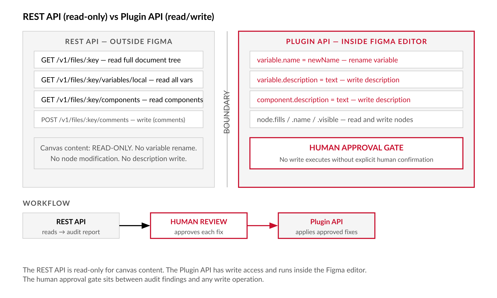

# Chapter 6 — Fixing the File with the Plugin API

*The audit tells you what is wrong. The plugin is the only tool that can fix it — and why the human in the loop is not optional.*

---

Forty-five minutes. Eleven variables. Your wrist is starting to complain, and the audit report has 247 items on it.

This is not a time-management problem. It is an architectural one. The Figma REST API — the same API that produced the audit report in Chapter 5 — is read-only for canvas content. You can read every node, every variable, every component description. You cannot change any of them through REST. Write access to the canvas belongs exclusively to the Plugin API: the JavaScript environment that runs inside the Figma editor itself.

That boundary is intentional. Understanding why it exists is the first thing this chapter has to explain, because the design of the fix tool follows directly from it.


*Figure 6.1 — REST API (read-only) vs Plugin API (read/write): where the human approval gate sits*

---

## Why REST Can Read but Not Write

The Figma REST API is a query interface. It answers questions about a file's current state. The Plugin API is the editor interface — it operates on the file with the full authority of the editor itself, meaning changes appear immediately on the canvas and propagate to every other editor in the file via Figma's multiplayer sync. [verify — current REST API write capabilities; as of writing, write operations via REST are limited to comments and a small number of specific endpoints]

Figma drew this line deliberately. When a script modifies a file through the REST API, nothing about the execution context ensures a human is present or paying attention. When a plugin runs inside the Figma editor, the editor is open, the file is visible, and a human made a deliberate choice to run the plugin. Writes belong in the context where the consequences are visible.

This reasoning has a practical implication that the plugin in this chapter takes seriously: Figma does not provide batch undo for plugin operations. You can Ctrl+Z individual operations after a plugin run, but if a plugin renames 247 variables in a loop, you cannot reverse that as a unit. The only safe pattern is: preview every proposed change, require explicit human approval, then apply.

The dangerous word in "apply all" is "all." This chapter builds a plugin that treats it with the caution it deserves.

---

## The Plugin API Runtime

The Plugin API runs in a QuickJS WebAssembly sandbox inside the Figma desktop application. [verify — current runtime; Figma has used different sandboxes at different points in its history] The desktop app is required — the plugin sandbox is not available in the browser editor.

What this sandbox can do: read and write node properties (`name`, `fills`, `strokes`, `opacity`, `visible`, `locked`, `effects`, layout constraints); read and write variable names, descriptions, values, and collection structure; read and write component descriptions; traverse the full document tree; create, delete, and move nodes. [verify — full writable property list and variable write support in current Plugin API release]

What this sandbox cannot do: access browser APIs directly. There is no `fetch`, no `localStorage`, no DOM. The sandbox can only access the Figma document model through `figma.*`.

This creates the two-process model that every non-trivial Figma plugin uses. Plugin code splits into two environments that communicate via `postMessage`:

```
Plugin Sandbox (figma.*)          Plugin UI (iframe)
        │                                │
        │  figma.ui.postMessage() ────► │  (browser APIs available here)
        │                                │
        │ ◄──── parent.postMessage()     │
```

The sandbox has `figma.*`. The UI iframe has the browser. If the plugin needs to load external data — like the audit JSON from Chapter 5 — it fetches that data in the UI iframe and posts it to the sandbox. The sandbox applies the changes and posts results back to the UI for display.


*Figure 6.2 — Two-process plugin architecture: sandbox and UI iframe with postMessage channel*

This split is not a quirk to work around. It is the plugin model. The approach taken here is to do everything we can in the UI iframe — loading and parsing the audit JSON, generating fix proposals, rendering the preview, managing approval state — and to send only the final approved change list to the sandbox for execution.

---

## The Staged Workflow

The fix plugin follows a strict three-phase sequence. No write happens until Phase 3, and Phase 3 requires explicit human confirmation.

**Phase 1 — Load:** The user pastes the `audit-report.json` produced by `figma-audit.js`. The UI parses it and generates fix proposals for every finding that can be automatically addressed. Findings that require design judgment are excluded — flagged for manual review, not proposed for automation.

**Phase 2 — Preview:** Every proposed fix is displayed with its current value, its proposed new value, and its rule ID and severity from the audit. The user can approve or reject each fix individually. Nothing changes in the Figma file during this phase.

**Phase 3 — Apply:** The user clicks "Apply Approved Changes." A confirmation dialog appears showing the count. After confirmation, only the approved fixes are sent to the sandbox for execution. Results — successes and failures — are reported back to the UI.

Phase 2 is not a courtesy. It is where the human exercises judgment that the tool cannot substitute for. A variable named `Color 4` needs a human to determine that it should become `color/primitive/blue-500` rather than `color/palette/brand-primary` — those are different semantic claims, and the naming convention rules alone cannot make the distinction. Phase 2 is where that decision happens.

---

## `figma-fix-plugin/`

The named artifact for this chapter is a plugin directory, not a Node.js script. It runs inside the Figma editor.

```
figma-fix-plugin/
├── manifest.json
├── code.js
├── ui.html
└── README.md
```

### manifest.json

```json
{
  "name": "Figma Fix — Audit Remediation",
  "id": "figma-fix-audit",
  "api": "1.0.0",
  "main": "code.js",
  "ui": "ui.html",
  "editorType": ["figma"],
  "permissions": ["currentuser", "activeusers"]
}
```

[verify — current manifest format and required permissions for variable write access]

### code.js — The Sandbox

```javascript
// code.js
// Plugin sandbox — accesses figma.* but not browser APIs.
// Illustrative — adapt to your file structure.

figma.showUI(__html__, { width: 600, height: 700 });

figma.ui.onmessage = async (msg) => {
  switch (msg.type) {
    case 'APPLY_FIXES':
      await applyFixes(msg.fixes);
      break;
    case 'CLOSE':
      figma.closePlugin();
      break;
  }
};

async function buildVariableMap() {
  const collections = await figma.variables.getLocalVariableCollectionsAsync();
  const variableMap = new Map();
  for (const collection of collections) {
    for (const varId of collection.variableIds) {
      const variable = await figma.variables.getVariableByIdAsync(varId);
      if (variable) variableMap.set(varId, variable);
    }
  }
  return variableMap;
}

async function applyFixes(fixes) {
  const results = { applied: [], failed: [] };
  const variableMap = await buildVariableMap();

  for (const fix of fixes) {
    try {
      if (fix.type === 'RENAME_VARIABLE') {
        const variable = variableMap.get(fix.nodeId);
        if (!variable) {
          results.failed.push({ ...fix, reason: 'Variable not found by ID' });
          continue;
        }
        variable.name = fix.newValue;
        results.applied.push(fix);
      }

      if (fix.type === 'SET_VARIABLE_DESCRIPTION') {
        const variable = variableMap.get(fix.nodeId);
        if (!variable) {
          results.failed.push({ ...fix, reason: 'Variable not found by ID' });
          continue;
        }
        variable.description = fix.newValue;
        results.applied.push(fix);
      }

      if (fix.type === 'SET_COMPONENT_DESCRIPTION') {
        const component = await figma.getNodeByIdAsync(fix.nodeId);
        if (!component || component.type !== 'COMPONENT') {
          results.failed.push({ ...fix, reason: 'Component not found by ID' });
          continue;
        }
        component.description = fix.newValue;
        results.applied.push(fix);
      }

    } catch (err) {
      results.failed.push({ ...fix, reason: err.message });
    }
  }

  figma.ui.postMessage({
    type: 'APPLY_RESULTS',
    results,
    log: {
      appliedAt: new Date().toISOString(),
      appliedBy: figma.currentUser?.name ?? 'unknown', // [verify — currentUser property]
      fileKey: figma.fileKey ?? 'unknown',             // [verify — figma.fileKey availability]
      changeCount: results.applied.length,
    }
  });
}
```

### ui.html — The Preview Panel

```html
<!DOCTYPE html>
<html>
<head>
  <meta charset="utf-8" />
  <title>Figma Fix</title>
  <style>
    body { font-family: monospace; font-size: 12px; margin: 0; padding: 12px; }
    .finding { border-bottom: 1px solid #ddd; padding: 8px 0; }
    .finding.error { border-left: 3px solid #e00; padding-left: 8px; }
    .finding.warning { border-left: 3px solid #f80; padding-left: 8px; }
    .approved { background: #e8f4e8; }
    .rejected { background: #f4e8e8; text-decoration: line-through; }
    #apply-btn { background: #18a0fb; color: white; border: none;
                 padding: 8px 16px; cursor: pointer; margin-top: 12px; }
    #apply-btn:disabled { opacity: 0.4; cursor: not-allowed; }
  </style>
</head>
<body>
  <h3>Figma Fix — Audit Remediation</h3>

  <div id="load-section">
    <p>Paste the contents of <code>audit-report.json</code> below:</p>
    <textarea id="json-input" rows="6" style="width:100%;font-size:11px;"></textarea>
    <button onclick="loadAudit()">Load Audit</button>
  </div>

  <div id="preview-section" style="display:none;">
    <p id="summary"></p>
    <div id="fix-list"></div>
    <button onclick="approveAll()">Approve All</button>
    <button id="apply-btn" disabled onclick="applyApproved()">Apply Approved Changes</button>
  </div>

  <div id="results-section" style="display:none;">
    <h4>Results</h4>
    <div id="results-list"></div>
    <button onclick="parent.postMessage({ pluginMessage: { type: 'CLOSE' } }, '*')">Close</button>
  </div>

  <script>
    let fixes = [];

    function loadAudit() {
      try {
        const report = JSON.parse(document.getElementById('json-input').value);
        fixes = generateFixes(report.findings);
        renderPreview();
      } catch (e) {
        alert('Invalid JSON: ' + e.message);
      }
    }

    // Only rules that are deterministically fixable from structure — no design judgment required.
    const AUTO_FIXABLE_RULES = ['TOK002', 'COMP001'];

    function generateFixes(findings) {
      return findings
        .filter(f => AUTO_FIXABLE_RULES.includes(f.ruleId))
        .map(f => ({
          id: f.nodeId,
          ruleId: f.ruleId,
          nodeName: f.nodeName,
          type: fixTypeForRule(f.ruleId),
          currentValue: f.nodeName,
          newValue: proposedValue(f),
          severity: f.severity,
          approved: null,
        }))
        .filter(f => f.newValue !== null);
    }

    function fixTypeForRule(ruleId) {
      return { 'TOK002': 'SET_VARIABLE_DESCRIPTION', 'COMP001': 'SET_COMPONENT_DESCRIPTION' }[ruleId] ?? null;
    }

    function proposedValue(finding) {
      // Description rules: flag that a description is needed but require manual input.
      // NAME001 (rename) is never auto-proposed — the correct name requires design judgment.
      if (finding.ruleId === 'TOK002') return '(no description — add one in this panel before approving)';
      if (finding.ruleId === 'COMP001') return '(no description — add one in this panel before approving)';
      return null;
    }

    function renderPreview() {
      document.getElementById('load-section').style.display = 'none';
      document.getElementById('preview-section').style.display = 'block';

      document.getElementById('summary').textContent =
        `${fixes.length} auto-fixable findings. NAME001 (rename) findings excluded — require manual input.`;

      const list = document.getElementById('fix-list');
      list.innerHTML = '';
      for (const fix of fixes) {
        const div = document.createElement('div');
        div.className = `finding ${fix.severity}`;
        div.id = `fix-${fix.id}`;
        div.innerHTML = `
          <strong>${fix.ruleId}</strong> · ${fix.nodeName}<br/>
          <em>${fix.newValue}</em><br/>
          <button onclick="approve('${fix.id}')">Approve</button>
          <button onclick="reject('${fix.id}')">Reject</button>
        `;
        list.appendChild(div);
      }
      updateApplyButton();
    }

    function approve(id) {
      const fix = fixes.find(f => f.id === id);
      if (fix) fix.approved = true;
      document.getElementById(`fix-${id}`).className = `finding ${fix.severity} approved`;
      updateApplyButton();
    }

    function reject(id) {
      const fix = fixes.find(f => f.id === id);
      if (fix) fix.approved = false;
      document.getElementById(`fix-${id}`).className = `finding ${fix.severity} rejected`;
      updateApplyButton();
    }

    function approveAll() { for (const fix of fixes) approve(fix.id); }

    function updateApplyButton() {
      const count = fixes.filter(f => f.approved === true).length;
      const btn = document.getElementById('apply-btn');
      btn.disabled = count === 0;
      btn.textContent = `Apply ${count} Approved Change${count === 1 ? '' : 's'}`;
    }

    function applyApproved() {
      const approved = fixes.filter(f => f.approved === true);
      if (!approved.length) return;
      const confirmed = confirm(
        `You are about to apply ${approved.length} changes to this Figma file.\n\nThis cannot be batch-undone. Continue?`
      );
      if (!confirmed) return;
      parent.postMessage({ pluginMessage: { type: 'APPLY_FIXES', fixes: approved } }, '*');
    }

    window.onmessage = (event) => {
      const msg = event.data.pluginMessage;
      if (!msg) return;
      if (msg.type === 'APPLY_RESULTS') renderResults(msg.results);
    };

    function renderResults(results) {
      document.getElementById('preview-section').style.display = 'none';
      document.getElementById('results-section').style.display = 'block';
      document.getElementById('results-list').innerHTML = `
        <p>${results.applied.length} applied. ${results.failed.length} failed.</p>
        ${results.failed.map(f => `<p class="finding error">${f.nodeName}: ${f.reason}</p>`).join('')}
      `;
    }
  </script>
</body>
</html>
```

---

## Loading the Plugin

During development: open Figma Desktop, go to Plugins → Development → Import plugin from manifest, navigate to `figma-fix-plugin/manifest.json`. Run it from Plugins → Development → Figma Fix. [verify — current plugin development load flow]

For team distribution, publish to your organization's private plugin library through the Figma admin panel. [verify — organization plugin publishing flow]

The desktop application is required. The plugin sandbox is not available in the browser-based Figma editor.


*Figure 6.3 — Plugin loading flow: development import through production distribution*

---

## What the Approval Gate Is For

The approval gate is not a UX nicety. It is where two things happen that the tool cannot substitute for.

The first is judgment about semantic meaning. The audit can tell you that a variable is named `Color 4`, which violates the naming convention from Chapter 4. It cannot tell you whether `Color 4` should become `color/primitive/blue-500` or `color/semantic/action-primary` — those are different claims about what the color means in the design system. One of them may be correct. Only someone who understands the design system knows which one.

The second is awareness of consequences. When you rename a variable in Figma, alias references to that variable within the same file update automatically. [verify — current alias update behavior on rename] Aliases from other library consumer files may not update immediately. [verify — cross-file alias update behavior on rename] The person approving the rename needs to know whether this variable is referenced by other files and whether those consumers are prepared for the change. The tool has no visibility into that.

The `generateFixes` function above deliberately excludes `NAME001` (naming violations) from auto-proposals. This is the right call. Naming errors are the most common finding, but they are the ones that most require judgment. The plugin surfaces them in the audit summary and tells you how many there are. It does not propose specific new names, because it has no basis for choosing.

| Rule ID | What it flags | Auto-fixable | Why / why not |
|---|---|---|---|
| NAME001 | Variable name violates the three-tier naming convention (wrong depth, invalid characters, unknown category) | No | The correct new name requires knowing what the token actually represents in the design system. `Color 3` could be `color/palette/blue-500`, `color/brand/primary`, or `color/button/background/default` — those are three different semantic claims. Only a human with the file open can determine which is correct. |
| TOK001 | Alias references a deleted variable ID | No | Fixing an orphaned alias requires choosing a new alias target or setting a direct value — both are design decisions about what the semantic token should resolve to. The audit has no basis for choosing. |
| TOK002 | Semantic token has no description field | Yes (placeholder) | The fix is deterministic: the description field is absent and needs content. The plugin surfaces it in the approval panel with a placeholder. The human writes the actual description text before approving. |
| COMP001 | Component has no description field | Yes (placeholder) | Same reasoning as TOK002. Description absence is binary and checkable; description content requires authoring by someone who knows what the component does. |
| ACC001 | Text/background pair fails WCAG contrast minimum | No | Fixing a contrast failure requires changing one or both color values — a design decision. The audit can identify the failing pair and its ratio; it cannot select a replacement color that is both accessible and on-brand. |
| BRD001 | Solid fill without a `boundVariables` token reference | No | The fix requires binding the fill to the correct token, which means identifying which token the color should reference. A script cannot determine which semantic token maps to a given hardcoded hex value without design context. |
| STR001 | Required page, variable collection, or export layer is missing | No | Missing structure requires creating or renaming the asset — a structural decision that may affect multiple downstream consumers and cannot be made without understanding the pipeline's expectations. |

---

## What to Never Automate

Structural fixes — description text, a description where there was none — are safe to automate because the only question is "does this field have content?" The answer is deterministic.

The following are not safe to automate, regardless of how confident the audit findings look:

**Alias target changes.** If a semantic token aliases the wrong primitive, the correct alias requires understanding what the token is supposed to represent. A script cannot know this.

**Value changes.** Changing a color value, a spacing value, a typography scale — these are design decisions. The audit can flag that a value looks inconsistent with its peer variables; it cannot propose the correct value.

**Component restructuring.** Merging similar components, adding or removing variants, changing a component's API surface — these require design and engineering alignment that cannot be captured in a JSON rule.

**Deletions.** What looks unused to a static analysis may have runtime uses the REST API does not see. Deletion is irreversible. Cleanup should always be manual.

The rule is: automate what is deterministic from structure and naming convention alone. Ask a human for everything else. When in doubt, put it in the preview and let the human reject it, rather than silently excluding it.

---

## The Backup Pattern

Before any bulk fix run, create a version history checkpoint in Figma. File menu → Save to Version History → add a note like "Pre-audit-fix 2026-06-01." [verify — current plan requirements for version history access]

If your plan does not include version history: File → Save local copy to export the file as `.fig`. This is a manual snapshot, not a live backup, but it is a restore point.

For teams with this in a structured workflow, a pre-fix call to the Figma REST API `/v1/files/:key/versions` endpoint can capture a programmatic version snapshot before the plugin runs. [verify — whether REST API supports creating version history snapshots]

The log that `code.js` emits after a successful apply run — `appliedAt`, `appliedBy`, `fileKey`, `changeCount` — should be saved to `./reports/fix-log-<date>.json` alongside the audit reports from Chapter 5. When someone asks who renamed `Color 3` to `color/palette/blue-500` and when, the log has the answer. This is not nice to have. It is the paper trail that makes bulk automation auditable by the people who are responsible for the design system.

---

## Failure Modes

Understanding how this plugin fails is as important as understanding how it works.

| Failure mode | Symptom | Mitigation |
|---|---|---|
| ID mismatch | `Variable not found by ID` errors appear in Phase 3 results; more than 10% of proposed fixes fail with this error | The fixture was created before the file was modified. Stop the run. Re-run `figma-audit.js` against the live API to generate a fresh fixture, then re-run the plugin with the updated `audit-report.json`. |
| Sandbox memory limit | Plugin freezes or crashes mid-run without an error message; no Phase 3 results appear | Process fixes in batches of 50 with a `setTimeout(r, 0)` yield between batches to return control to the event loop. Reduce batch size to 20 if crash persists. |
| Multiplayer collision | A co-editor's changes overwrite or conflict with plugin writes; fix proposals generated before their edits are now stale | Coordinate socially: announce "running fix plugin — need 5 minutes of clear ownership" in the team channel before running. Ask co-editors to pause until Phase 3 is complete. |
| Alias propagation lag | Library consumer files still show old variable names after a bulk rename; broken alias references appear in consumer files after sync | Do not check consumer files immediately after the plugin run. Wait for Figma's multiplayer sync to propagate the changes (minutes to hours depending on file complexity), then validate consumer files. |
| TOK002 / COMP001 placeholder applied without edit | Description field in Figma reads "(no description — add one in this panel before approving)" exactly as the placeholder | The reviewer approved a placeholder without writing the actual description. Open the Figma file, navigate to the flagged variable or component, and replace the placeholder with a meaningful description. |
| Plugin not loading in Figma Desktop | Error in Figma developer console: `__html__ is not defined` or similar | Confirm that both `"main": "code.js"` and `"ui": "ui.html"` are present in `manifest.json`. The `__html__` token is only available when a `ui` field is declared. |

**The ID mismatch.** The audit report captures node IDs at the time the fixture was created. If the file was modified between fixture creation and plugin execution, some IDs may have changed or been deleted. The `Variable not found by ID` error in the `failed` results is the signal. If more than 10% of proposed fixes report this error, stop the run — re-audit against a fresh fixture before continuing.

**The sandbox memory limit.** A plugin processing thousands of nodes in a loop can hit the QuickJS memory ceiling. [verify — current memory limits for the Figma plugin sandbox] The symptom is the plugin freezing or crashing without an error message. The mitigation is to process fixes in batches of 50, yielding between batches:

```javascript
for (let i = 0; i < fixes.length; i += 50) {
  const batch = fixes.slice(i, i + 50);
  await processBatch(batch);
  await new Promise(r => setTimeout(r, 0)); // yield to event loop
}
```

**The multiplayer collision.** If another editor has the file open during the plugin run, their concurrent edits and the plugin's writes may interleave. Figma's multiplayer generally handles this safely at the data level, but the audit findings were generated before their edits — fix proposals may be stale. The mitigation is social, not technical: announce "running fix plugin" in your team channel and ask for five minutes of clear ownership.

**The alias propagation lag.** After a bulk variable rename, aliases in other library consumer files may take time to resolve to the new names. [verify — current cross-file alias update behavior on rename] Do not run the plugin and immediately check consumer files expecting everything to be updated. Give Figma's sync infrastructure time to propagate the changes, then validate.

---

## What Comes Next

The plugin gives you the write path. The audit gives you the findings. What you do not yet have is a way to run this loop continuously — not as a one-time remediation effort, but as an ongoing check that fires whenever the file changes. Chapter 7 covers webhooks and event-driven automation: how Figma notifies external systems when a file is updated, and how to use those notifications to trigger the audit pipeline automatically so that the 247 errors never accumulate in the first place.

---

## LLM Exercises

**Exercise 1 — Generate and examine.**
Paste the `applyFixes` function from `code.js` into a conversation with an LLM. Ask it to walk through what happens when `fix.type` is `RENAME_VARIABLE` and `variableMap.get(fix.nodeId)` returns `undefined`. Ask: what would the function do if the `if (!variable)` guard was absent? What class of runtime error would result, and would it be caught by the outer `try/catch`? Ask the LLM to propose a version of the function that logs a structured warning for each skipped fix rather than pushing to `results.failed`.

**Exercise 2 — Apply to known context.**
Take the approval log format from this chapter — `appliedAt`, `appliedBy`, `fileKey`, `changeCount`. Ask an LLM to extend the log schema to also capture, per individual fix: the rule ID, the old value, and the new value. Then ask it to write a short Node.js script that reads a directory of fix log files and produces a summary: total changes applied across all runs, broken down by rule ID. Run the script against two or three fabricated log files to verify it works.

**Exercise 3 — Stress-test a specific claim.**
The chapter claims that `NAME001` findings should never be auto-proposed — that the correct name always requires design judgment. Ask an LLM to argue the opposite: under what conditions could a tool safely auto-propose a rename for a naming violation? What information would the tool need to have, and what constraints would need to hold, for the proposal to be reliably correct? Evaluate the argument against the actual naming violations in your own design system (or a plausible fabricated example).

**Exercise 4 — Draft a professional deliverable.**
You have just run the fix plugin on your team's design system file and applied 89 approved changes. Write a brief message to your design and engineering teams explaining: what was fixed, how the process worked, what was excluded and why, and what they should do if they notice something has changed unexpectedly. Ask an LLM to draft the first version, then revise it to match the communication norms of your team.

---

## Chapter 6 Exercises: Fixing the File with the Plugin API
**Project:** figma-tools — Your Design System Extraction Toolkit
**This chapter adds:** `figma-fix-plugin/` — a staged Figma plugin with a three-phase load → preview → apply workflow, human approval gate before any canvas write, and a fix log written to `reports/fix-log-<date>.json`.

---

### Exercise 1 — When to Use AI

The fix plugin handles deterministic structural repairs. AI is well-suited to tasks that extend or analyze that mechanism — not to deciding which repairs to make.

**Task 1: Extending the `AUTO_FIXABLE_RULES` set.** The chapter's plugin auto-proposes fixes only for `TOK002` and `COMP001` — the two rules where the fix is deterministic (adding a missing description flag). Ask an AI to evaluate whether any other `ruleId` values from `figma-audit.js` could safely be added to `AUTO_FIXABLE_RULES`, and what the condition for "safe to auto-propose" is. This is a bounded reasoning task: analyze the rule definitions and the fixing logic, apply a safety criterion, produce a list. You review and accept or reject each proposed addition.

*Why AI works here:* Bounded evaluation. The safety criterion is defined ("deterministic from structure and naming convention alone"). AI can apply it to a finite list of rules faster than manual analysis. You make the final call.

**Task 2: Drafting the fix log schema extension.** The fix log captures `appliedAt`, `appliedBy`, `fileKey`, and `changeCount`. Ask an AI to extend the schema to also capture per-fix detail: `ruleId`, `nodeId`, `nodeName`, `oldValue`, `newValue`. Then ask it to write the Node.js aggregation script that reads a directory of fix logs and reports total changes by `ruleId` across all runs. The schema and aggregation logic are both mechanical; the output is a useful audit trail.

*Why AI works here:* Schema extension and script generation. Both tasks have fully specified inputs and outputs. AI handles the boilerplate; you verify the logic against the chapter's `code.js` fix result structure.

**Task 3: Writing a pre-flight checklist for the fix run.** Before running the plugin, a designer should take a version history snapshot, announce in the team channel, confirm the fixture is fresh, and have the audit report open. Ask an AI to write this as a one-page runbook — a numbered checklist with the rationale for each step. Runbook drafting from a known set of steps is something AI does well and fast.

*Why AI works here:* Procedural documentation generation. The steps are known; AI produces the formatted, readable version.

**The tell:** Run a fix plugin session with a small batch (five fixes maximum) and compare the fix log output to the pre-run audit findings. Every applied fix should appear in the log with its `ruleId`. If a fix appears in the log but not in the audit findings, something in the proposal generation is inventing fixes. If fixes appear in the audit but not in the log, the filter in `generateFixes` is too restrictive.

---

### Exercise 2 — When NOT to Use AI

Chapter 6 is where the book's "when not to use AI" argument reaches its strongest form. The approval gate exists because certain decisions are not delegatable. These tasks belong to that category.

**Task 1: Deciding whether to approve a specific rename in the Phase 2 preview.** The plugin surfaces a proposed rename: `Color 4 → color/brand/primary`. The rule is structurally valid. But is `Color 4` actually the primary brand color? Or is it an accent, an error state, or a neutral background that was mislabeled? The approval gate exists precisely for this decision. AI cannot look at the Figma canvas, understand how `Color 4` is applied across 300 frames, and confirm the semantic claim in the proposed name.

*Why AI fails here:* Usage-context blindness. The plugin shows the variable name and proposed replacement. It cannot show how the variable is applied in context. Approving a rename without checking the canvas is where semantically wrong names enter the system — at the moment of approval, not at the moment of proposal.

**Task 2: Approving a batch of renames under time pressure.** An approval gate that a fatigued designer clicks through without reviewing each item is not an approval gate — it is a rubber stamp. The "Approve All" button in the plugin UI is a convenience for cases where every fix is unambiguous (adding descriptions to flagged components, for example). For NAME001 renames, clicking "Approve All" is never safe. The human judgment the gate requires does not scale to "approve all 89 renames in 30 seconds."

*Why AI fails here:* This is not an AI failure — it is a human-process failure that AI cannot compensate for. The risk is that an AI-generated rename proposal looks authoritative and confident, making approval feel like rubber-stamping correct answers. The approval gate only works if the reviewer actually reviews.

**Task 3: Deciding what to never automate.** The chapter's "What to Never Automate" section lists alias target changes, value changes, component restructuring, and deletions. These boundaries were drawn by humans who understood the failure modes. Asking an AI to extend the list — to decide whether a new category of fix is safe to automate — is the wrong use of AI in this loop. AI may argue persuasively that some unsafe operation is safe. The human who owns the design system must make this call and own the consequences.

*Why AI fails here:* Wisdom under irreversibility. The chapter introduces this concept at Tier 7 — decisions that cannot be undone require human accountability, not algorithmic authority. AI can analyze risk; it cannot accept responsibility for an irreversible action.

**The tell:** If you find yourself asking an AI "is it safe to approve all these renames?" rather than reviewing each one in the plugin UI, the approval gate has failed. The gate is a human process. Using AI to shortcut it defeats its purpose.

**Series connection:** This exercise sits at Tier 4 (metacognitive — recognizing the limits of your tooling) and Tier 7 (wisdom — what must never be automated, and why). The approval-gate / irreversibility lesson is the central ethical argument of Act Two of the book. A bulk rename that is applied without review is not a fix — it is technical debt with a false audit trail.

---

### Exercise 3 — LLM Exercise

**What you're building:** An extended version of the `generateFixes` function that handles a broader set of auto-fixable rules, with a per-rule justification for why each is (or is not) included.

**Tool:** Claude Project (preferred) — add your `figma-audit.js` check functions and `ui.html` to the project context so the model can reason about the existing rule definitions. If you do not have a Claude Project, a single conversation with the relevant code pasted in works.

**The Prompt:**

```
I'm building figma-tools, a CLI design system extraction toolkit. I've just completed Chapter 6 of "The Figma API: From Canvas to Production."

Chapter 6 builds a Figma Plugin called figma-fix-plugin. The plugin's UI parses audit-report.json findings and generates fix proposals. Currently, only two rules are auto-fixable:
- TOK002: semantic token has no description (auto-fixable because the fix is deterministic — add a placeholder description)
- COMP001: component has no description (same reason)

The rule that is explicitly NOT auto-fixable:
- NAME001: naming violation — requires human judgment to determine the correct new name

Here are the other ruleId values from figma-audit.js:
- TOK001 (error): alias references a deleted variable — the fix requires choosing a new alias target or setting a direct value; this requires design judgment
- ACC001 (error): text/background contrast fails WCAG — the fix requires choosing different colors; design judgment required
- COMP002 (warning): component not published to library — fixable via Plugin API (figma.components.get(id).remote — but verify whether Plugin API can publish components)
- NAME002 (warning): component name does not follow Category/Variant/State convention — like NAME001, requires design judgment

For each ruleId above, evaluate:
1. Is it deterministically fixable from structure alone, without design judgment?
2. If yes: what is the fix operation, and what is the Plugin API call that would execute it?
3. If no: why not, and what would a human need to know before making the fix?

Then write an extended generateFixes(findings) function that handles all deterministically fixable rules, following this existing pattern exactly:

[PASTE your current generateFixes function from ui.html here]

Requirements for the extended function:
- Follows the same filter → map → filter(null) pattern
- Each new rule has a fixTypeForRule() entry
- Each new rule has a proposedValue() entry that returns a concrete placeholder or null
- Includes a comment on each new case explaining why it is or is not auto-fixable
- Does NOT add NAME001, NAME002, TOK001, or ACC001 to auto-fixable rules

Output the extended function only — no surrounding HTML.
```

**What this produces:** An extended `generateFixes` function with documented reasoning for every inclusion/exclusion decision, ready to replace the current version in `ui.html`. The per-rule comments become the in-code justification for what the approval gate defers to humans.

**How to adapt this prompt:**
- *Own project:* Replace the ruleId list with your actual audit config. If your `figma-audit.js` generates different ruleIds, paste your actual check function definitions.
- *ChatGPT or Gemini:* The prompt works as written. Paste the existing generateFixes function from your ui.html. Both models handle JavaScript function extension well.
- *Claude Project:* Upload `checks/check-naming.js`, `checks/check-token-hygiene.js`, `checks/check-component-hygiene.js`, and `figma-fix-plugin/ui.html` to the project. The model will produce a more accurate function because it can read the exact Finding shapes rather than reasoning from descriptions.

**Connection to previous chapters:** The `ruleId` values this prompt reasons about are defined in `figma-audit.js` from Chapter 5. The `generateFixes` function decides which of those rules the Chapter 6 plugin will handle. The three chapters form a closed loop: Chapter 4 defines the contract, Chapter 5 audits against it, Chapter 6 repairs what the audit found.

**Preview of next chapter:** Chapter 7 builds `FIGMA.md` — the governing file that declares what the pipeline is authorized to read, write, and automate. The "what to never automate" list from this chapter becomes one of the sections in `FIGMA.md`. The fix plugin's approval-gate architecture is the enforcement mechanism that `FIGMA.md` documents.

---

### Exercise 4 — CLI Exercise

**What you're building:** The complete `figma-fix-plugin/` directory, loadable in Figma Desktop, with fix logging wired to `reports/fix-log-<date>.json`.

**Tool:** Claude Code

**Skill level:** Intermediate-Advanced — the plugin runs inside Figma's sandbox, not in Node.js. Claude Code scaffolds the files; you load and test them in Figma Desktop.

**Setup:**
- [ ] `figma-audit.js` from Chapter 5 Exercise 4 is working and has produced `reports/audit-report.json`
- [ ] Figma Desktop is installed (plugin sandbox requires it)
- [ ] `reports/` directory exists

**The Task:**

```
Read the following files:
- reports/audit-report.json (first 5 findings only)
- package.json

Do NOT read or modify chapter files, research files, or any file outside the figma-tools project directory.
Do NOT modify figma-audit.js, figma-read.mjs, or any file in fixtures/ or lib/.

Create the figma-fix-plugin/ directory and the following four files inside it:

1. figma-fix-plugin/manifest.json
   Use: name "Figma Fix — Audit Remediation", id "figma-fix-audit", api "1.0.0",
   main "code.js", ui "ui.html", editorType ["figma"].

2. figma-fix-plugin/code.js
   Implements the two-process plugin sandbox from Chapter 6:
   - figma.showUI(__html__, { width: 600, height: 700 })
   - Handles APPLY_FIXES message: iterates approved fixes, applies RENAME_VARIABLE,
     SET_VARIABLE_DESCRIPTION, and SET_COMPONENT_DESCRIPTION operations
   - After applying, posts APPLY_RESULTS back to the UI with results and a log object:
     { appliedAt, appliedBy (figma.currentUser?.name), fileKey (figma.fileKey), changeCount }
   - Handles CLOSE message: figma.closePlugin()
   - Processes fixes in batches of 50 with a yield between batches to avoid sandbox memory issues
   - IMPORTANT SAFETY RULE: This plugin NEVER writes to the canvas without explicit human approval.
     All write operations must come from user-approved fixes sent via the APPLY_FIXES message.
     The plugin does not auto-apply any fix on load. Reads and previews only by default.

3. figma-fix-plugin/ui.html
   Implements the three-phase UI from Chapter 6:
   Phase 1 (Load): textarea for pasting audit-report.json, Load button
   Phase 2 (Preview): fix list with Approve/Reject per item, Approve All button,
     Apply Approved Changes button (disabled until at least one fix is approved)
   Phase 3 (Results): applied/failed counts, Close button
   AUTO_FIXABLE_RULES = ['TOK002', 'COMP001'] only — do not add NAME001
   The Apply button shows a confirm() dialog before posting to the sandbox:
   "You are about to apply N changes to this Figma file. This cannot be batch-undone. Continue?"

4. figma-fix-plugin/README.md
   Three sections: Prerequisites (Figma Desktop required), Loading for Development
   (Plugins → Development → Import plugin from manifest), Running (step-by-step),
   and a Safety section noting that the plugin never writes without explicit approval
   and that NAME001 (rename) findings are excluded from auto-proposals and require
   manual input.

Stop after creating these four files. Do not create any Node.js scripts or modify any existing project files.

Verification step: List the files created and show me the first 20 lines of code.js.
Note: I will load the plugin manually in Figma Desktop — you cannot run it for me.
```

**Expected output:** `figma-fix-plugin/` directory with four files. Load the plugin in Figma Desktop by going to Plugins → Development → Import plugin from manifest, selecting `figma-fix-plugin/manifest.json`. Paste your `audit-report.json` content into the textarea and verify that the Phase 2 preview shows findings and allows per-item approval.

**What to inspect:** Verify that the Phase 2 list shows `TOK002` and `COMP001` findings but NOT `NAME001` findings. If NAME001 findings appear in the list, check the `AUTO_FIXABLE_RULES` array in `ui.html`.

**If it goes wrong:** If the plugin fails to load in Figma Desktop, open Figma's developer console (Plugins → Development → Open Console) and check for JavaScript errors. Common issues: `__html__` not recognized (means `main` and `ui` fields in manifest are not both present), or `figma.variables.getLocalVariableCollectionsAsync` unavailable (verify Figma Desktop version supports async variable APIs).

**CLAUDE.md / AGENTS.md note:** Add this standing rule to your project CLAUDE.md:

```
## figma-tools: Plugin Safety Rule
figma-fix-plugin NEVER writes to the Figma canvas without explicit human approval.
All write operations require the user to: (1) review proposed changes in the Phase 2
preview, (2) approve each change individually or confirm "Approve All," and (3) confirm
the apply dialog. The plugin performs reads and previews only by default.
Do not add any auto-apply logic to code.js. Do not add NAME001 to AUTO_FIXABLE_RULES.
This rule exists because Figma does not support batch undo for plugin operations.
```

---

### Exercise 5 — AI Validation Exercise

**What you're validating:** The `figma-fix-plugin/` generated by Exercise 4, focused on the approval gate implementation and the boundary between auto-fixable and human-required decisions.

**Validation type:** Safety and correctness review — verifying that the plugin cannot execute writes without human confirmation and that the auto-fixable rule set is correctly bounded.

**Risk level:** High. The failure modes for this chapter are the most consequential in the book so far: a bulk rename that is applied without review, or an unsafe operation that the approval gate lets through under fatigue. Both are irreversible in the absence of version history.

**Setup:** Use the `figma-fix-plugin/` directory from Exercise 4. You will review the code directly rather than running it — this is a static code review exercise.

**The Validation Task:**

```
Checklist — apply each criterion to figma-fix-plugin/code.js and figma-fix-plugin/ui.html:

CORRECTNESS
[ ] Open code.js. Confirm that the only message handler that triggers a write operation is
    'APPLY_FIXES'. No write should occur on plugin load, on any other message type, or
    without an explicit message from the UI.
[ ] Open ui.html. Confirm that the Apply button is disabled on load and only enables after
    at least one fix is marked approved (approved === true).
[ ] Confirm that the Apply button handler calls confirm() before posting to the sandbox.
    If confirm() is absent, any click applies changes without user confirmation — a safety failure.

COMPLETENESS
[ ] The AUTO_FIXABLE_RULES array contains only TOK002 and COMP001. Open ui.html and
    find this array. If NAME001 appears, the plugin will propose renames without design
    judgment — remove it.
[ ] The Phase 2 preview shows both the current value and the proposed value for each fix.
    A review panel that shows only the node name without the proposed change is not a
    meaningful approval gate.
[ ] The results panel (Phase 3) shows both applied count and failed count. If only the
    applied count is shown, failures are invisible.

SCOPE
[ ] code.js does not import or call any function that fetches data from outside the Figma
    document model. All data comes from figma.* or from the postMessage channel.
[ ] ui.html does not write to localStorage or make external network requests.

CHAPTER-SPECIFIC: APPROVAL GATE INTEGRITY
[ ] The "Approve All" button calls approve() on each fix individually rather than setting
    approved = true directly on the array. If it bypasses the per-item approve() function,
    it may also bypass any validation logic added there in the future.
[ ] The confirmation dialog text includes the change count and the phrase "cannot be batch-
    undone" (or equivalent). A dialog that does not communicate irreversibility is not
    informing the user of the risk.

CHAPTER-SPECIFIC: IRREVERSIBILITY DISCLOSURE
[ ] README.md includes a Safety section that states the plugin never writes without explicit
    approval and that NAME001 findings require manual input.
[ ] README.md or a comment in code.js notes that Figma does not support batch undo for
    plugin operations — this is the reason the approval gate is required, and developers
    who maintain the plugin need to know it.

FAILURE-MODE CHECK
[ ] "Fluent but wrong" check: read the proposedValue() function for TOK002. The chapter's
    implementation proposes "(no description — add one in this panel before approving)" as
    the placeholder. If Claude Code generated a different placeholder — for example, an
    AI-generated description based on the token name — flag it. Auto-generated descriptions
    that sound plausible but misrepresent the token's role are semantically wrong and will
    pass into the Figma file as if they were human-authored.
[ ] Bulk-rename safety check: confirm there is no code path where a loop over findings
    applies RENAME_VARIABLE operations without going through the Phase 2 approval step.
    Search code.js for any call to variable.name = that is not inside the applyFixes()
    function triggered by APPLY_FIXES.
[ ] Fatigue-gate check: if the plugin were to show 89 fixes in Phase 2, is there any
    friction that slows the reviewer down — a per-fix required text input, a mandatory
    scroll to the bottom, a count displayed per category? If "Approve All" applies all 89
    in one click without any friction, the approval gate will fail under production load.
    Note this as a UX risk even if the code is technically correct.

What to do with your findings:
- Any write operation outside the APPLY_FIXES handler = a safety regression. Remove it
  before loading the plugin in a real Figma file.
- Auto-generated descriptions in proposedValue() = replace with the placeholder from the
  chapter. Add a note to CLAUDE.md: "Never generate description text for TOK002 or COMP001
  fixes — the human must provide the description in the approval panel."
- Absent confirm() dialog = add it before any plugin use on a real file.
- Fatigue-gate risk = file as a known limitation in README.md and consider adding a
  per-category confirmation step for batches over 20 fixes.

AI Use Disclosure (mandatory — copy this into your project log):
"Exercise 4 used Claude Code to scaffold figma-fix-plugin/. Exercise 5 used a manual
checklist to review the approval gate implementation. I confirmed [N] safety requirements
and identified [N] issues requiring correction before use on a real Figma file."

Series connection: The "bulk rename that is unsafe or irreversible, or that the approval
gate lets through under fatigue" is the Tier 7 wisdom failure for this chapter. Tier 7
is not about what AI cannot do technically — it is about what must never be automated
regardless of technical capability, because the consequences of failure are irreversible
and the accountability is human. A plugin that correctly implements the approval gate in
code but fails to create friction against fatigue-approval has satisfied the letter of
the chapter's safety requirement but not its spirit.
```

---

## Prompts

*Load NEU/CLAUDE.md and NEU/DESIGN.md before generating any figure from this section.*

### Figure 6.1 — REST API (read-only) vs Plugin API (read/write)

Two-column diagram with a dashed vertical boundary between columns. Left column (REST API — Outside Figma): light fill #F5F5F5, border #CCCCCC/0.75. Four operation rows inside (GET /v1/files/:key, GET /v1/files/:key/variables/local, GET /v1/files/:key/components, POST /v1/files/:key/comments), each in a white cell, labels in #555555. Footer text: "Canvas content: READ-ONLY." Right column (Plugin API — Inside Figma Editor): white fill, border #C8102E/1.5. Four operation rows (variable.name = newValue, variable.description = text, component.description = text, node.fills / .visible / .name), labels in #C8102E. At the bottom of the plugin column: a "HUMAN APPROVAL GATE" box, white fill, border #C8102E/1.5, label in #C8102E bold. Below both columns: a three-step workflow strip (REST API reads → audit report | HUMAN REVIEW approves each fix [red box] | Plugin API applies approved fixes) connected by arrows, with the human review box in #C8102E/1.5. viewBox 700×420. Deliverable: single HTML, inline CSS, D3 v7 CDN, responsive, dark mode, ARIA, interactive hover on each operation row.

> Reference implementation: `../d3/06-fixing-the-file-with-the-plugin-api-fig-01.html`

### Figure 6.2 — Two-process plugin architecture

Split diagram with two process boxes and a central channel. Left box "Plugin Sandbox (code.js)": fill #F5F5F5, border #CCCCCC/0.75; six bullet rows of figma.* API calls in #C8102E. Right box "Plugin UI (ui.html — iframe)": fill #F5F5F5, border #CCCCCC/0.75; six bullet rows of UI operations in #000000. Inside the UI box at the bottom: "HUMAN APPROVAL GATE" panel with white fill, border #C8102E/1.5. Center channel box "postMessage channel": white fill, border #C8102E/1.5. Two arrows between sandbox and channel: sandbox → channel labeled "APPLY_RESULTS" in #000000/1.5; channel → sandbox labeled "APPLY_FIXES (approved only)" in #C8102E/1.5 with red arrowhead. Below: three-phase workflow strip (Phase 1 Load | Phase 2 Preview [red border] | Phase 3 Apply) with arrows. viewBox 700×420. Deliverable: single HTML, inline CSS, D3 v7 CDN, responsive, dark mode, ARIA, tooltip on operations.

> Reference implementation: `../d3/06-fixing-the-file-with-the-plugin-api-fig-02.html`

### Figure 6.3 — Plugin loading flow: development through production distribution

Left column: five numbered development steps as stacked boxes. Steps 1–3 fill #F5F5F5, border #CCCCCC/0.75. Steps 4 (Phase 2 review) and 5 (Apply) fill #FFFFFF, border #C8102E/1.5, step number and label in #C8102E — these are the human gate steps. Each box contains a one-line label and two-line description. Arrows between steps: black for steps 1–3 transitions, red for steps 3→4 and 4→5. Right column: "Never Automate" block with five rows (NAME001 renames, alias target changes, value changes, component restructuring, deletions), each in #F5F5F5/border#CCCCCC; below them a single "AUTO-FIXABLE ONLY: TOK002 · COMP001" box with white fill and red border. Column divider is visual space only. Caption: "Steps 4 and 5 require human review. No batch undo exists. Save a version history checkpoint before running." viewBox 700×480. Deliverable: single HTML, inline CSS, D3 v7 CDN, responsive, dark mode, ARIA, tooltip on each step.

> Reference implementation: `../d3/06-fixing-the-file-with-the-plugin-api-fig-03.html`
