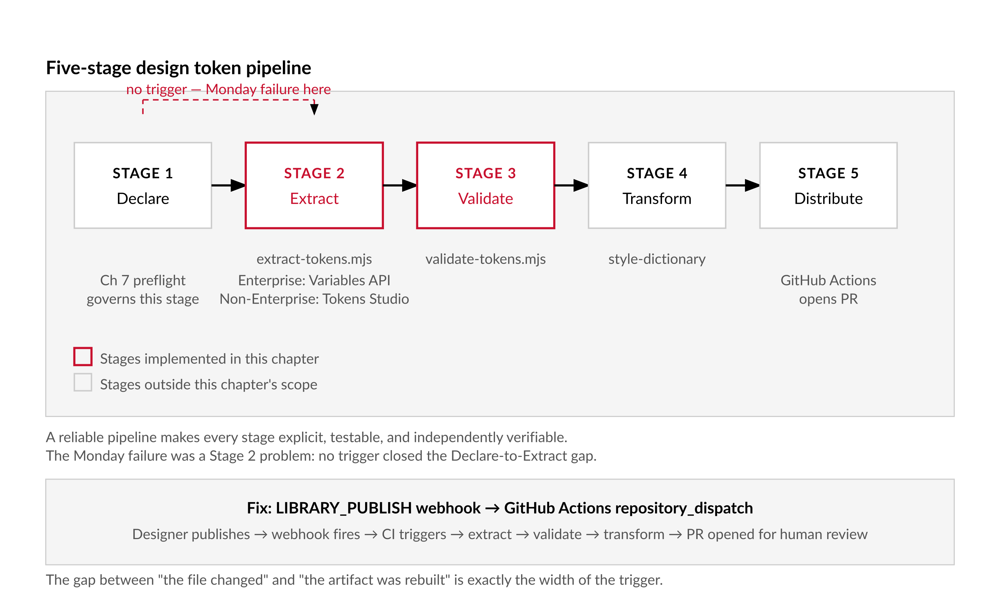
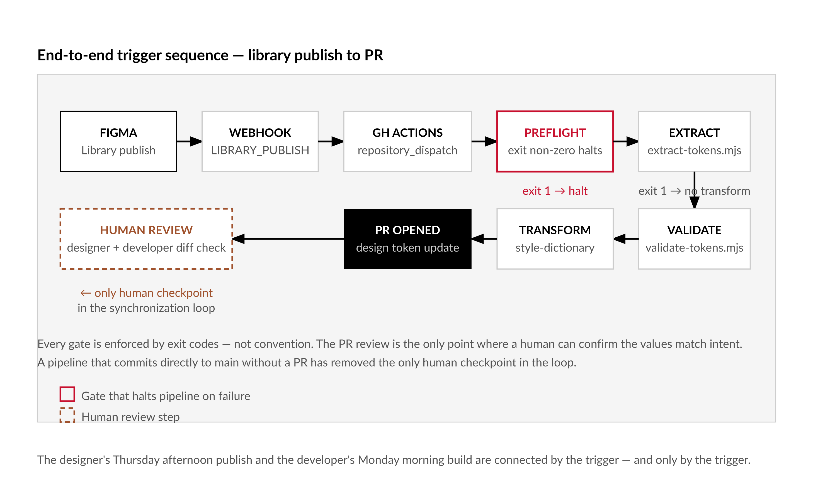

# Chapter 8 — Design Token Pipelines

*The synchronization has a human-sized hole in it — and the pipeline has no way to know.*

---

The sprint ended on a Friday. On Monday a developer opened the staging build to find that every interactive element — buttons, links, focus rings, form borders — had the wrong blue.

She checked the CSS. Correct. She checked the custom properties. Correct. She checked the generated token JSON. Correct. She tracked it back to the Figma file. In Figma, `color/brand/interactive` resolved to `#2563EB`. In the CSS, `--color-brand-interactive` was `#1D4ED8`. Both values existed in the design system. They were two adjacent steps on the blue scale — close enough that no automated test caught them, different enough that a designer noticed immediately.

The pipeline had run successfully. It had extracted tokens from the file as it existed the previous Wednesday. The designer had updated `color/brand/interactive` on Thursday afternoon and published the library. No one triggered the pipeline again. The pipeline had no way to know the file had changed. The staging build was running four-day-old tokens.

The problem was not the extraction code. The problem was a pipeline with no automatic trigger — a synchronization loop with a human-shaped gap in it that only closed when someone remembered to close it.

---

## The Five-Stage Architecture

Before writing any code, the architecture deserves examination, because token pipelines that break do so at predictable points. Understanding where those points are makes failures legible rather than mysterious.

**Stage 1 — Declare.** The design system declares its token taxonomy in Figma: what collections exist, what modes they contain, what naming conventions apply. This stage happens in the design tool. The machine-readiness contract from Chapter 7 governs it. If Stage 1 is wrong — bad names, broken aliases, missing collections — every downstream stage amplifies the problem rather than catching it.

**Stage 2 — Extract.** The pipeline reads variables from Figma and writes them to a normalized intermediate format. This chapter implements this stage in `extract-tokens.mjs`. The most important architectural decision in the entire pipeline lives here: whether extraction reaches the Figma Variables REST API directly, or goes through Tokens Studio. The answer depends entirely on plan tier.

**Stage 3 — Validate.** A validation script runs after extraction and before transformation, catching broken aliases, malformed values, missing modes, and platform-incompatible names. If validation exits with an error, Style Dictionary does not run. This chapter implements `validate-tokens.mjs`.

**Stage 4 — Transform.** Style Dictionary reads the normalized JSON and applies platform-specific transforms: `#2563EB` becomes `--color-brand-interactive: #2563EB` in CSS, a UIColor initializer in Swift, a hex resource in Android XML. [verify — current as of writing]

**Stage 5 — Distribute.** The pipeline writes transformed output to wherever downstream consumers can reach it — a PR updating files in the repository, a package in a private registry, a commit to a distribution branch.

A reliable pipeline makes every stage explicit, testable, and independently verifiable. The failure on Monday morning was a Stage 2 problem that looked like a Stage 4 problem because no one had instrumented Stage 2 with a trigger.


*Figure 8.1 — Five-stage design token pipeline*

---

## The Enterprise Gate

The Figma Variables REST API — `GET /v1/files/:key/variables/local` — requires an Enterprise plan. [verify — current as of writing] This is not a soft limitation or an undocumented quirk. It is an access control decision. On Professional plans or below, the endpoint returns a 403.

A significant portion of design systems engineers working in product companies are on Professional plans. Every token pipeline designed exclusively around the Variables REST API excludes them, and it excludes them silently — the extraction script runs, returns nothing useful, and the team spends time debugging what looks like a code problem before discovering it is a billing problem.

This chapter solves the problem by treating Enterprise and non-Enterprise as two parallel implementations of Stage 2. `extract-tokens.mjs` supports both paths via a `--source` flag. Validation, transformation, and distribution are identical either way. The plan tier affects only extraction.

---

## The Enterprise Path: `extract-tokens.mjs`

The extraction script has two jobs: fetch the variable graph from the Figma API, and write it to DTCG-compatible JSON. [verify — W3C DTCG format: https://tr.designtokens.org/format/] The intermediate format uses `$value`, `$type`, and `$description` as key names — close to the current DTCG draft rather than conforming to a ratified standard, because the standard has not been ratified. When it is, the extraction script changes and the fixture tests catch the regression.

The most consequential function in the script is alias resolution. Figma variables reference each other. A semantic token like `color/brand/interactive` does not hold a hex value directly — it holds a reference to a primitive like `color/palette/blue/600`, which holds the hex value. The extraction script must follow that chain to its end. If the chain is broken — if a reference points to a deleted variable — the script must surface the break as an explicit error rather than writing `undefined` or an empty string into the token file.

```javascript
// extract-tokens.mjs (Enterprise path)
// Usage: node extract-tokens.mjs
// Requires: FIGMA_TOKEN, FIGMA_FILE_KEY in environment
// Optional: FIGMA_COLLECTION_FILTER (comma-separated collection names to include)
// Illustrative — verify Variables API response shape before shipping

import { writeFileSync, mkdirSync } from 'fs';
import { join } from 'path';

const TOKEN    = process.env.FIGMA_TOKEN;
const FILE_KEY = process.env.FIGMA_FILE_KEY;
const FILTER   = process.env.FIGMA_COLLECTION_FILTER
  ? process.env.FIGMA_COLLECTION_FILTER.split(',').map(s => s.trim())
  : null;

if (!TOKEN || !FILE_KEY) {
  console.error('[extract-tokens] ERROR: FIGMA_TOKEN and FIGMA_FILE_KEY are required.');
  process.exit(1);
}

const BASE = 'https://api.figma.com/v1'; // [verify — current base URL]

async function get(path) {
  const res = await fetch(`${BASE}${path}`, {
    headers: { 'X-Figma-Token': TOKEN }
  });
  if (res.status === 403) {
    console.error('[extract-tokens] 403 Forbidden — the Variables REST API requires an Enterprise plan.');
    console.error('[extract-tokens] Use --source=studio for the non-Enterprise path.');
    process.exit(2);
  }
  if (!res.ok) throw new Error(`Figma API ${res.status}: ${await res.text()}`);
  return res.json();
}

async function fetchVariables() {
  // [verify — current as of writing] Response shape: { variables, variableCollections }
  const data = await get(`/files/${FILE_KEY}/variables/local`);
  return {
    variables:   data.variables            ?? {},
    collections: data.variableCollections  ?? {}
  };
}

// Resolve alias chains to raw values.
// Returns { resolved: value, type: 'COLOR'|'FLOAT'|'STRING'|'BOOLEAN' }
export function resolveAlias(variableId, modeId, variables, depth = 0) {
  if (depth > 10) throw new Error(`Alias chain too deep for variable ${variableId}`);
  const variable = variables[variableId];
  if (!variable) throw new Error(`Missing variable: ${variableId}`);

  // Fall back to first mode value if the requested mode has no entry
  const value = variable.valuesByMode[modeId]
    ?? Object.values(variable.valuesByMode)[0];

  // [verify — alias shape: { type: 'VARIABLE_ALIAS', id: 'variableId' }]
  if (value?.type === 'VARIABLE_ALIAS') {
    return resolveAlias(value.id, modeId, variables, depth + 1);
  }
  return { resolved: value, type: variable.resolvedType };
}

// Convert Figma RGBA float object to hex.
// [verify — Figma uses 0–1 float range for all RGBA channels]
export function rgbaToHex({ r, g, b, a }) {
  const toHex = v => Math.round(v * 255).toString(16).padStart(2, '0');
  const hex = `#${toHex(r)}${toHex(g)}${toHex(b)}`;
  return a === 1 ? hex : `${hex}${toHex(a)}`;
}

export function buildDTCGToken(variable, resolvedValue, resolvedType) {
  const token = {
    $value: resolvedValue,
    $type:  resolvedType.toLowerCase()
  };
  if (variable.description) token.$description = variable.description;
  return token;
}

function setNestedValue(obj, path, value) {
  const keys = path.split('/');
  let cursor = obj;
  for (let i = 0; i < keys.length - 1; i++) {
    const key = keys[i];
    if (!cursor[key] || typeof cursor[key] !== 'object') cursor[key] = {};
    cursor = cursor[key];
  }
  cursor[keys[keys.length - 1]] = value;
}

async function run() {
  console.log('[extract-tokens] Fetching variables...');
  const { variables, collections } = await fetchVariables();
  console.log(`[extract-tokens] ${Object.keys(variables).length} variables in ${Object.keys(collections).length} collections`);

  const output = {};

  for (const [, collection] of Object.entries(collections)) {
    if (FILTER && !FILTER.includes(collection.name)) {
      console.log(`[extract-tokens] Skipping collection: ${collection.name}`);
      continue;
    }

    for (const mode of collection.modes) {
      const modeKey = mode.name.toLowerCase().replace(/\s+/g, '-');
      if (!output[modeKey]) output[modeKey] = {};

      for (const variableId of collection.variableIds) {
        const variable = variables[variableId];
        if (!variable) continue;

        let resolvedValue, resolvedType;
        try {
          const { resolved, type } = resolveAlias(variableId, mode.modeId, variables);
          resolvedType = type;
          resolvedValue = type === 'COLOR' ? rgbaToHex(resolved)
                        : type === 'FLOAT' ? resolved
                        : String(resolved);
        } catch (err) {
          console.warn(`[extract-tokens] WARN: Could not resolve "${variable.name}" in mode "${mode.name}": ${err.message}`);
          continue;
        }

        setNestedValue(
          output[modeKey],
          variable.name,
          buildDTCGToken(variable, resolvedValue, resolvedType)
        );
      }
    }
  }

  mkdirSync('tokens', { recursive: true });
  for (const [modeKey, tokens] of Object.entries(output)) {
    const outPath = join('tokens', `${modeKey}.json`);
    writeFileSync(outPath, JSON.stringify(tokens, null, 2));
    console.log(`[extract-tokens] Wrote ${outPath}`);
  }

  console.log('[extract-tokens] Done.');
}

run().catch(err => {
  console.error('[extract-tokens] Fatal:', err.message);
  process.exit(1);
});
```

Two design decisions in this code are worth slowing down for.

The alias resolver has a depth limit of ten. This is not arbitrary. Circular alias references are possible — a variable that references a chain that eventually points back to itself. Without a depth limit, the resolver loops until the stack overflows. With a depth limit of ten, it throws a legible error that names the variable. Ten levels is more than any real design system should need; it is a conservative ceiling that catches pathological cases without false-positives.

The `rgbaToHex` function is exported alongside `resolveAlias` and `buildDTCGToken`. Exporting the pure transformation functions separately from the `run()` entry point is what makes them testable without mocking the entire Figma API. The fixture tests at the end of this chapter depend on this.

---

## The Non-Enterprise Path: Tokens Studio

Tokens Studio (formerly Figma Tokens) is a plugin that runs inside Figma and exports variables to JSON without touching the Variables REST API. [verify — current as of writing] Because it runs inside the plugin environment, it has access to local variable data regardless of plan tier. It is the standard non-Enterprise extraction path.

The workflow is: a designer runs Tokens Studio inside Figma and exports the token JSON — or configures Tokens Studio to sync to a GitHub repository branch automatically — and the CI pipeline picks up that JSON, normalizes it to DTCG format, and proceeds identically to the Enterprise path from validation onward.

```javascript
// Add to extract-tokens.mjs for non-Enterprise support

import { readFileSync } from 'fs';

const SOURCE       = process.argv.includes('--source=studio') ? 'studio' : 'api';
const STUDIO_INPUT = process.env.TOKENS_STUDIO_INPUT ?? 'tokens-studio-output.json';

// In run(), before the API fetch:
if (SOURCE === 'studio') {
  console.log(`[extract-tokens] Using Tokens Studio input: ${STUDIO_INPUT}`);
  const raw = JSON.parse(readFileSync(STUDIO_INPUT, 'utf8'));
  // Tokens Studio JSON is not DTCG-compatible out of the box.
  // Use @tokens-studio/sd-transforms with Style Dictionary,
  // or run a normalization pass here. [verify — current as of writing]
  const normalized = normalizeTokensStudio(raw);
  writeFileSync('tokens/source.json', JSON.stringify(normalized, null, 2));
  console.log('[extract-tokens] Wrote tokens/source.json from Tokens Studio input.');
  return;
}
```

The `@tokens-studio/sd-transforms` package bridges Tokens Studio's output format to DTCG-compatible JSON that Style Dictionary can process. [verify — current as of writing] For teams on Professional plans, the recommended architecture keeps everything simple: Tokens Studio handles extraction, configured to sync to a branch in GitHub, and the CI pipeline picks up the synced JSON, validates it, and runs Style Dictionary. The Variables REST API is never called.

| Path | Extraction mechanism | Plan requirement | Automation level | Who operates the export step |
|---|---|---|---|---|
| **Variables REST API** | `GET /v1/files/:key/variables/local` called by `extract-tokens.mjs` directly | Enterprise (Figma) — 403 on Professional and below | Fully automated — triggered by `LIBRARY_PUBLISH` webhook, no human action required between publish and token JSON | CI pipeline; no designer involvement after initial configuration |
| **Tokens Studio — manual** | Designer opens Tokens Studio plugin inside Figma and clicks Export; writes JSON to disk or uploads to repository | Any plan — plugin runs inside Figma, bypasses REST API plan gate | Semi-automated — extraction step requires a designer to trigger the export on each publish | Designer initiates; CI picks up the committed JSON and proceeds from validation onward |
| **Tokens Studio — GitHub sync** | Tokens Studio configured to push JSON to a GitHub repository branch automatically on each Figma save or publish | Any plan — sync uses the plugin's own GitHub OAuth, not the REST API | Fully automated — plugin sync + CI on push event closes the human gap without Enterprise access | Plugin handles extraction; CI validates, transforms, and opens the PR; designer publishes in Figma as normal |

---

## `validate-tokens.mjs`

Validation sits between extraction and Style Dictionary. Its job is to catch problems that would cause Style Dictionary to either fail visibly or — worse — succeed silently while writing incorrect values.

The validator walks the DTCG JSON tree and checks three things. First, that every token path contains only lowercase slugs with no spaces, uppercase letters, or special characters — because Style Dictionary's CSS transform will produce malformed custom property names from anything else. Second, that color values are valid hex strings — because an unresolved alias that slipped through extraction looks like `{color.palette.blue.600}` in the `$value` field, and Style Dictionary will write that string verbatim into the CSS. Third, that FLOAT tokens have numeric values — not strings, not null, not the object that results when a Figma number variable resolves unexpectedly.

```javascript
// validate-tokens.mjs
// Usage: node validate-tokens.mjs [--input tokens/]

import { readFileSync, readdirSync } from 'fs';
import { join } from 'path';

const INPUT_DIR = process.argv[2] ?? 'tokens';

function getTokenFiles(dir) {
  return readdirSync(dir)
    .filter(f => f.endsWith('.json'))
    .map(f => ({ file: f, path: join(dir, f) }));
}

function walkTokens(obj, path, callback) {
  for (const [key, value] of Object.entries(obj)) {
    const currentPath = path ? `${path}/${key}` : key;
    if (value && typeof value === 'object' && '$value' in value) {
      callback(currentPath, value);
    } else if (value && typeof value === 'object') {
      walkTokens(value, currentPath, callback);
    }
  }
}

function validateColor(value, path) {
  // Accept #RGB, #RRGGBB, #RRGGBBAA
  if (!/^#[0-9a-fA-F]{3}([0-9a-fA-F]{3}([0-9a-fA-F]{2})?)?$/.test(value)) {
    return `Invalid color value at "${path}": "${value}"`;
  }
  return null;
}

function validateFloat(value, path) {
  if (typeof value !== 'number' && isNaN(parseFloat(value))) {
    return `Invalid float value at "${path}": "${value}"`;
  }
  return null;
}

function validateTokenName(path) {
  const segments = path.split('/');
  const invalid = segments.filter(s => !/^[a-z0-9][a-z0-9\-]*$/.test(s));
  if (invalid.length > 0) {
    return `Token path has non-slug segments at "${path}": [${invalid.join(', ')}]`;
  }
  return null;
}

function validateFile(filePath) {
  const errors = [];
  const raw = JSON.parse(readFileSync(filePath, 'utf8'));

  walkTokens(raw, '', (path, token) => {
    const nameError = validateTokenName(path);
    if (nameError) errors.push(nameError);

    if (token.$type === 'color') {
      const colorError = validateColor(token.$value, path);
      if (colorError) errors.push(colorError);
    }

    if (token.$type === 'number' || token.$type === 'dimension') {
      const floatError = validateFloat(token.$value, path);
      if (floatError) errors.push(floatError);
    }

    // DTCG aliases use { } syntax — an unresolved alias looks like this in $value
    if (typeof token.$value === 'string' && token.$value.startsWith('{')) {
      errors.push(`Unresolved alias at "${path}": "${token.$value}" — was not resolved during extraction`);
    }
  });

  return errors;
}

function run() {
  const files = getTokenFiles(INPUT_DIR);
  if (files.length === 0) {
    console.error(`[validate-tokens] No JSON files found in ${INPUT_DIR}`);
    process.exit(1);
  }

  let totalErrors = 0;
  for (const { file, path } of files) {
    console.log(`[validate-tokens] Checking ${file}...`);
    const errors = validateFile(path);
    if (errors.length > 0) {
      console.error(`  ERRORS in ${file}:`);
      errors.forEach(e => console.error(`    ${e}`));
      totalErrors += errors.length;
    } else {
      console.log('  OK');
    }
  }

  if (totalErrors > 0) {
    console.error(`\n[validate-tokens] FAILED: ${totalErrors} error(s). Fix before running Style Dictionary.`);
    process.exit(1);
  }

  console.log(`\n[validate-tokens] PASSED. ${files.length} file(s) validated.`);
}

run();
```

The validator makes one guarantee: if it exits zero, Style Dictionary will not write unresolved aliases or malformed color values into the output. It does not guarantee semantic correctness. A token named `color/brand/interactive` that holds the wrong blue passes every check the validator can run. Semantic correctness requires a human looking at a diff.

---

## Style Dictionary Configuration

Style Dictionary reads the DTCG-compatible JSON from `tokens/` and emits platform-specific output. [verify — Style Dictionary 4.x API current as of writing] The name transformation from slash-separated DTCG paths to kebab-case CSS custom property names is handled by Style Dictionary's built-in CSS transform group. A token at `color/brand/primary` in the JSON becomes `--color-brand-primary` in the CSS.

```javascript
// sd.config.mjs
// Usage: npx style-dictionary build --config sd.config.mjs

import StyleDictionary from 'style-dictionary';

export default {
  source: ['tokens/*.json'],
  platforms: {
    css: {
      transformGroup: 'css',
      prefix: '',
      buildPath: 'dist/css/',
      files: [{
        destination: 'tokens.css',
        format: 'css/variables',
        options: {
          outputReferences: false  // resolve aliases in output; set true to emit var() chains
        }
      }]
    },
    js: {
      transformGroup: 'js',
      buildPath: 'dist/js/',
      files: [{
        destination: 'tokens.js',
        format: 'javascript/module'
      }]
    }
    // Add swift and android platforms following Style Dictionary docs
  }
};
```

The `outputReferences` option is the one decision here that matters enough to reason about explicitly. Setting it to `false` resolves every alias chain to its raw value — `--color-brand-primary: #2563EB` in the output, no chaining. Setting it to `true` emits `var()` chains — `--color-brand-primary: var(--color-palette-blue-600)` — which preserves the alias structure in CSS and allows runtime overrides without regenerating tokens, but requires all referenced variables to be present in the same CSS file. Use `false` when distributing to consumers who may have only part of the token set. Use `true` when the entire system ships together and runtime override flexibility matters.

---

## The Trigger: GitHub Actions and the Figma Webhook

The failure in the opening scenario was a missing trigger. The fix is a GitHub Actions workflow that fires on a Figma `LIBRARY_PUBLISH` webhook event — the event Figma sends when a designer publishes a library update. [verify — current as of writing: webhook event types documented at https://developers.figma.com/docs/rest-api/webhooks/]

```yaml
# .github/workflows/tokens.yml
name: Update design tokens

on:
  repository_dispatch:
    types: [figma-library-publish]
  workflow_dispatch:  # manual trigger for testing

permissions:
  contents: write
  pull-requests: write

jobs:
  extract-tokens:
    runs-on: ubuntu-latest
    steps:
      - uses: actions/checkout@v4

      - uses: actions/setup-node@v4
        with:
          node-version: '20'

      - run: npm ci

      - name: Preflight check
        run: npm run figma:preflight
        env:
          FIGMA_TOKEN:    ${{ secrets.FIGMA_TOKEN }}
          FIGMA_FILE_KEY: ${{ secrets.FIGMA_FILE_KEY }}

      - name: Extract tokens
        run: node extract-tokens.mjs
        env:
          FIGMA_TOKEN:    ${{ secrets.FIGMA_TOKEN }}
          FIGMA_FILE_KEY: ${{ secrets.FIGMA_FILE_KEY }}

      - name: Validate tokens
        run: node validate-tokens.mjs

      - name: Transform with Style Dictionary
        run: npx style-dictionary build --config sd.config.mjs

      - name: Open PR with updated tokens
        uses: peter-evans/create-pull-request@v6
        with:
          token: ${{ secrets.GITHUB_TOKEN }}
          commit-message: "chore: update design tokens from Figma"
          branch: figma/token-update
          title: "Design token update from Figma library publish"
          body: |
            Automated design token update triggered by Figma library publish.
            Review the diff before merging. This PR was opened by the pipeline — not a human.
          labels: design-tokens, automated
```


*Figure 8.2 — End-to-end trigger sequence: library publish to PR*

The pull request is not optional. A pipeline that commits token changes directly to main without review has removed the only human checkpoint in the synchronization loop. The PR diff is the design-development conversation: the designer sees exactly which CSS variables changed, the developer confirms the values match what they saw in the file. On minor updates — a spacing value shifts from 8 to 10 — this review takes thirty seconds. On a large update that touches hundreds of tokens, or any update to color primitives that all semantic tokens reference, it should take longer and may require a visual regression test before merging.

Wire the stages in sequence in the workflow. Validation exits non-zero on any error, and `if: success()` on the Style Dictionary step means transformation only runs when validation passes. The PR only opens when transformation succeeds. Every gate is enforced by exit codes rather than by convention.

---

## Fixture Tests

Pipelines are code. Code without tests fails silently in ways that feel like success. The extraction functions are exported specifically so they can be tested against a saved API response without making network calls.

```javascript
// test/extract-tokens.test.mjs
// Usage: node --test test/extract-tokens.test.mjs
// Requires a saved fixture: test/fixtures/variables-response.json

import { strict as assert } from 'assert';
import { test }             from 'node:test';
import { readFileSync }     from 'fs';

import { resolveAlias, rgbaToHex, buildDTCGToken } from '../extract-tokens.mjs';

const fixture = JSON.parse(readFileSync('test/fixtures/variables-response.json', 'utf8'));

test('rgbaToHex converts Figma RGBA to hex', () => {
  assert.equal(rgbaToHex({ r: 0.145, g: 0.388, b: 0.922, a: 1 }),  '#2563EB');
  assert.equal(rgbaToHex({ r: 1, g: 1, b: 1, a: 0.5 }),            '#FFFFFF80');
});

test('resolveAlias resolves direct value', () => {
  const vars       = fixture.variables;
  const firstId    = Object.keys(vars)[0];
  const firstMode  = Object.keys(vars[firstId].valuesByMode)[0];
  const result     = resolveAlias(firstId, firstMode, vars);
  assert.ok(result.resolved !== undefined);
});

test('resolveAlias throws on broken alias', () => {
  const vars = {
    'broken-id': {
      name: 'broken',
      resolvedType: 'COLOR',
      valuesByMode: { 'mode1': { type: 'VARIABLE_ALIAS', id: 'nonexistent' } }
    }
  };
  assert.throws(() => resolveAlias('broken-id', 'mode1', vars));
});
```

Save a real API response to `test/fixtures/variables-response.json` by running the extract script in dry-run mode. The fixture does not change unless you update it deliberately. The tests catch regressions in the transformation logic without making API calls, and they run in a few milliseconds. Add one test per known edge case: a color with alpha, a deep alias chain, a FLOAT variable, a variable with no description. Each test is a regression that has not happened yet.

---

## Failure Modes

Several failure modes appear consistently across real-world deployments.

**The UID wrench.** Figma variable IDs are stable across file saves, but if a designer deletes a variable and creates a new one with the same name, the ID changes. [verify — current as of writing] The alias chain in other variables that referenced the old ID is now broken. The Chapter 7 preflight catches this, but only if it runs against the current file state — not a cached response from earlier in the same CI run.

**The sync lag.** The Figma API reflects the current save state of the file, not necessarily the last published library state. A designer who saves without publishing may produce a file state that differs from what library consumers see. [verify — current as of writing: the Variables API returns data for the current file; consult Figma documentation for the published-vs-current distinction]

**The modes explosion.** A variable collection with many modes — light, dark, high-contrast-light, high-contrast-dark, compact, comfortable, brand-a, brand-b — produces a token file per mode. Style Dictionary needs explicit configuration to combine modes correctly. Without it, the platform-specific output may contain incomplete or incorrectly layered values.

**Silent type coercion.** Figma FLOAT variables can represent spacing, font sizes, line heights, border radii, or durations — the variable type does not distinguish between them. Without explicit `$type` declarations in the DTCG output, Style Dictionary treats all of them as raw numbers and applies no unit. A spacing token that should emit `8px` in CSS emits `8`. The fix requires a type mapping in `extract-tokens.mjs` that infers `$type` from the collection name and variable name path. A variable in a collection named "Spacing" under `spacing/s/200` gets `"$type": "dimension"`. A variable under "Duration" gets `"$type": "duration"`. This mapping cannot be generated automatically from the Figma data — it requires a configuration decision made once by a human.

| Failure | Stage | Symptom | Detection method | Fix |
|---|---|---|---|---|
| **UID wrench** — designer deletes a variable and creates a new one with the same name; the new variable has a different ID | Stage 2 (Extract) and Stage 3 (Validate) | Alias chains in other variables that referenced the old ID are broken; `validate-tokens.mjs` reports unresolved aliases in the output | `checkAliasChains()` in preflight catches it if run against the live file after the delete-recreate; fixture tests do not catch it if the fixture predates the change | Identify the new variable IDs via the Variables API; update alias references in Figma to point to the new IDs; re-run extraction |
| **Sync lag** — designer saves without publishing; Variables API returns current save state, not the published library state | Stage 2 (Extract) | Token output reflects unpublished changes that library consumers do not see; extracted CSS may differ from what components actually apply | Compare the extraction timestamp against the last library publish timestamp in the Figma file metadata; warn if extraction ran within the same save session as an unpublished change | Run extraction only after a `LIBRARY_PUBLISH` event, not on file save; `LIBRARY_PUBLISH` webhook is the authoritative trigger |
| **Modes explosion** — variable collection has many modes (light, dark, high-contrast-light, high-contrast-dark, compact, comfortable, brand-a, brand-b) | Stage 4 (Transform) | Style Dictionary emits multiple incomplete or incorrectly layered output files; platform CSS may apply the wrong mode values at runtime | Inspect the `tokens/` directory after extraction: one JSON file per mode is expected; if mode count exceeds what Style Dictionary config handles, output will be malformed | Add explicit mode-combination configuration to `sd.config.mjs`; define which modes are base versus overlay; do not add new modes without updating the transform config |
| **Silent type coercion** — Figma FLOAT variables represent spacing, font sizes, line heights, border radii, or durations without distinguishing between them | Stage 4 (Transform) | Style Dictionary emits raw numbers without units (`--spacing-s-200: 8` instead of `--spacing-s-200: 8px`); no error is thrown; affected components silently misapply values | Check `dist/css/tokens.css` for numeric values on dimension tokens that lack units; compare against known spacing or font-size token paths | Add a `$type` mapping in `extract-tokens.mjs` that infers `dimension`, `duration`, or `fontWeight` from collection name and variable path; this mapping requires a human configuration decision — it cannot be derived automatically |
| **Unresolved aliases** — alias written as `{color.palette.blue.600}` DTCG reference syntax appears in `$value` fields | Stage 3 (Validate) and Stage 4 (Transform) | `validate-tokens.mjs` should catch `$value` strings starting with `{`; if it does not, Style Dictionary writes the literal string verbatim into the CSS output | Run `validate-tokens.mjs` and inspect exit code; search output CSS for values matching `var\(\{` as a secondary check | Fix alias resolution in `extract-tokens.mjs` so VARIABLE_ALIAS types are followed to their raw values before writing DTCG JSON; ensure the depth limit of 10 is not exceeded |

---

## Style Dictionary and the DTCG Standard

Style Dictionary was created by Danny Banks at Amazon in 2017, initially as an internal tool for managing design tokens across Amazon's product surfaces. It was open-sourced and became the de facto standard for token transformation before the W3C Design Tokens Community Group had published a format specification. [verify — current as of writing]

The DTCG format — `$value`, `$type`, `$description` — resulted from multi-year work by the Design Tokens Community Group to standardize the JSON structure that tools like Style Dictionary, Tokens Studio, and Theo had been inventing independently. The specification is ongoing and has not reached Recommendation status. [verify — current as of writing: https://tr.designtokens.org/format/]

The practical consequence is that "DTCG-compatible" in 2026 means conforming to the current draft rather than to a ratified standard. Style Dictionary 4.x added explicit DTCG support. Tokens Studio added a DTCG export option. Both are tracking a moving target. The architecture this chapter builds handles that by keeping the normalization logic isolated in `extract-tokens.mjs` and covered by fixture tests. When the standard moves, the tests fail, the function changes, and the rest of the pipeline does not care.

The synchronization gap that opened on Monday morning — a human who forgot to trigger a pipeline — was not a novel problem. It was the same problem that motivated every build system ever written: the gap between "the source changed" and "the artifact was rebuilt" is exactly the width of the trigger. Figma webhooks close that gap. The design token pipeline, properly triggered and properly gated, is what closes the gap between a designer's Thursday afternoon publish and a developer's Monday morning staging build.

---

## What Comes Next

Chapter 9 handles the other half of the canvas: the images, icons, and graphics that live in Figma as vector nodes and need to arrive in the repository as optimized, production-ready files. Token extraction deals in structured data — names, values, types. Asset extraction deals in rendered output — SVG, PNG, PDF — and introduces a different set of API surfaces and transformation problems.

---

## LLM Exercises

**Exercise 1 — Generate and examine**

Paste the `resolveAlias` function into a conversation with an LLM and ask it to trace through what happens when a variable aliases another variable that aliases a third — a chain of depth three. Then ask: what happens if the chain is circular? Walk through the depth-limit logic with the model and confirm that the error it describes matches what the function actually does.

**Exercise 2 — Apply to known context**

Describe your organization's Figma plan tier and variable structure to an LLM. Ask it to recommend whether to use the Enterprise path or the Tokens Studio path, and to explain what would need to be true about your setup for the other path to be preferable. Compare the recommendation against your actual situation.

**Exercise 3 — Stress-test a specific claim**

The chapter argues that the PR is non-optional — that a pipeline committing token changes directly to main without review has removed the only human checkpoint. Ask an LLM to argue the opposing position: that auto-merging token PRs is acceptable and even desirable for a mature, well-tested design system. Evaluate the argument. Under what specific conditions does auto-merge become defensible? Under what conditions does it remain indefensible regardless of test coverage?

**Exercise 4 — Draft or audit a professional deliverable**

The Monday morning incident in the opening scenario needs a post-mortem. Ask an LLM to draft a two-page incident report covering: what happened, why the pipeline architecture allowed it, what the fix is (webhook trigger + PR review gate), and what monitoring would prevent recurrence. Then audit the draft: does it accurately describe the failure mode? Does the remediation section correctly identify the trigger gap as the root cause, or does it misattribute the failure to extraction code?

---

## Chapter 8 Exercises: Design Token Pipelines
**Project:** figma-tools — Your Design System Extraction Toolkit
**This chapter adds:** `extract-tokens.mjs` (Variables API or Tokens Studio extraction to DTCG JSON) and `validate-tokens.mjs` (pre-Style-Dictionary alias and format checks), wired to a GitHub Actions workflow triggered by `LIBRARY_PUBLISH`.

---

### Exercise 1 — When to Use AI

The token pipeline introduces a lot of wiring — alias resolution logic, DTCG format rules, Style Dictionary configuration, GitHub Actions YAML. Several tasks in this chapter are good candidates for AI assistance.

**Task A — Generating Style Dictionary platform configurations for Swift and Android XML.**
The chapter ships a CSS and JS config. Adding Swift (`UIColor` initializers) and Android XML (hex resource strings) follows the same structural pattern but requires knowing Style Dictionary's platform-specific transform group names and file format strings. Give an AI the existing `sd.config.mjs` and ask it to add the two platforms, specifying the output paths and format names. The AI is doing pattern-completion and boilerplate generation against a documented API.

*Why AI works here:* boilerplate. The Style Dictionary platform config is highly regular. The AI is extending a pattern you have already established.

**Task B — Drafting a `normalizeTokensStudio` function stub.**
The chapter includes a reference to a `normalizeTokensStudio` function that is not fully implemented. Describe the Tokens Studio JSON structure to an AI (or paste a sample) and ask it to draft the normalization function that maps Tokens Studio keys to DTCG `$value`/`$type`/`$description`. The AI is doing format translation drafting — a task with a clear input shape and a known target shape.

*Why AI works here:* drafting and reformatting. The transformation rules are derivable from comparing the two JSON structures, and the AI can enumerate them more quickly than you can.

**Task C — Writing fixture test cases for known edge cases.**
The chapter identifies edge cases: a color with alpha, a deep alias chain, a FLOAT variable with no description, a variable whose mode ID does not exist in its collection. Describe each to an AI and ask it to write the corresponding `test()` block that would catch a regression. The AI is generating test boilerplate against a pattern that already exists in `test/extract-tokens.test.mjs`.

*Why AI works here:* pattern-following boilerplate. The test structure is established; the AI is instantiating it for each new case.

**The tell:** you can run every test the AI produces and see whether it passes or fails on the actual extraction code. Output is independently verifiable. If a test passes on a known-broken input, the test is wrong — and you will catch it.

---

### Exercise 2 — When NOT to Use AI

Token pipelines look like pure data transformation, but several decisions in this chapter require human judgment that AI cannot supply.

**Task A — Deciding the `$type` mapping for FLOAT variables.**
The chapter names the "silent type coercion" failure: Figma FLOAT variables can be spacing, font sizes, line heights, border radii, or durations — the variable type does not distinguish. Assigning `"$type": "dimension"` vs `"$type": "duration"` vs `"$type": "fontWeight"` requires knowing what each variable actually means in your design system. No AI has that knowledge. The configuration is a design decision, not a derivable fact.

*Why AI fails here:* missing ground truth. The correct type depends on the semantic intent of each variable group — information that exists only in the design system's structure and the team's mental model.

**Task B — Setting the `outputReferences` flag.**
The chapter presents `outputReferences: false` (resolve all aliases to raw values) vs `outputReferences: true` (emit `var()` chains). The right choice depends on whether your downstream consumers receive the full token set or a subset, and whether runtime override flexibility matters more than distribution simplicity. AI can explain both options accurately. It cannot know which scenario applies to your deployment.

*Why AI fails here:* calibration and missing ground truth. The consequence of choosing wrong is a CSS build that either produces unresolvable `var()` references or loses runtime override capability — both silent failures in different contexts.

**Task C — Reviewing the PR diff when a library publish changes many token values.**
The chapter is explicit: the PR review is the human checkpoint. When a library publish changes fifty color primitives and all their semantic aliases, someone needs to look at the diff and confirm that the changes reflect the designer's intent. AI cannot do this review — it cannot distinguish "this is correct, the designer updated the brand blue" from "this is wrong, someone's change got included in the publish by accident."

*Why AI fails here:* missing ground truth and values. The review requires cross-referencing the diff against the designer's stated intention, the Figma version history, and the team's understanding of what was supposed to change.

**The tell:** if the answer requires knowing something about your file, your team's conventions, or your deployment environment that is not written down anywhere the AI can read, you are in Exercise 2 territory.

**Series connection:** Tier 4 — knowing when to pull the human into the loop, specifically at the PR review gate the chapter identifies as the only human checkpoint in the synchronization loop.

---

### Exercise 3 — LLM Exercise

**What you're building this chapter:** a fixture test file for `extract-tokens.mjs` that covers the five known edge cases the chapter names, plus a brief analysis of whether the depth-10 alias limit is the right ceiling for your design system.

**Tool:** Claude Project (recommended). The extraction functions — `resolveAlias`, `rgbaToHex`, `buildDTCGToken` — are the context the model needs to generate correct tests. A Project that includes `extract-tokens.mjs` and the existing `test/extract-tokens.test.mjs` fixture will produce tests that match the established pattern without you having to paste the full file every time.

**The Prompt:**

```
I am extending the test suite for extract-tokens.mjs in the figma-tools project. The file exports three pure functions: resolveAlias, rgbaToHex, and buildDTCGToken. The existing test file uses Node's built-in test runner (node:test) and strict assert.

Write five additional test() blocks — one for each of these edge cases:

1. A color with alpha (RGBA where a < 1) — verify that rgbaToHex produces an 8-character hex string with the alpha channel appended.

2. An alias chain of depth 3 — variable A aliases B which aliases C which holds a raw value. Verify that resolveAlias(A) returns C's resolved value, not B's or an intermediate.

3. A FLOAT variable with no description — verify that buildDTCGToken produces a token with $value and $type but no $description key.

4. A circular alias — A aliases B which aliases A. The depth limit should throw before the stack overflows. Verify the error is thrown and that the message includes the variable ID.

5. A variable whose requested modeId does not exist in valuesByMode — verify that resolveAlias falls back to the first available mode value rather than throwing.

For each test: use realistic-looking variable IDs (format: "abc123:1"), realistic names (slash-separated lowercase slugs), and the exact assert.* methods already used in the test file. Do not import anything that is not already in node:test or node:assert.
```

**What this produces:** five copy-paste-ready `test()` blocks that you add to `test/extract-tokens.test.mjs`. Run them with `node --test test/extract-tokens.test.mjs`. All five should pass against the current implementation; if one fails, it has found a real bug.

**How to adapt this prompt:**
- *Own project:* if your extraction script has different function signatures (e.g., mode resolution works differently), update the edge case descriptions to match your actual implementation.
- *ChatGPT or Gemini:* paste `extract-tokens.mjs` and the existing test file into context before sending this prompt — these models do not retain previous turns' file content. The prompt itself is model-agnostic.
- *Claude Project:* if the Project already has the extraction script in context, drop the function descriptions from the prompt — Claude already knows the signatures.

**Connection to previous chapters:** the fixture-based testing pattern (save an API response, test against it locally) was introduced in Chapter 3 with `figma-read.mjs`. These tests extend the same pattern to the extraction layer. The depth-limit logic also appears implicitly in the preflight script from Chapter 7 — a circular alias chain is one of the conditions that would cause a preflight alias check to loop without a guard.

**Preview of next chapter:** Chapter 9's `export-assets.mjs` uses a similarly exportable function structure — `verifyAsset` and `optimizeSvg` are both testable independently of the Figma API. The same fixture-test pattern applies, and you can use this prompt structure again to generate integrity-check tests for known bad SVG inputs.

---

### Exercise 4 — CLI Exercise

**What you're building:** `extract-tokens.mjs` and `validate-tokens.mjs` running end-to-end against your Figma file, with `tokens/` output committed and a Style Dictionary build confirmed.

**Tool:** Claude Code (default)

**Skill level:** Advanced — requires a passing preflight from Chapter 7, an Enterprise Figma plan (or a Tokens Studio export JSON on disk), and `style-dictionary` installed.

**Setup:**
- [ ] `FIGMA.md` exists at the figma-tools root (from Chapter 7 Exercise 4)
- [ ] `figma-preflight.mjs` passes with zero blocking findings
- [ ] `extract-tokens.mjs` and `validate-tokens.mjs` are committed to figma-tools
- [ ] `sd.config.mjs` is committed to figma-tools
- [ ] `style-dictionary` is listed in `package.json` and installed
- [ ] Either: `FIGMA_TOKEN` has Enterprise plan access, or a Tokens Studio export JSON is at `tokens-studio-output.json`

**The Task:**

```
You are working in the figma-tools repository. Read FIGMA.md before doing anything else.

Then do the following in order:

1. Read extract-tokens.mjs and validate-tokens.mjs to understand the pipeline.

2. Run the extraction step:
   - If FIGMA_TOKEN has Enterprise access: node extract-tokens.mjs
   - If tokens-studio-output.json exists on disk: node extract-tokens.mjs --source=studio
   Record the number of variables extracted and the list of token files written to tokens/.

3. Run: node validate-tokens.mjs
   - If it exits non-zero, read the error output carefully. Do NOT attempt to fix token values in tokens/*.json directly.
   - Report which validation rules failed and for which token paths.
   - If the errors are "Unresolved alias" type, check whether the corresponding variables exist in the extraction output. Report your finding but do not modify the file.
   - If validation passes, continue.

4. Run: npx style-dictionary build --config sd.config.mjs
   Report the files written to dist/ and their sizes.

5. Do not commit anything. Do not modify tokens/*.json, extract-tokens.mjs, validate-tokens.mjs, or sd.config.mjs.

6. Write a summary to extraction-report.md at the figma-tools root:
   - Timestamp
   - Extraction source (api or studio)
   - Number of variables extracted
   - Validation result (pass / fail with error count)
   - Style Dictionary output files (paths and sizes)
   - Any warnings from the extraction step (null values, skipped collections)

Verification: show me the first 20 lines of extraction-report.md.
```

**Expected output:** `tokens/*.json` files, `dist/css/tokens.css` (and other platform outputs if configured), and `extraction-report.md`. Claude Code's response should show the extraction-report.md header.

**What to inspect in the output:**
- Does `tokens/` contain one JSON file per mode defined in your Figma variable collections?
- Does `dist/css/tokens.css` contain custom properties with names that match your variable naming convention (lowercase, hyphen-separated)?
- Are there any "Unresolved alias" warnings? If so, those are broken alias chains the preflight missed — report them.

**If it goes wrong:** the most common failure after a passing preflight is the FLOAT type coercion problem from the chapter's failure modes section. If Style Dictionary emits numbers without units (e.g., `--spacing-s-200: 8` instead of `--spacing-s-200: 8px`), the validator passed but the `$type` mapping is missing. Do not patch the output CSS manually. Instead, note the affected token paths in `extraction-report.md` under a "Type mapping gaps" heading — this is the human decision from Exercise 2 Task A.

**CLAUDE.md / AGENTS.md note:** add this standing rule — `figma-tools: never edit tokens/*.json directly. Token files are generated artifacts. All changes flow through extract-tokens.mjs or the Tokens Studio export. Editing generated files creates a divergence that the next pipeline run will silently overwrite.`

---

### Exercise 5 — AI Validation Exercise

**What you're validating:** the `tokens/` JSON files produced by Exercise 4, specifically checking for the broken-alias failure mode the chapter identifies as the most dangerous silent failure.

**Validation type:** generated artifact correctness — checking that extraction and validation together catch what they claim to catch.

**Risk level:** High. A token file that contains unresolved aliases or wrong values will pass through Style Dictionary and produce syntactically valid CSS that silently applies wrong design decisions to every component that consumes those tokens. This failure does not throw an error anywhere in the pipeline after `validate-tokens.mjs`. If validation missed something, the error reaches production.

**Setup:** use the `tokens/*.json` files produced by Exercise 4. If you have not completed Exercise 4, generate a synthetic `tokens/light.json` with at least one valid color token, one valid FLOAT token, and one token whose `$value` is `{color.palette.blue.600}` (an unresolved alias in DTCG syntax).

**The Validation Task:**

```
Validation checklist for tokens/*.json — Chapter 8

Correctness
[ ] Every token's $value is a resolved, concrete value — no strings starting with { (DTCG alias syntax indicates an unresolved reference)
[ ] Every color token's $value matches the pattern #[0-9a-fA-F]{6} or #[0-9a-fA-F]{8} (no named colors, no rgb(), no unresolved aliases)
[ ] Every number/dimension token's $value is a JavaScript number, not a string

Completeness
[ ] The number of tokens in tokens/*.json is plausible given your Figma variable collection sizes (spot-check: if your file has 50 semantic color tokens, tokens/light.json should have approximately 50 color entries)
[ ] Every mode defined in your Figma variable collections has a corresponding tokens/*.json file

Scope
[ ] No tokens/*.json file is empty (zero tokens is almost always a collection-filter misconfiguration)
[ ] Token paths in the JSON use only lowercase slugs and forward slashes — no spaces, no uppercase, no underscores

Chapter-specific criterion 1 — alias chain integrity
[ ] Pick three semantic tokens at random. Trace their $value back to a primitive manually (using the Figma file or the raw extraction output). Do the resolved values match?

Chapter-specific criterion 2 — mode coverage
[ ] If your file has light and dark modes, both tokens/light.json and tokens/dark.json exist and have the same set of token paths (different values, identical keys)

Failure-mode check
[ ] "Fluent but wrong": does any token have a value that looks valid but is semantically incorrect — a spacing token with a color hex value, a color token with a numeric value, a semantic alias that resolved to the wrong primitive?
[ ] "Broken alias chain": does validate-tokens.mjs exit zero even though any $value contains { } (alias syntax)? If yes, the validator has a gap — report it in extraction-report.md and do not merge the token files until it is fixed.
```

**What to do with your findings:**
- All boxes checked: token files are ready for the Style Dictionary build and PR review.
- One box unchecked: trace the specific failing token path back through the extraction script. Is it an extraction bug or a Figma file issue? Document the finding in `extraction-report.md`.
- Multiple boxes unchecked: do not open the PR. Fix the extraction issues before the token files reach any downstream consumer.

**AI Use Disclosure prompt:** copy this into the PR description when you open the token update PR:

```
Token files in this PR were generated by extract-tokens.mjs and validated by validate-tokens.mjs. The output was manually spot-checked against the Chapter 8 validation checklist. Any token value that appears incorrect should be traced to the Figma file before this PR is merged — do not adjust token JSON directly.
```

**Series connection:** the "broken alias chain" failure — an unresolved `{alias.reference}` in a `$value` field — is a Tier 4 metacognitive failure. The validator claims to catch it; this exercise verifies that claim. If the validator exits zero on a file containing unresolved aliases, you have found a gap in the pipeline's own quality gates, and you now know not to trust the validator's exit code alone.

---

## Prompts

*Load `/NEU/CLAUDE.md` and `/NEU/DESIGN.md` into context before generating any figure from this section.*

### Figure 8.1 — Five-stage design token pipeline

Produce a single standalone HTML file using D3 v7 from the CDN `https://cdnjs.cloudflare.com/ajax/libs/d3/7.9.0/d3.min.js`. Chart type: horizontal flow diagram with five stage boxes in sequence. Stages: Declare, Extract, Validate, Transform, Distribute. Stages 2 (Extract) and 3 (Validate) use red borders and red labels — they are implemented in this chapter. The other three use standard border color. Arrows (`<line>` with arrowhead markers) connect each stage to the next. Annotate the gap between Stage 1 and Stage 2 with a dashed red callout labeled "Monday failure: no trigger." Below each implemented stage, show the script name in secondary color. On hover, tooltip shows the full stage description including which script operates there and what failure condition it catches. ResizeObserver redraw, dark-mode `:root` block, reduced-motion suppression, full SVG accessibility attributes. Deliverable: single HTML file, inline CSS, D3 v7 CDN.

> Reference implementation: `../d3/08-design-token-pipelines-fig-01.html`

### Figure 8.2 — End-to-end trigger sequence: library publish to PR

Produce a single standalone HTML file using D3 v7. Chart type: linear sequence diagram that wraps across two rows when the viewport is narrow. Eight steps in order: Library publish (Figma) → Webhook fires (LIBRARY_PUBLISH) → repository_dispatch (GitHub Actions) → Preflight check (red border, exits non-zero) → Extract tokens → Validate tokens → Transform (style-dictionary) → PR opened (filled black, human review entry point). After the PR step, show a human review node with a dashed brown border connected by an arrow. Each step is interactive — hover shows a tooltip with its role in the pipeline and what happens if it fails. Steps that exit non-zero on failure have red borders. The filled-black PR step uses white text. Arrows use standard ink color with arrowhead markers. ResizeObserver redraw with `colsPerRow` adapting to viewport. Full accessibility, dark mode, reduced motion. Deliverable: single HTML file.

> Reference implementation: `../d3/08-design-token-pipelines-fig-02.html`
