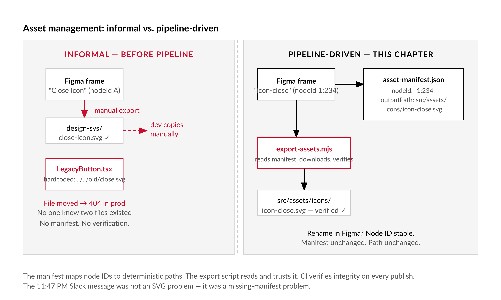
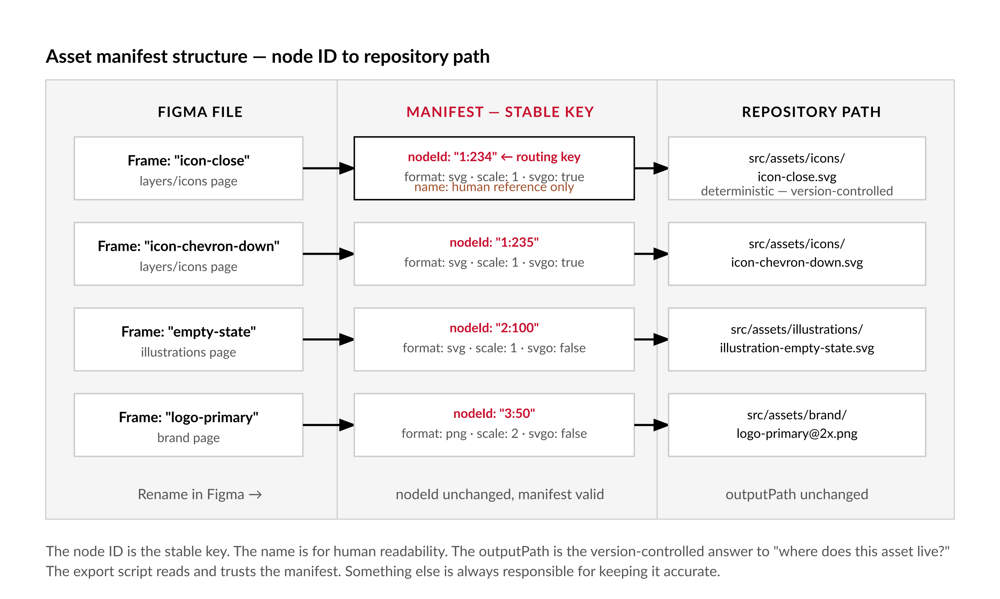
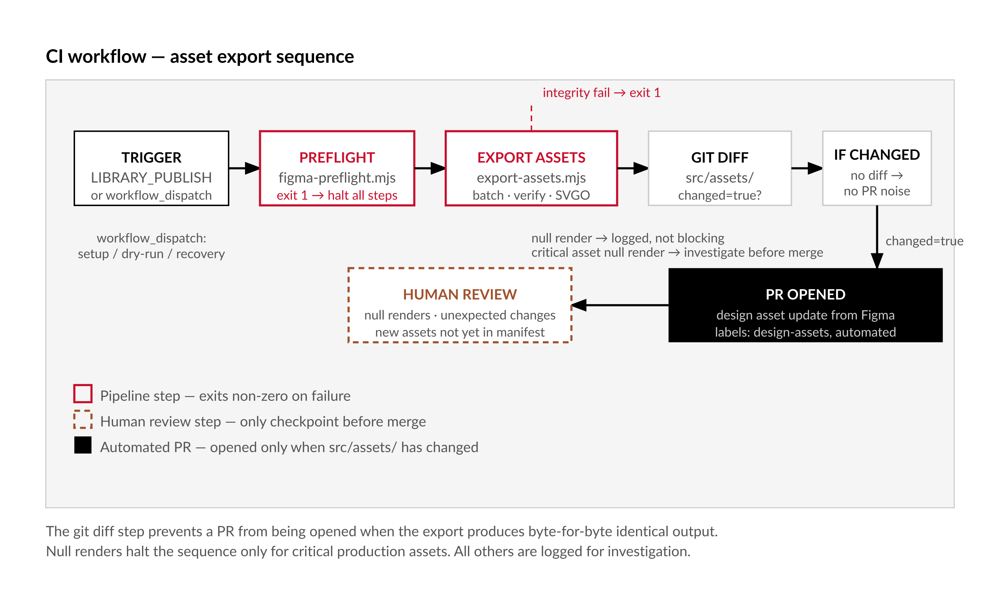

# Chapter 9 — Asset Export Automation

*A pipeline is just a story about where things come from — until it breaks, and then it's a story about what nobody wrote down.*

---

The Slack message arrived at 11:47 PM: "buttons look fine on staging but the close icon is completely broken in prod."

It was not the close icon. The close icon SVG had been re-exported from Figma three days earlier, optimized, and committed. The icon in production was a different file — six months old — that a developer had hardcoded into a legacy component because they did not know the design system had an official close icon. The two files had the same display name in the UI. Completely different paths in the codebase. When the designer re-exported and overwrote the design system file, the legacy component did not update. It had no connection to the asset pipeline. It had a hardcoded relative path to a file that no longer existed at that path. The broken display was a 404 on an SVG that had been moved.

This is not a story about SVG optimization. It is a story about what happens when asset management is informal: no single source of truth, no deterministic paths, no manifest of what exists and where it should live, no automated check that the file in the repository matches the node in Figma.

The pipeline in this chapter builds the thing that team did not have.


*Figure 9.1 — Informal vs. pipeline-driven asset management*

---

## The Render Endpoint Is Not a File Download

Before writing any code, the most important thing to understand about the Figma image export endpoint is that it is a render endpoint, not a file storage endpoint. You do not ask it for a file. You ask it to render a node — at a given format and scale — and it hands you a URL pointing to a CDN-hosted render. That URL expires. [verify — current expiry window; Figma documentation states that generated image URLs expire; verify the exact period before shipping]

This is the root cause of every failure mode the pipeline has to handle. It shapes the architecture completely.

A pipeline that requests export URLs, stores them in a file, and downloads them later will produce 403 errors silently. A pipeline that requests 500 icons in a single call will hit rate limits. A pipeline that does not verify what it downloaded can write a JSON error body to disk, name it `.svg`, and commit it to the repository with no indication that anything went wrong.

The pipeline in this chapter is designed around these constraints. Understanding them is what makes the design legible.

---

## The Four Hazards

There are four operational hazards that do not exist in simpler file-download pipelines. The code addresses all four explicitly.

**Expiring URLs.** The pipeline must download each rendered asset immediately after receiving its URL. Request the URLs, download them, move on. There is no "cache the URLs and download later." There is no "retry the same URL after an hour." A URL that was valid thirty seconds ago may not be valid now. The pipeline is structured so that every URL is consumed within the same execution that requested it.

**Rate limits on image requests.** The image endpoint is rate-limited separately from other Figma API endpoints. [verify — current as of writing] Requesting exports for 500 icons in a single call will not work. The pipeline batches node IDs into chunks, adds a delay between batches, and handles 429 responses with exponential backoff rather than a hard failure. The delays are not overhead to be optimized away — they are what keeps the pipeline from exhausting its quota.

**Node ID instability after copy-paste.** A Figma node ID is stable for the lifetime of a node. A rename does not change it. A move does not change it. A copy-paste creates a new node with a new ID. If a designer duplicates an icon frame rather than moving it, the original node ID is still valid, the manifest is still correct for that icon, and the copy is simply not in the manifest until someone adds it deliberately. But if a designer rebuilds a component from scratch — which is functionally equivalent to delete-and-recreate — the old ID no longer resolves to anything. The pipeline detects this as a null render and logs it rather than silently overwriting a working asset with nothing.

**Raw Figma SVG is not production-ready.** Figma's SVG export includes IDs generated by its rendering model, filter references, clip paths, and attributes that are Figma-specific. These are not harmful in isolation. They become harmful when two SVGs are inlined on the same page: duplicate `id` attributes cause CSS and JavaScript selectors to match the wrong elements. They add unnecessary file size. They do not follow the accessibility conventions production SVGs should follow. Post-processing with SVGO is not optional — it is the step that transforms a Figma export into something the application can actually use.

| Hazard | What causes it | How the pipeline handles it |
|---|---|---|
| **Expiring URLs** | The Figma image endpoint returns CDN-hosted render URLs that expire; a URL valid thirty seconds ago may not be valid now | `requestImageBatch()` and `downloadImage()` run in the same loop iteration — every URL is consumed within the same execution that requested it; URLs are never stored in files, databases, or logs |
| **Rate limits on image requests** | The image endpoint is rate-limited separately from other Figma API endpoints; requesting exports for 500 icons in a single call exhausts quota | `chunk()` splits node IDs into batches of 50; `figmaGet()` handles 429 responses by reading the `Retry-After` header and sleeping before retrying, up to `MAX_RETRIES = 3`; a 1000ms delay runs between batches |
| **Node ID instability after copy-paste** | A Figma rename or move does not change the node ID; copy-paste creates a new node with a new ID; if a designer rebuilds a component from scratch, the old ID no longer resolves | When `images[asset.nodeId]` returns null, the pipeline logs a null render warning and continues rather than writing a zero-byte file or silently skipping; the null render list appears in the export summary and `export-assets-log.json` |
| **Raw Figma SVG is not production-ready** | Figma's SVG export includes rendering-model IDs, filter references, and clip paths; duplicate `id` attributes across multiple inlined SVGs cause CSS and JavaScript selectors to match the wrong elements; file size is larger than necessary | `optimizeSvg()` runs SVGO with a plugin list that strips Figma-specific attributes (`removeEditorsNSData`, `cleanupIds`, `removeUselessDefs`), merges paths, and converts transforms; SVGO runs only after `verifyAsset()` passes so the optimizer never receives an error body |

---

## The Asset Manifest

The manifest is the contract between the Figma file and the repository. It is a JSON file, version-controlled alongside the code, that maps node IDs to repository paths, formats, and per-asset settings. The export script reads it and trusts it. It does not generate it.

```json
{
  "version": 2,
  "assets": [
    {
      "nodeId": "1:234",
      "name": "icon-close",
      "outputPath": "src/assets/icons/icon-close.svg",
      "format": "svg",
      "scale": 1,
      "svgo": true
    },
    {
      "nodeId": "1:235",
      "name": "icon-chevron-down",
      "outputPath": "src/assets/icons/icon-chevron-down.svg",
      "format": "svg",
      "scale": 1,
      "svgo": true
    },
    {
      "nodeId": "2:100",
      "name": "illustration-empty-state",
      "outputPath": "src/assets/illustrations/illustration-empty-state.svg",
      "format": "svg",
      "scale": 1,
      "svgo": false
    },
    {
      "nodeId": "3:50",
      "name": "logo-primary",
      "outputPath": "src/assets/brand/logo-primary@2x.png",
      "format": "png",
      "scale": 2,
      "svgo": false
    }
  ]
}
```

The node ID is the stable key. It survives renames. When a designer renames an icon from "Close" to "Icon / Close / Default" in the Layers panel, the node ID does not change, the manifest does not need to be updated, and the repository path stays the same. The name in the manifest is for human readability, not for routing. The `outputPath` is the deterministic location — the answer to "where does this asset live in the repository?" that is written down and version-controlled rather than remembered by whoever happens to be on the team.

The decision of which nodes go in the manifest, in what format, to what path, is a design systems decision. It is not something the pipeline should infer from the file. The manifest is maintained by a human, or by the audit tooling from Chapter 5 in its manifest-generation mode. The export script reads and trusts it.


*Figure 9.2 — Asset manifest structure: node ID to repository path*

---

## `export-assets.mjs`

```javascript
// export-assets.mjs
// Usage: node export-assets.mjs [--dry-run] [--manifest=asset-manifest.json]
// Requires: FIGMA_TOKEN, FIGMA_FILE_KEY in environment
// Illustrative — verify endpoint behavior and rate-limit headers before shipping

import { readFileSync, writeFileSync, mkdirSync } from 'fs';
import { join, dirname }                           from 'path';
import { fileURLToPath }                           from 'url';

const __dir = dirname(fileURLToPath(import.meta.url));

const TOKEN    = process.env.FIGMA_TOKEN;
const FILE_KEY = process.env.FIGMA_FILE_KEY;
const DRY_RUN  = process.argv.includes('--dry-run');
const MANIFEST = process.argv.find(a => a.startsWith('--manifest='))?.split('=')[1]
               ?? 'asset-manifest.json';

if (!TOKEN || !FILE_KEY) {
  console.error('[export-assets] ERROR: FIGMA_TOKEN and FIGMA_FILE_KEY are required.');
  process.exit(1);
}

const BASE = 'https://api.figma.com/v1';

// Batch size: node IDs per image request.
// [verify — current as of writing] Figma does not publish an explicit batch limit;
// 50 is a conservative default that avoids URL-length and rate-limit issues.
const BATCH_SIZE    = 50;
const BATCH_DELAY_MS = 1000;
const MAX_RETRIES   = 3;

const sleep = ms => new Promise(r => setTimeout(r, ms));

async function figmaGet(path, retries = 0) {
  const res = await fetch(`${BASE}${path}`, {
    headers: { 'X-Figma-Token': TOKEN }
  });

  if (res.status === 429) {
    if (retries >= MAX_RETRIES) throw new Error(`Rate limit exceeded after ${MAX_RETRIES} retries on ${path}`);
    const wait = parseInt(res.headers.get('Retry-After') ?? '30', 10);
    console.warn(`[export-assets] Rate limited. Waiting ${wait}s (retry ${retries + 1}/${MAX_RETRIES})...`);
    await sleep(wait * 1000);
    return figmaGet(path, retries + 1);
  }

  if (!res.ok) throw new Error(`Figma API ${res.status}: ${await res.text()}`);
  return res.json();
}

// Request image renders for a batch of node IDs.
// Returns { [nodeId]: url | null }
// [verify — current as of writing] GET /v1/images endpoint and response shape
async function requestImageBatch(nodeIds, format, scale) {
  const ids  = nodeIds.join(',');
  const data = await figmaGet(
    `/images/${FILE_KEY}?ids=${encodeURIComponent(ids)}&format=${format}&scale=${scale}`
  );
  if (data.err) throw new Error(`Image endpoint error: ${data.err}`);
  return data.images;
}

// Download an expiring URL immediately.
// A 403 or 410 here almost always means the URL has expired.
// [verify — current as of writing] Figma CDN URL expiry behavior
async function downloadImage(url, name) {
  const res = await fetch(url);
  if (!res.ok) throw new Error(`Download failed for "${name}": ${res.status}. URL may have expired.`);
  return Buffer.from(await res.arrayBuffer());
}

function chunk(arr, n) {
  const out = [];
  for (let i = 0; i < arr.length; i += n) out.push(arr.slice(i, i + n));
  return out;
}

function writeAsset(outputPath, buffer) {
  const abs = join(__dir, outputPath);
  mkdirSync(dirname(abs), { recursive: true });
  writeFileSync(abs, buffer);
}

// Integrity check: catch silent failures where Figma returns an error body as HTTP 200
function verifyAsset(buffer, asset) {
  const errors = [];
  if (buffer.length === 0) {
    errors.push('Empty render — zero-byte file.');
  }
  if (asset.format === 'svg') {
    const content = buffer.toString('utf8');
    if (!content.trim().startsWith('<')) errors.push('SVG does not start with <. Possible error response body.');
    if (!content.includes('<svg'))       errors.push('SVG does not contain <svg> element.');
  }
  if (asset.format === 'png') {
    // PNG magic bytes: 89 50 4E 47
    if (buffer[0] !== 0x89 || buffer[1] !== 0x50 || buffer[2] !== 0x4E || buffer[3] !== 0x47) {
      errors.push('Missing PNG magic bytes. Possible error response body.');
    }
  }
  return errors;
}

async function run() {
  const manifest = JSON.parse(readFileSync(MANIFEST, 'utf8'));
  const assets   = manifest.assets ?? [];

  if (!assets.length) { console.log('[export-assets] No assets in manifest.'); return; }

  // Validate for duplicate output paths before doing anything
  const paths      = assets.map(a => a.outputPath);
  const duplicates = paths.filter((p, i) => paths.indexOf(p) !== i);
  if (duplicates.length) {
    console.error(`[export-assets] ERROR: Duplicate output paths in manifest:\n  ${duplicates.join('\n  ')}`);
    process.exit(1);
  }

  console.log(`[export-assets] Processing ${assets.length} asset(s)...`);
  if (DRY_RUN) console.log('[export-assets] DRY RUN — no files will be written.');

  // Group by format+scale so each batch request is homogeneous
  const groups = {};
  for (const asset of assets) {
    const key = `${asset.format}:${asset.scale}`;
    (groups[key] ??= []).push(asset);
  }

  const results = { succeeded: [], failed: [], nullRender: [] };

  for (const [groupKey, groupAssets] of Object.entries(groups)) {
    const [format, scale] = groupKey.split(':');
    const batches = chunk(groupAssets, BATCH_SIZE);

    for (let bi = 0; bi < batches.length; bi++) {
      const batch   = batches[bi];
      const nodeIds = batch.map(a => a.nodeId);

      console.log(`[export-assets] ${format}@${scale}x — batch ${bi + 1}/${batches.length} (${batch.length} nodes)`);

      let images;
      try {
        images = await requestImageBatch(nodeIds, format, parseFloat(scale));
      } catch (err) {
        console.error(`[export-assets] FAILED batch: ${err.message}`);
        batch.forEach(a => results.failed.push({ name: a.name, reason: err.message }));
        continue;
      }

      for (const asset of batch) {
        const url = images[asset.nodeId];

        if (!url) {
          // Null render: node deleted, moved, or ID changed in Figma.
          console.warn(`[export-assets] WARN: Null render for "${asset.name}" (${asset.nodeId}). Node may be deleted or its ID changed.`);
          results.nullRender.push(asset.name);
          continue;
        }

        try {
          let buffer = await downloadImage(url, asset.name);

          const integrity = verifyAsset(buffer, asset);
          if (integrity.length) {
            throw new Error(`Integrity check failed: ${integrity.join('; ')}`);
          }

          if (format === 'svg' && asset.svgo) {
            buffer = await optimizeSvg(buffer, asset.name);
          }

          if (!DRY_RUN) {
            writeAsset(asset.outputPath, buffer);
            console.log(`[export-assets]   -> ${asset.outputPath}`);
          } else {
            console.log(`[export-assets]   [dry-run] ${asset.outputPath} (${buffer.length}b)`);
          }

          results.succeeded.push(asset.name);
        } catch (err) {
          console.error(`[export-assets] FAILED "${asset.name}": ${err.message}`);
          results.failed.push({ name: asset.name, reason: err.message });
        }
      }

      if (bi < batches.length - 1) await sleep(BATCH_DELAY_MS);
    }
  }

  console.log('\n=== Export Summary ===');
  console.log(`Succeeded:    ${results.succeeded.length}`);
  console.log(`Null renders: ${results.nullRender.length}`);
  console.log(`Failed:       ${results.failed.length}`);

  if (results.nullRender.length) {
    console.warn('\nNull renders (check node IDs in manifest):');
    results.nullRender.forEach(n => console.warn(`  ${n}`));
  }
  if (results.failed.length) {
    console.error('\nFailures:');
    results.failed.forEach(f => console.error(`  ${f.name}: ${f.reason}`));
  }

  const log = { timestamp: new Date().toISOString(), dryRun: DRY_RUN, ...results };
  writeFileSync('export-assets-log.json', JSON.stringify(log, null, 2));
  console.log('\nLog written to export-assets-log.json');

  if (results.failed.length) process.exit(1);
}

run().catch(err => { console.error('[export-assets] Fatal:', err.message); process.exit(1); });
```

The structure here follows directly from the four hazards. Grouping by format and scale before batching ensures each call to the image endpoint is homogeneous — format and scale are request-level parameters, not per-asset parameters in the URL. Downloading inside the same loop that receives URLs ensures nothing expires between request and consumption. Integrity checks happen before SVGO so the optimizer never receives garbage input. The failure path for any individual asset allows the rest of the batch to continue — a single bad node ID should not prevent 499 icons from exporting.

---

## SVG Post-Processing with SVGO

Install SVGO before using this:

```bash
npm install svgo
```

```javascript
// Add to export-assets.mjs
import { optimize } from 'svgo';

// [verify — current as of writing] SVGO 3.x config API
const SVGO_CONFIG = {
  plugins: [
    'removeDoctype',
    'removeXMLProcInst',
    'removeComments',
    'removeMetadata',
    'removeEditorsNSData',
    'cleanupAttrs',
    'mergeStyles',
    'inlineStyles',
    'minifyStyles',
    'cleanupIds',             // removes unused IDs; see note below on multi-SVG pages
    'removeUselessDefs',
    'cleanupNumericValues',
    'convertColors',
    'removeNonInheritableGroupAttrs',
    'removeUselessStrokeAndFill',
    'cleanupEnableBackground',
    'removeHiddenElems',
    'removeEmptyText',
    'convertShapeToPath',
    'moveElemsAttrsToGroup',
    'moveGroupAttrsToElems',
    'collapseGroups',
    'convertPathData',
    'convertEllipseToCircle',
    'convertTransform',
    'removeEmptyAttrs',
    'removeEmptyContainers',
    'mergePaths',
    'removeUnknownsAndDefaults',
    'sortAttrs',
    'sortDefsChildren',
    'removeTitle',            // see accessibility note below
    'removeDesc'
  ]
};

async function optimizeSvg(buffer, name) {
  const result = optimize(buffer.toString('utf8'), { ...SVGO_CONFIG, path: name });
  if (result.error) throw new Error(`SVGO error for ${name}: ${result.error}`);

  const original  = buffer.length;
  const optimized = Buffer.byteLength(result.data, 'utf8');
  console.log(`[export-assets]   SVGO: ${original}b → ${optimized}b (${((1 - optimized / original) * 100).toFixed(1)}% smaller)`);

  return Buffer.from(result.data, 'utf8');
}
```

Two configuration decisions require explicit judgment before you use this config.

The first is `removeViewBox`. When set to `true`, SVGO removes the `viewBox` attribute and replaces it with `width` and `height` at the export's pixel dimensions. An SVG without `viewBox` cannot be scaled via CSS `width` and `height` without distortion. For an icon system where icons are sized via CSS, `viewBox` is required. Remove `removeViewBox` from the plugin list, or this will cause visual bugs across every icon in the system.

The second is `removeTitle`. The `<title>` element inside an SVG is the accessible name the browser exposes to screen readers. If your icons are used as standalone images — not wrapped in an element with its own `aria-label` — removing `<title>` breaks accessibility. Know which pattern your component library uses. If every icon is wrapped in a button or span that provides the accessible label, `removeTitle` is safe. If any icon is ever the sole accessible label for a UI element, it is not.

| Plugin | What it does | When to include | When to exclude |
|---|---|---|---|
| `removeViewBox` | Removes the `viewBox` attribute and replaces it with `width` and `height` at the export's pixel dimensions | Only when icons are always used at a fixed size and never scaled via CSS | Any icon system where icons are sized via CSS `width`/`height` — removing `viewBox` prevents CSS scaling and causes distortion; not included in the default config |
| `removeTitle` | Removes the `<title>` element that browsers expose to screen readers as the SVG's accessible name | When every icon is always wrapped in a button or element that provides its own `aria-label` — the `<title>` is then redundant | When any icon is ever the sole accessible label for a UI element; removing `<title>` breaks accessibility for standalone SVGs |
| `cleanupIds` | Removes unused IDs and shortens or removes used IDs to reduce file size | Icons that are not inlined together on the same page — no ID collision risk | Sprite sheets and pages where multiple SVGs are inlined simultaneously; Figma-generated IDs like `paint0_linear` will collide across icons if not namespaced before this plugin runs |
| `mergePaths` | Combines separate path elements into a single compound path | Simple icon geometry — chevrons, arrows, basic shapes; produces meaningfully smaller SVG output | Complex icon geometry with fine strokes, rounded joins, or multiple fill colors that must remain separate; verify output visually before committing |
| `convertPathData` | Rounds path coordinates and converts absolute to relative commands to minimize path data length | All icons unless geometry is precision-dependent | Icons that require sub-pixel precision for hairline strokes or optical alignment; diff the optimized output against the original before deciding |
| `removeComments` | Strips XML comment nodes from the SVG | Always — Figma does not embed meaningful comments in its SVG exports | Never for this pipeline; no valid production reason to preserve SVG comments from a Figma export |

---

## The GitHub Actions Workflow

```yaml
# .github/workflows/assets.yml
name: Export design assets

on:
  repository_dispatch:
    types: [figma-library-publish]
  workflow_dispatch:

permissions:
  contents: write
  pull-requests: write

jobs:
  export-assets:
    runs-on: ubuntu-latest
    steps:
      - uses: actions/checkout@v4

      - uses: actions/setup-node@v4
        with:
          node-version: '20'

      - run: npm ci

      - name: Preflight check
        run: npm run figma:preflight
        env:
          FIGMA_TOKEN:    ${{ secrets.FIGMA_TOKEN }}
          FIGMA_FILE_KEY: ${{ secrets.FIGMA_FILE_KEY }}

      - name: Export assets
        run: node export-assets.mjs
        env:
          FIGMA_TOKEN:    ${{ secrets.FIGMA_TOKEN }}
          FIGMA_FILE_KEY: ${{ secrets.FIGMA_FILE_KEY }}

      - name: Check for changes
        id: changes
        run: git diff --quiet src/assets/ || echo "changed=true" >> $GITHUB_OUTPUT

      - name: Open PR with updated assets
        if: steps.changes.outputs.changed == 'true'
        uses: peter-evans/create-pull-request@v6
        with:
          token: ${{ secrets.GITHUB_TOKEN }}
          commit-message: "chore: update design assets from Figma"
          branch: figma/asset-update
          title: "Design asset update from Figma library publish"
          body: |
            Automated asset update triggered by Figma library publish.

            Review the diff. Check for:
            - Node IDs that produced null renders (possible deleted or moved nodes)
            - Unexpected changes to stable assets
            - New assets not yet in the manifest

            This PR was opened by the asset pipeline — not a human.
          labels: design-assets, automated
```

The `Check for changes` step prevents a PR from being opened when the export produces byte-for-byte identical output — which will happen on most runs when no assets have changed since the last export. A PR that says "nothing changed" is noise; the `git diff` step filters it out before it reaches anyone's review queue.

The `workflow_dispatch` trigger makes it possible to run the export manually without a library publish event — for initial setup, for recovering from manifest errors, and for dry-run validation before connecting the webhook.


*Figure 9.3 — CI workflow sequence for asset export*

---

## Failure Modes

**Render timeouts on complex vectors.** Figma's image endpoint will return a null URL for nodes whose renders time out — complex gradients, stacked effects, layered masks. [verify — current as of writing] The pipeline logs these as null renders and continues. The fix is almost always to simplify the node in Figma — flatten effects, reduce gradient complexity, rasterize where vector precision is not needed — rather than anything the pipeline can do.

**Node ID instability after file refactors.** When a designer restructures the Figma file — moving frames between pages, rebuilding icons from scratch, reorganizing component sets — node IDs can change for entire subtrees. The manifest becomes invalid for those nodes and the pipeline produces null renders. There is no automated way to detect this ahead of time; the null render list in the export log is the signal. The fix is to locate the new node IDs for the affected assets and update the manifest.

**SVG output quirks.** Three surprises that come up often:

Text nodes in Figma export as `<text>` elements, not as paths, unless the text is explicitly outlined. `<text>` in SVG requires font files to render correctly in a browser. Export icons with outlined text, or ensure the font is available everywhere the SVG will render.

Nested frames produce nested SVGs in some export configurations. SVGO's `collapseGroups` and `mergeStyles` handle this in most cases, but verify on your specific file structure.

Auto-layout containers export as groups with transforms. After SVGO flattening, the transforms can produce unexpected coordinate offsets. If icons appear shifted after optimization, inspect the intermediate SVG before SVGO processes it.

**The silent error body.** Figma can return a valid HTTP 200 with a JSON error body in the response when a render fails internally. Without the integrity check, the pipeline writes that JSON body to disk named as an SVG, and the error is invisible until someone opens the file. The `verifyAsset` function catches this by checking for the `<svg` element in anything that claims to be SVG.

**Duplicate output paths.** If two entries in the manifest share the same `outputPath`, the second write silently overwrites the first. The manifest validation step at the top of `run()` catches this before any API calls are made.

---

## Decision Rules

| Decision | When to choose A | When to choose B | Consequence of wrong choice |
|---|---|---|---|
| **SVG vs PNG** | SVG: icons, illustrations, and graphics that need to scale or be resized via CSS | PNG: pixel-precise assets — retina photographs, complex raster compositions, or targets that do not support SVG | Choosing PNG for scalable icons: icons are blurry on retina displays or require regeneration at each new size. Choosing SVG for complex photography: file sizes are large, browser rendering varies |
| **SVGO on vs off** | On (`svgo: true`): simple icon geometry — chevrons, arrows, logos, UI icons where SVGO's path optimizations are demonstrably safe | Off (`svgo: false`): complex illustrations, icons with fine strokes or gradient fills where `mergePaths` or `convertPathData` may produce visible differences | SVGO on for complex art: optimized output looks wrong; defect is invisible until the icon renders in context. SVGO off for simple icons: larger file sizes, Figma-generated IDs remain, potential collision if multiple icons are inlined |
| **Manifest update — automatic vs manual** | Manual only: a human reviews and commits changes to `asset-manifest.json`; the export script reads and trusts the manifest; nothing auto-modifies it | N/A — automatic manifest update is not supported and should not be implemented | Automatic manifest updates remove the human checkpoint for node ID changes; a redesigned icon with a new node ID would be silently added while the old entry remains, producing duplicate assets at different paths |
| **Trigger: LIBRARY_PUBLISH vs scheduled** | `LIBRARY_PUBLISH` webhook: fires exactly when a designer publishes; no latency, no unnecessary runs | `workflow_dispatch` only for setup, dry-run validation, and manifest recovery — not as the steady-state trigger | Scheduled trigger: adds latency (assets are stale until the next scheduled run) and runs even when nothing changed, producing empty PRs or consuming rate limits on no-op runs |
| **Null render severity: blocking vs advisory** | Blocking (must investigate before merging): null renders on critical production assets — navigation icons, branding elements, core UI components | Advisory (log and continue): null renders on assets not yet in active use or not referenced by any current production component | Treating all null renders as advisory: a broken navigation icon ships to production because no one reviewed the null render before the PR merged. Treating all as blocking: the pipeline stalls on unimportant assets and engineers ignore the alerts |

Use SVG for all icons, illustrations, and graphics that need to scale or be resized via CSS. Use PNG only for pixel-precise assets — retina photographs, complex raster compositions — or for targets that do not support SVG.

Disable SVGO for complex illustrations where path optimization changes the visual output. SVGO's `mergePaths` and `convertPathData` are lossless in theory; on complex artwork they can produce visible differences. When in doubt, diff the optimized output against the original before committing.

Do not update the manifest automatically. It is a deliberate, human-owned document. The export script reads and trusts it; something else has to be responsible for keeping it accurate.

Use `LIBRARY_PUBLISH` as the steady-state trigger. Use `workflow_dispatch` for setup, recovery, and dry-run validation. Do not use a scheduled trigger as the primary mechanism — it adds latency and runs even when nothing has changed.

Treat null renders for critical production assets — navigation icons, branding elements, core UI components — as a blocking failure. Do not merge the PR without investigation. Treat null renders for assets not yet in active use as advisory.

---

## What Comes Next

The token pipeline and the asset pipeline together cover the two highest-value extraction use cases. Chapter 10 applies the same structural thinking to component documentation: reading component names, descriptions, and variant properties from the API and generating documentation artifacts that stay in sync with the file. The question it answers is the same one the close icon failure raised — not "can we get the data?" but "does everyone know where the data came from and when it was last verified?"

---

## LLM Exercises

**Exercise 1 — Generate and examine.**
Paste the `requestImageBatch` and `downloadImage` functions into an LLM conversation. Ask it to explain what would happen if the `downloadImage` call were moved outside the batch loop — that is, if all URLs were collected first and downloaded in a second pass separated by a `sleep(60000)`. Ask the LLM to describe concretely what error the pipeline would produce, at which line, and why. Then ask it to propose a test fixture that would let you simulate an expired URL in a local test without hitting the Figma API.

**Exercise 2 — Apply to known context.**
Take your `asset-manifest.json` (real or fabricated with five or six entries). Ask an LLM to write a validation script — separate from `export-assets.mjs` — that reads the manifest and checks: no duplicate `outputPath` values, all `format` values are `svg` or `png`, all `scale` values are numbers greater than zero, all `nodeId` values match the pattern `\d+:\d+`. Run the script against your manifest and fix any violations before running the export.

**Exercise 3 — Stress-test a specific claim.**
The chapter recommends a batch size of 50 and a 1-second inter-batch delay. Ask an LLM to analyze the tradeoff: what would happen to a 500-icon export run if the batch size were increased to 200? What if the inter-batch delay were removed entirely? Ask it to estimate how long the 50/1000ms configuration takes for 500 icons vs. 200/0ms, and to explain what the failure mode of the aggressive configuration looks like from the server's perspective. Evaluate whether the conservative defaults are right for your specific design system's asset count.

**Exercise 4 — Draft a professional deliverable.**
You have just connected the asset export pipeline to your CI system. Write a short guide for designers on your team explaining: what triggers an export, what they need to do in Figma to ensure their assets are picked up correctly (keeping node IDs stable, publishing library changes), and what they should do if an asset they exported is not appearing in the repository after a day. Ask an LLM to draft the first version, then revise it to remove any jargon a non-technical designer would find opaque.

---

## Chapter 9 Exercises: Asset Export Automation
**Project:** figma-tools — Your Design System Extraction Toolkit
**This chapter adds:** `export-assets.mjs` — batch export of Figma nodes to versioned, SVGO-optimized files, with integrity checks, expiring-URL handling, and null-render detection.

---

### Exercise 1 — When to Use AI

Asset export involves a lot of regular, pattern-driven work: manifest entries, SVGO configuration, test fixtures for known failure inputs. Several tasks here are strong AI candidates.

**Task A — Generating an initial `asset-manifest.json` from a list of Figma node IDs.**
You have run `figma-read.mjs` and have a JSON of every exported frame name and node ID. You need to turn that into a manifest. Give the raw inventory to an AI with the manifest schema from this chapter and ask it to produce the JSON — specifying SVG format, `svgo: true` for all icons, `svgo: false` for the one illustration, and deterministic output paths under `src/assets/icons/`. The AI is doing format translation from one JSON structure to another.

*Why AI works here:* reformatting. Input structure and target structure are both explicit; the mapping is mechanical.

**Task B — Writing SVGO configuration for an icon system with specific accessibility requirements.**
You know your icon system uses inline SVGs in button elements that provide their own `aria-label`. You need an SVGO config that removes `<title>` safely and also removes `viewBox`-related attributes only if the export already has explicit `width` and `height`. Describe the requirements to an AI and ask it to produce the `svgo.config.mjs` with annotations explaining each plugin choice. The AI is doing option-generation and configuration drafting against a documented API.

*Why AI works here:* option-generation. SVGO has dozens of plugins. The AI can enumerate the relevant ones and annotate the tradeoffs faster than reading the plugin docs manually.

**Task C — Drafting a `verifyAsset` extension for PDF format.**
The chapter's integrity check covers SVG and PNG. If your pipeline needs to export PDF assets, you need an additional branch in `verifyAsset` that checks for the PDF magic bytes (`%PDF-`). Describe the requirement and the existing function structure to an AI and ask it to add the PDF branch. The AI is extending an established pattern with a new case.

*Why AI works here:* boilerplate and pattern-following. The extension is structurally identical to the PNG check — different magic bytes, same logic.

**The tell:** every output from these tasks is independently verifiable — the manifest can be cross-checked against the Figma node inventory, the SVGO config can be tested against a sample SVG, and the PDF magic byte check is a single comparison against a known constant.

---

### Exercise 2 — When NOT to Use AI

Asset export looks like a data-pipeline problem, but several decisions in this chapter are judgment calls that AI cannot make reliably.

**Task A — Deciding whether a null render is a deleted node or a restructured one.**
After a Figma file reorganization, `export-assets.mjs` reports null renders for eight icons. Were those nodes deleted (manifest must be updated to remove them), moved to a different page (manifest must be updated with new node IDs), or rebuilt from scratch (the original nodes are gone and new IDs exist)? The export log tells you the node IDs are no longer resolving. It does not tell you which scenario applies. That requires someone to open Figma and look at the version history.

*Why AI fails here:* missing ground truth. The node state exists only in the Figma file's history. AI cannot inspect it.

**Task B — Evaluating whether an SVGO-optimized icon looks correct.**
SVGO's `mergePaths` and `convertPathData` are lossless in theory. On complex icon geometry — icons with fine strokes, rounded joins, or gradient fills — they can produce visible differences. Whether the optimized output is acceptable is a visual judgment call that requires looking at the icon at production size in its actual usage context. AI can describe what the plugins do. It cannot tell you whether the result looks right in your design system.

*Why AI fails here:* values and calibration. "Looks correct" is a visual quality judgment that depends on your design system's standards and the icon's usage context.

**Task C — Deciding which null renders are blocking vs. advisory.**
The chapter distinguishes between null renders for critical production assets (navigation icons, branding elements) and null renders for assets not in active use. Classifying each null render requires knowing which icons are currently used in production components. AI can apply a rule you give it, but it cannot generate the ground truth — which icons your application actually renders.

*Why AI fails here:* missing ground truth. The usage inventory exists only in your codebase and your team's knowledge of it.

**The tell:** if resolving the issue requires opening a browser, opening Figma, or talking to a teammate, you are in Exercise 2 territory.

**Series connection:** Tier 4 — metacognitive judgment about when the pipeline's output is trustworthy enough to merge, specifically the null render classification decision that the chapter presents as a team policy call.

---

### Exercise 3 — LLM Exercise

**What you're building this chapter:** a manifest validation script — separate from `export-assets.mjs` — that checks `asset-manifest.json` for structural correctness before any API calls are made.

**Tool:** Claude (standard conversation, not a Project). The task is self-contained code generation; no persistent context is needed, and the prompt is fully specified.

**The Prompt:**

```
Write a Node.js ESM script called validate-manifest.mjs that reads asset-manifest.json and performs the following checks. The script should exit with code 0 if all checks pass and code 1 if any fail.

Checks to implement:

1. The file parses as valid JSON.

2. The top-level object has a "version" key (number) and an "assets" key (array).

3. Every entry in "assets" has the required fields: nodeId (string), name (string), outputPath (string), format (string), scale (number), svgo (boolean).

4. No two entries share the same outputPath value. Log all duplicates if found.

5. No two entries share the same nodeId value. Log all duplicates if found.

6. All "format" values are one of: "svg", "png", "pdf".

7. All "scale" values are positive numbers greater than zero.

8. All "nodeId" values match the pattern \d+:\d+ (Figma node ID format).

9. All "outputPath" values start with "src/" (enforces the convention that assets live under src/).

10. All "name" values contain only lowercase letters, hyphens, and digits — no spaces, no slashes, no uppercase.

For each failed check: print a line in this format — [validate-manifest] ERROR: <description of the problem>

If all checks pass, print: [validate-manifest] PASSED. N entries validated.

The script should accept an optional command-line argument for the manifest path, defaulting to "asset-manifest.json". Use process.argv to read it. Do not use any dependencies outside the Node.js standard library.
```

**What this produces:** `validate-manifest.mjs` — a standalone preflight for the manifest file. Add it to `package.json` as `"figma:validate-manifest": "node validate-manifest.mjs"` and wire it to run before `export-assets.mjs` in CI, before any API calls are made.

**How to adapt this prompt:**
- *Own project:* if your output paths use a different base directory (e.g., `public/`, `assets/`), update check 9 accordingly. If you export to additional formats beyond SVG/PNG/PDF, add them to check 6.
- *ChatGPT or Gemini:* the prompt is model-agnostic. Both models handle code generation of this specificity well. Verify the output runs — ask it to add a `--test` flag that generates a sample manifest with three known violations and verifies the script catches them.
- *Claude Project:* if your Project includes `export-assets.mjs`, Claude can check that the validation rules match the assumptions the export script makes — specifically that `outputPath` uniqueness is verified before API calls, which matches the duplicate-path check in `export-assets.mjs`'s `run()` function.

**Connection to previous chapters:** this script extends the validation-before-execution pattern from Chapter 7 (preflight before pipeline) and Chapter 8 (`validate-tokens.mjs` before Style Dictionary). The figma-tools project now has three validation scripts that run before their respective pipeline scripts: `figma-preflight.mjs`, `validate-tokens.mjs`, and `validate-manifest.mjs`. Each one catches a class of errors before they propagate to an API call or a generated artifact.

**Preview of next chapter:** Chapter 10 introduces `sync-docs.mjs`, which reads component names, descriptions, and variant properties from the API and writes documentation artifacts. The manifest concept extends naturally to documentation: a list of components to document, their node IDs, and the output paths for their generated documentation files. The validation pattern applies there too.

---

### Exercise 4 — CLI Exercise

**What you're building:** `export-assets.mjs` running in dry-run mode against your manifest, producing `export-assets-log.json` and a human-readable summary of what would be exported.

**Tool:** Claude Code (default)

**Skill level:** Intermediate — requires `figma-preflight.mjs` passing, `asset-manifest.json` committed with at least three entries, and `export-assets.mjs` committed to figma-tools.

**Setup:**
- [ ] `FIGMA.md` exists and has been reviewed (from Chapter 7)
- [ ] `figma-preflight.mjs` passes with zero blocking findings
- [ ] `asset-manifest.json` is committed with at least three entries covering different formats (at least one SVG with `svgo: true`)
- [ ] `export-assets.mjs` is committed to figma-tools
- [ ] `svgo` is listed in `package.json` and installed
- [ ] `FIGMA_TOKEN` and `FIGMA_FILE_KEY` are in your environment

**The Task:**

```
You are working in the figma-tools repository. Read FIGMA.md before doing anything else.

Then do the following in order:

1. Read asset-manifest.json. Count the entries and list the unique formats and output paths.

2. Read export-assets.mjs to confirm the --dry-run flag is supported and that it does not write any files to src/.

3. Run: node export-assets.mjs --dry-run
   This will make real API calls to Figma (to request render URLs and download them for integrity checking), but it will NOT write any files to disk.

4. Read export-assets-log.json after the run. Extract:
   - How many assets succeeded (dry-run)
   - How many null renders were reported
   - How many failures occurred
   - The timestamp of the run

5. Do NOT run export-assets.mjs without --dry-run. Do NOT write to src/assets/ or any subdirectory under src/. Do NOT delete any existing file in the repository. Do NOT commit anything.

6. If any null renders were reported: read the null-render names from the log. For each one, look up its nodeId in asset-manifest.json. Report the node ID and name to me — do not attempt to update the manifest.

7. Write a summary to dry-run-report.md at the figma-tools root:
   - Timestamp
   - Total assets in manifest
   - Succeeded (dry-run)
   - Null renders (with names and node IDs)
   - Failures (with names and error messages)
   - Recommendation: ready to run live, or investigation needed before live run

Verification: show me the "Export Summary" section from the CLI output and the first 15 lines of dry-run-report.md.
```

**Expected output:** `export-assets-log.json`, `dry-run-report.md`, and Claude Code's display of the export summary and report header. No files should be written to `src/`.

**What to inspect in the output:**
- Is the null render count zero or near-zero? Any null render for an icon that was in your last successful export is a signal that a node ID has changed and the manifest needs updating.
- Do the integrity checks pass for the SVG assets? If any SVG fails the `<svg` element check, the node may be misconfigured in Figma (invisible, empty, or not an exportable frame).
- Is the dry-run duration reasonable? If 10 icons take more than 30 seconds, the batch delay or retry logic may be engaging — check for 429 warnings in the log.

**If it goes wrong:** if `export-assets.mjs` fails with a 403 on the image endpoint (not the Variables API — the image endpoint), this is an API token scope issue. Verify that your token has `file:read` scope in the Figma developer settings. This is different from the Variables API 403, which is a plan-tier issue. Do not attempt to work around it by modifying the script — fix the token scope and re-run.

**CLAUDE.md / AGENTS.md note:** add these two standing rules — `figma-tools: always run export-assets.mjs --dry-run before any live export. Never delete a file from src/assets/ based on a null render alone — a null render means the node ID is unresolvable, not that the asset should be removed. Confirm the node state in Figma before updating the manifest.` Also add: `figma-tools: Figma image export URLs expire within minutes of being generated. Never store render URLs in any file or database — always download immediately within the same script execution that requested them.`

---

### Exercise 5 — AI Validation Exercise

**What you're validating:** the `export-assets-log.json` produced by Exercise 4's dry run, and the `dry-run-report.md` recommendation.

**Validation type:** pipeline output correctness — checking that the export run caught what it claims to catch and that the recommendation reflects the actual findings.

**Risk level:** High. An asset that passes the dry run but fails in a live run — or worse, a live run that writes a JSON error body to disk as an SVG file — goes directly into the repository and potentially into production. The integrity checks exist precisely to catch this; this exercise verifies that they work.

**Setup:** use `export-assets-log.json` and `dry-run-report.md` from Exercise 4. If you have not completed Exercise 4, generate a synthetic `export-assets-log.json` with at least one succeeded entry, one null render entry, and one entry where the integrity check flagged "SVG does not contain <svg> element" — simulating the silent error body failure mode.

**The Validation Task:**

```
Validation checklist for export-assets-log.json and dry-run-report.md — Chapter 9

Correctness
[ ] The log's "timestamp" field is a valid ISO 8601 datetime
[ ] The log's "dryRun" field is true (confirms the live write was not triggered)
[ ] The count of entries in "succeeded" plus "nullRender" plus "failed" equals the total number of entries in asset-manifest.json

Completeness
[ ] Every asset in asset-manifest.json appears in exactly one of the three result lists (succeeded / nullRender / failed)
[ ] Every entry in "failed" has a "reason" field with a non-empty string describing the failure

Scope
[ ] No files were written to src/ during the dry run (verify by checking whether dry-run-report.md was the only file created)
[ ] The log does not contain any Figma API tokens, file keys, or image CDN URLs (these should never be logged — CDN URLs expire and must not be persisted)

Chapter-specific criterion 1 — expiring URL handling
[ ] No "Download failed" errors appear in the "failed" list with "URL may have expired" in the reason (if they do, the pipeline is not downloading immediately after receiving URLs — this is an architecture violation, not a transient error)

Chapter-specific criterion 2 — integrity check coverage
[ ] For any failed entry with an integrity check reason (empty render, SVG does not start with <, missing PNG magic bytes): trace the corresponding nodeId in asset-manifest.json and confirm the node ID format is valid (\d+:\d+). An integrity failure on a valid node ID indicates a Figma render issue, not a manifest error.

Failure-mode check
[ ] "Fluent but wrong": does dry-run-report.md's recommendation say "ready to run live" when the log contains null renders for assets that appear in the critical navigation or branding entries in the manifest? If yes, the recommendation is wrong regardless of how confident it sounds.
[ ] "Expiring-URL stale asset": does the log contain any CDN URL that was logged as a string (i.e., was the download skipped and the URL stored instead)? If any URL appears as a string value in the log, the download-immediately invariant has been broken — do not proceed to a live run until this is fixed in export-assets.mjs.
```

**What to do with your findings:**
- All boxes checked: proceed to a live run (`node export-assets.mjs` without `--dry-run`) and open the PR.
- One box unchecked: investigate the specific finding before the live run. One unchecked integrity item means one asset that may write garbage to the repository.
- Multiple boxes unchecked: do not run live. Identify whether the failures are manifest issues (wrong node IDs) or script issues (integrity checks not catching what they should) before proceeding.

**AI Use Disclosure prompt:** copy this into the PR description when you open the asset update PR:

```
Assets in this PR were exported by export-assets.mjs, integrity-checked on download, and post-processed with SVGO where configured. The export log was validated against the Chapter 9 checklist before this PR was opened. Any null renders logged during export are listed in dry-run-report.md — they have not been removed from the manifest pending Figma file investigation.
```

**Series connection:** the "expiring-URL stale asset" failure mode is a Tier 4 metacognitive failure: the script ran, the log looks reasonable, but an architectural invariant — download immediately, never persist URLs — was violated. This exercise teaches you to check for that invariant explicitly rather than trusting the exit code. The same pattern of "exit zero but the output is stale or wrong" appears in Chapter 8's broken alias chain — both are cases where the pipeline's own quality gate needs to be tested, not just trusted.

---

## Prompts

*Load `/NEU/CLAUDE.md` and `/NEU/DESIGN.md` into context before generating any figure from this section.*

### Figure 9.1 — Informal vs. pipeline-driven asset management

Produce a single standalone HTML file using D3 v7 from the CDN `https://cdnjs.cloudflare.com/ajax/libs/d3/7.9.0/d3.min.js`. Chart type: split vertical flow diagram — two parallel columns separated by a dashed divider. Left column labeled "INFORMAL — BEFORE PIPELINE" in red, showing five steps: Figma frame → manual export (red border) → design-sys/ folder → LegacyButton.tsx with hardcoded path (red border) → 404 in prod (filled red, white text). Right column labeled "PIPELINE-DRIVEN — THIS CHAPTER" in ink, showing five steps: Figma frame → asset-manifest.json (black border, routing key) → export-assets.mjs (red border, chapter implementation) → src/assets/icons/ → PR review (filled black, human checkpoint). Each step is hoverable with a tooltip. Arrows connect steps downward within each column. ResizeObserver, dark mode, reduced motion, full SVG accessibility. Deliverable: single HTML file.

> Reference implementation: `d3/09-asset-export-automation-fig-01.html`

### Figure 9.2 — Asset manifest structure: node ID to repository path

Produce a single standalone HTML file using D3 v7. Chart type: three-column table with interactive row highlighting. Columns: "FIGMA FILE" (frame name and page), "MANIFEST ENTRY" (nodeId in red as routing key, format/scale/svgo settings), "REPOSITORY PATH" (directory and filename). Four data rows from `asset-manifest.json`: icon-close (nodeId 1:234, svg, svgo true), icon-chevron-down (1:235, svg, svgo true), illustration-empty-state (2:100, svg, svgo false), logo-primary (3:50, png, scale 2). Column headers in filled rectangles (ink for MANIFEST ENTRY, secondary for the other two) with white text. On row hover, highlight row background to fill color and show a tooltip explaining that row's notable field (routing key stability, svgo decision, PNG magic byte check). A note below the table states that renames do not change the node ID. ResizeObserver, dark mode, reduced motion, full accessibility. Deliverable: single HTML file.

> Reference implementation: `d3/09-asset-export-automation-fig-02.html`

### Figure 9.3 — CI workflow sequence for asset export

Produce a single standalone HTML file using D3 v7. Chart type: linear sequence diagram that wraps across rows when narrow. Seven steps: TRIGGER (webhook/dispatch) → PREFLIGHT (red border, exit 1 halts) → EXPORT ASSETS (red border, exit 1 on integrity fail) → GIT DIFF (check src/assets/) → IF CHANGED (conditional) → PR OPENED (filled black, white text) → HUMAN REVIEW (dashed brown border). Arrows connect steps sequentially with polyline wrapping at row boundaries. Hover tooltip on each step explains its role and failure behavior. The PREFLIGHT and EXPORT ASSETS steps display a red-border treatment and label "exit 1 → halt." The PR OPENED step is filled black. The HUMAN REVIEW step uses a dashed brown border. Below the diagram, a brief legend explains the three visual treatments. ResizeObserver, dark mode, reduced motion, full SVG accessibility. Deliverable: single HTML file.

> Reference implementation: `d3/09-asset-export-automation-fig-03.html`
