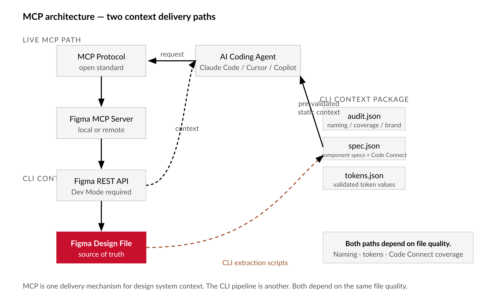

# Chapter 13 — The Figma MCP Server

*The agent can see your design. Whether it can use your design system is a different question.*

---

The component request went into the coding agent at 2:47 PM. By 3:03 PM the engineer had a working React component — 127 lines, typed props, proper ref forwarding, a story file, unit tests. It looked like the future.

Then she compared it to the design system.

The generated component used `#3B82F6` as its primary color instead of `--color-brand-blue`. It imported `styled-components` even though the codebase had migrated to CSS Modules six months ago. The spacing was 8px, 16px, 24px — sensible numbers, but not the 4/8/12/24/40 scale the team had defined and documented in Figma. The variant naming bore no relationship to the actual variant names on the live component. Three prop names were synonyms for props that already existed in the component library under different keys.

The code was not wrong. It was well-written generic React. It was precisely as useful as a component written by a contractor who had never seen the codebase, was working from a verbal description of the design, and had very good instincts about modern React patterns.

That is the problem Model Context Protocol is supposed to solve. Whether it solves it — and under what conditions, and to what degree — is what this chapter is actually about.

---

## What MCP Is, and What It Is Not

Model Context Protocol is an open standard for connecting AI coding agents to external data sources and tools. [verify — current as of writing] It defines how a host application — Claude Code, Cursor, Windsurf, Copilot — can communicate with a server that exposes resources, tools, and prompts in a structured way. The Figma MCP server sits between your AI coding agent and your Figma file. When the agent needs to know about a component, the server fetches structured information from Figma and provides it as context. The agent then uses that context when generating code.

The correct mental model is this: MCP is a structured context layer, not a code generator. The agent generates code. MCP supplies the design system information that makes the generation less generic. The quality of the output is bounded by two things: the quality of the information the server can retrieve, and the quality of the design file underneath it.

This second bound is the one most teams discover later than they should. A poorly structured Figma file — ambiguous names, empty description fields, no Code Connect mappings — produces poor MCP context. Poor context produces generic code. The work in Chapters 4 through 7 — naming discipline, audit, remediation, machine-readiness — is not preliminary to MCP. It is the precondition for MCP being useful at all.


*Figure 13.1 — MCP architecture: two context delivery paths*

As of writing, the Figma MCP server surfaces design context from a selected frame or component — layout properties, style information, component metadata — to the coding agent. [verify — current as of writing] What it surfaces is constrained by what the file makes available. A component with no description, unnamed styles, and inconsistent slash naming produces minimal useful context regardless of server configuration.

What the server does not do is worth being explicit about, because the product surface changes faster than any book can track. It does not write code to your codebase. It does not make design decisions. It does not resolve ambiguities in the design file — if a spacing value is inconsistent, the agent sees the inconsistency. It does not replace a well-maintained component specification. It does not guarantee that generated code is correct, accessible, or idiomatic for your codebase. These are not deficiencies to work around. They are the correct scope of a context layer.

---

## Code Connect: The Difference Between Seeing and Knowing

The clearest way to understand what MCP actually changes is to run the same component request twice — once with Code Connect published for the target component, once without.

**Request in both cases:** "Generate a React component for the Primary Button, medium size, with the label 'Save changes', using the design system."

Without Code Connect, the agent receives layout and style data: a rectangle, 16px vertical padding, 24px horizontal padding, `#2563EB` background, white text, 6px border radius, 16px font size. It has to infer everything about the code surface from this geometry and color.

```tsx
// Generated without Code Connect [illustrative]
import React from 'react'

interface ButtonProps {
  label: string
  onClick?: () => void
}

const Button: React.FC<ButtonProps> = ({ label, onClick }) => {
  return (
    <button
      onClick={onClick}
      style={{
        backgroundColor: '#2563EB',
        color: 'white',
        padding: '16px 24px',
        borderRadius: '6px',
        fontSize: '16px',
        border: 'none',
        cursor: 'pointer',
      }}
    >
      {label}
    </button>
  )
}

export default Button
```

This code works. It does not use tokens. It does not use the component library. It will not update when the design system changes. It is new debt, introduced in sixteen minutes.

With Code Connect, the agent receives the same layout data plus a mapping: `import { Button } from '@acme/components'`, props include `variant` (enum: primary/secondary/destructive), `size` (enum: sm/md/lg), `children`, `disabled`, `onClick`.

```tsx
// Generated with Code Connect [illustrative]
import { Button } from '@acme/components'

export function SaveChangesButton() {
  return (
    <Button variant="primary" size="md">
      Save changes
    </Button>
  )
}
```

Six lines. Correct import. Correct props. Correct variant names. Updates automatically when `@acme/components` updates. No new debt.

The difference is not the agent's capability. The difference is what information the agent had when it generated the code. Code Connect is the mechanism that makes that information available.

| Dimension | Without Code Connect | With Code Connect |
|---|---|---|
| Color values | Hardcoded hex (`#2563EB`) inferred from Figma style data | Token reference (`--color-brand-primary`) from published variable |
| Library usage | Inline styles or `styled-components` guessed from context | `import { Button } from '@acme/components'` from mapping |
| Prop names | Inferred from variant label text — `type="primary"`, `variant="blue"` | Exact prop from `figma.enum()` mapping — `variant="primary"` |
| Prop values | Guessed from Figma variant name casing — `"Primary"`, `"MEDIUM"` | Exact code-side enum — `"primary"`, `"md"` |
| Maintainability | New inline debt that does not update with the design system | Uses the versioned component — updates on library release |
| Lines of new code | 25–40 lines of implementation | 4–8 lines of usage |
| Correctness risk | Wrong import, wrong prop name, hardcoded value — invisible at compile | Spec-matched; errors surface as TypeScript type failures |

Setting up Code Connect requires installing the CLI, creating a configuration file per component that maps the Figma node ID to the real component and its prop mappings, and publishing the mappings to Figma. [verify — current as of writing: `npm install --save-dev @figma/code-connect`, then `figma connect publish`] Here is a minimal example:

```typescript
// ButtonConnected.figma.ts [illustrative — verify current Code Connect API]
import { figma } from '@figma/code-connect'
import { Button } from '@acme/components'

figma.connect(Button, 'https://www.figma.com/file/FILE_KEY?node-id=NODE_ID', {
  props: {
    variant: figma.enum('Variant', {
      Primary:     'primary',
      Secondary:   'secondary',
      Destructive: 'destructive',
    }),
    size: figma.enum('Size', {
      Small:  'sm',
      Medium: 'md',
      Large:  'lg',
    }),
    label:    figma.string('Label'),
    disabled: figma.boolean('Disabled'),
  },
  example: ({ variant, size, label, disabled }) => (
    <Button variant={variant} size={size} disabled={disabled}>
      {label}
    </Button>
  ),
})
```

The Code Connect coverage problem is real: a design system with 200 components and 15 Code Connect files means 185 components will produce generic code when the agent encounters them. Prioritize coverage for the most frequently used components first — buttons, inputs, cards, navigation — and for components where the Figma variant naming is most different from the prop naming. That gap is where the most harmful inferences happen.

---

## Prerequisites

The Figma MCP server requires Dev Mode. [verify — current as of writing: available on Professional and Organization plans; check the Figma Help Center for current seat requirements before investing setup time] If you are on a Starter plan, you will encounter an authorization wall before the MCP server is reachable. That is a plan decision, not a configuration problem.

Before starting any MCP session, run `figma-ping.js` — introduced in Chapter 2 — against the file you intend to use:

```bash
node figma-ping.js
```

Expected output on a healthy session:

```
figma-ping v1.0
Token:        OK (PAT, read scope)
File key:     OK (resolves to "Acme Design System — v4.1")
File access:  OK (editor seat)
Dev Mode:     OK [verify — endpoint name may change]
Rate limit:   OK (requests remaining: 4950)
Endpoint:     GET /v1/files/:key → 200

Session ready. Proceed to MCP setup.
```

If any line prints `FAIL`, resolve it before configuring the MCP server. `Token: FAIL (403)` means the token scope is wrong for the resource type — regenerate with read access. `Dev Mode: FAIL (plan)` means the seat is not on a plan that includes Dev Mode. `File access: FAIL (403)` means the token owner does not have editor access to the file. These are not mysteries. They are access control failures with direct remediation.

Dev Mode provides the inspection layer that surfaces component annotations, style values, and code snippets. The MCP server draws from the same layer. Without Dev Mode, the agent can receive raw node data via the REST API, but this is unstructured from the agent's perspective: large, nested, without component intent, without Code Connect mappings. Building an MCP workflow without Dev Mode means building a slower, less informative version of the machine-readable specification workflow from Chapter 12.

---

## Setup

**The specific steps documented here are current as of writing. MCP is evolving rapidly. Verify the current setup process at the Figma help documentation before following them.** [verify — current as of writing: https://help.figma.com/hc/en-us/articles/32132100833559]

The Figma MCP server can run locally — as a process on your machine — or remotely as a hosted service. [verify — current as of writing] For most design systems work involving proprietary design files, unreleased products, or sensitive brand specifications, the local server is the appropriate choice. The remote server introduces network transmission of design data; verify your organization's data governance policy before using it.

```bash
# Install the MCP server package [verify — package name may change]
npm install -g @figma/mcp-server

# Configure environment
export FIGMA_TOKEN=fig_xxxxxxxxxxxxxxxx
export FIGMA_FILE_KEY=your_file_key_here

# Start the server [verify — command syntax may change]
figma-mcp-server --port 3845
```

In your coding agent's MCP configuration, point it to `http://localhost:3845`. [verify — configuration format varies by agent; see your agent's documentation]

---

## The Governance File

This is the most important section of the chapter. The MCP server gives the agent access to structured design information. The governance file defines what the agent is authorized to do with that information.

Without a governance file, the agent's behavior during an MCP session is bounded only by its general training and your prompts. With one, it is bounded by an explicit, reviewable, version-controlled specification of agent authority — one the whole team can read, debate, and update. The governance file is not bureaucracy. It is the difference between "the agent generates whatever seems reasonable" and "the agent generates what we have decided it should generate, within boundaries we can defend."

`FIGMA.md` lives at the root of your project or design system repository and declares four things: what the agent may read, what it may infer, what it may generate, and what it must refuse or escalate to a human.

```markdown
# FIGMA.md — AI Agent Governance for Figma MCP Sessions
# Project: Acme Design System
# Last updated: 2026-06-01
# Owner: Design Systems team (design-systems@acme.com)

## Authorized File
FILE_KEY: abc123def456
File name: Acme Design System — v4.1
Pages in scope:     Core Components, Foundation Tokens
Pages out of scope: WIP, Archive, Explorations (do not read, do not cite)

## What the Agent May Read
- Published component definitions and variant properties
- Published token values (colors, typography, spacing, radius, elevation)
- Component descriptions from the Figma description field
- Code Connect mappings for components where published

## What the Agent May Infer
- Token alias chains (color/brand/primary → color/primitive/blue-600 → #2563EB)
- Spacing arithmetic within the 4px base-unit scale
- Responsive behavior documented in component descriptions

## What the Agent May Generate
- Component markup using tokens and Code Connect mappings
- CSS using the token system's CSS custom property names
- TypeScript props that match Code Connect prop mappings
- Import statements for @acme/components packages
- Storybook stories using the documented variant properties

## What the Agent Must Refuse or Escalate

REFUSE without human instruction:
- Hardcoded color values (always use tokens)
- Hardcoded spacing values not in the defined scale
- Imports from libraries other than @acme/components
- New component variants not documented in the Figma file
- Any component from WIP or Explorations pages

ESCALATE if:
- A component has no Code Connect mapping (flag, do not infer props)
- A token has conflicting values across modes (flag, do not resolve)
- The description field is empty and intent is ambiguous (flag, do not guess)
- A requested component does not exist in the published library

## Human Gate
All generated code requires human review before merge.
No generated code is automatically committed.

## Version
Governance version: 1.2
Review cycle: On every major design system release
```


*Figure 13.2 — Agent decision tree: component without Code Connect*

Before each significant MCP working session, generate a preflight report that verifies the conditions declared in `FIGMA.md` are actually met:

```bash
node figma-audit.js --mcp-check > figma-mcp-check.md
```

The report surfaces session health, governance file age, Code Connect coverage with specific gaps called out, and token health. It is committed to the repository so the whole team can see the session conditions without running the audit themselves.

```markdown
# figma-mcp-check.md — MCP Session Preflight
# Generated: 2026-06-01T14:22:09Z

## Session Health
  figma-ping:   PASS
  File access:  PASS (Acme Design System — v4.1)
  Dev Mode:     PASS [verify]
  Token scope:  PASS (read)

## Governance
  FIGMA.md:           FOUND (version 1.2, updated 2026-04-15)
  Authorized pages:   Core Components, Foundation Tokens
  Out-of-scope pages: WIP, Archive, Explorations

## Code Connect Coverage
  Total components:  247
  Code Connect:       89
  Coverage:           36%

  High-priority gaps (most-used without Code Connect):
    - DataTable         (no mapping — agent will flag)
    - NavigationDrawer  (no mapping — agent will flag)
    - ComboBox          (no mapping — agent will flag)

## Token Health
  Broken aliases:    0
  Missing modes:     3 (see figma-audit output)
  Unresolved tokens: 0

## Readiness
  Session safe to proceed: YES
  Warnings:
    - Code Connect coverage is 36%. Expect agent escalations for
      unmapped components.
    - 3 tokens missing dark mode values. Runtime fallback to light
      mode; verify dark mode output manually.
```

---

## The CLI-to-Agent Handoff

One of the most effective patterns for MCP-backed sessions is passing verified, pre-processed context from your CLI pipeline directly to the agent alongside the live MCP retrieval. Instead of relying solely on real-time server fetches, the agent gets a stable, fixture-based context layer that was validated before the session started.

```bash
# Generate the context package before the MCP session
node figma-audit.js  --output json > .figma-context/audit.json
node build-spec.mjs  --output json > .figma-context/spec.json
node extract-tokens.mjs --output json > .figma-context/tokens.json
node figma-audit.js  --mcp-check    > .figma-context/mcp-check.md
```

In the agent session:

```
Before generating any code, read:
- .figma-context/mcp-check.md   (session preflight and Code Connect coverage)
- .figma-context/spec.json      (machine-readable component specifications)
- .figma-context/tokens.json    (current token values)
- FIGMA.md                      (what you are authorized to do)

Do not generate hardcoded color or spacing values. Do not import component
libraries other than @acme/components. If a component has no Code Connect
mapping, flag it and ask for guidance rather than inferring prop names.
```

The combination works because the two context sources have different strengths. The MCP server provides real-time, component-specific layout and style data for the exact frame or component being worked on. The CLI context package provides a stable, validated, comprehensive view of the design system that does not require additional API calls during the session and does not vary between runs. Together they cover what either approach misses alone.

---

## Failure Modes

**Large frame timeouts.** Requesting context for a full-page layout, a dense dashboard, or a deeply nested modal can exceed the MCP server's response time threshold. [verify — timeout values and behavior may change] The symptom is the agent reporting that the context request timed out or returned incomplete data. The remediation is to work at the component level, not the page level. If page-level context is necessary, use `build-spec.mjs` to generate a pre-processed specification rather than real-time MCP retrieval.

**Rate limit exhaustion.** MCP sessions make API requests through your personal access token. Intensive sessions — many context requests, large files, multiple engineers sharing a token — can exhaust rate limits mid-session. [verify — limits are plan-dependent and subject to change] Run `figma-ping.js` before each session to check headroom. The CLI context package pattern reduces mid-session API calls by front-loading context as static files.

**Missing Code Connect mappings.** When the agent encounters a component without a mapping, it defaults to inference from layout and style data. This produces the contractor-without-a-codebase output. The governance file's REFUSE clause handles this correctly: the agent flags the missing mapping and asks for guidance rather than inferring. If it is not doing this, the governance prompt needs strengthening. Track coverage with `figma-audit.js --check code-connect-coverage`.

**Write-to-canvas instability.** Some MCP configurations include tools that allow the agent to write back to the Figma canvas. [verify — availability and behavior of write-to-canvas tools is currently unstable] This is a high-risk capability in a production design system file. The REFUSE clause in `FIGMA.md` should explicitly prohibit it unless your team has specifically evaluated and approved it in a governance review.

**Stale governance files.** `FIGMA.md` is a document. Like all documents, it becomes wrong over time. An outdated governance file that permits access to deprecated components, references old token names, or lists the wrong file key is worse than no governance file — it misleads both the agent and the team members who rely on it as a source of truth. Tie `FIGMA.md` updates to the design system release process. The `figma-mcp-check.md` report should surface governance file age and flag it when it is more than ninety days old without a review.

---

## When MCP Is Not Available

Not every team has Dev Mode access. Not every file is ready for live agent sessions. Not every project justifies the setup overhead.

The work from Chapters 8 through 12 — token extraction, asset export, documentation sync, compliance monitoring, machine-readable specification — produces most of the value that MCP promises, on any plan, without requiring a live server connection. The agent can read `tokens.json`, `spec.json`, and `audit.json` from the filesystem as static context files. The governance file still applies. The human gate still applies. The output will be less real-time but not fundamentally different in quality for most component generation tasks.

The MCP server is not the destination. The extraction layer — audited file, clean tokens, complete specification, Code Connect mappings — is the destination. MCP is one delivery mechanism for that context. Build the layer. Choose the delivery mechanism that fits your plan and your team's working style. A team with excellent CLI pipelines and no MCP access will consistently outperform a team with MCP access and a poorly structured file.

---

## The Context That Made This Necessary

MCP was introduced as an open standard by Anthropic in November 2024. Within months, Figma, GitHub, Slack, and dozens of other platforms had shipped server implementations. The pattern represented a shift from bespoke, proprietary AI integrations to a common protocol that any agent and any server could use to exchange structured context.

The earliest Figma MCP integrations were simple: retrieve a frame, get style data, pass it to the agent. What made the combination of MCP and Code Connect significant was that it changed the question the design-to-code workflow was trying to answer. Before Code Connect, the question was "can the agent see the design?" — a retrieval problem. After Code Connect, the question became "is the design system structured well enough to be seen?" — a quality problem. The bottleneck moved from the agent to the file.

This is the same movement that happened when design tokens went from a nice-to-have to a pipeline requirement. The tool got better and exposed a different constraint. Teams that had invested in naming discipline, audit automation, and component documentation discovered that the investment paid off in the MCP era in ways they had not anticipated when they made it. Teams that had not made that investment found that a faster retrieval mechanism for a poorly structured file is still a fast path to the wrong output.

For readers consulting this chapter after the book's publication: verify whether MCP has since been superseded by a higher-level abstraction. The structural pattern — agent, protocol, server, governed context, human gate — is likely durable even if the specific protocol evolves.

---

**LLM Exercises**

*Use these with Claude or any capable language model to deepen your understanding of the concepts in this chapter.*

**1. Generate and examine.** Ask the agent to generate a React component for a button in your design system — first with only a verbal description, then with your `tokens.json` and a Code Connect mapping file provided as context. Compare the two outputs. Identify every specific difference that the context produced. Then trace each difference back to a specific piece of information in the context files.

**2. Apply to known context.** Describe your current design system setup — plan tier, whether you have Dev Mode, Code Connect coverage percentage, and the state of your Figma file's naming and documentation. Ask the model to assess whether an MCP session would produce meaningfully better output than the CLI context package approach alone, and to explain its reasoning. Push back if the assessment seems optimistic or pessimistic given what you know about your file.

**3. Stress-test a specific claim.** This chapter argues that Code Connect coverage is the primary determinant of MCP output quality — more important than the agent's capability or the MCP server's retrieval speed. Present this claim to the model and ask it to construct the strongest counterargument: a scenario where low Code Connect coverage still produces high-quality generated code. Evaluate whether the counterargument applies to your team's situation.

**4. Draft or audit a professional deliverable.** Write a `FIGMA.md` governance file for your actual project. Include specific component names from your design system in the escalation conditions. Ask the model to review it for completeness and edge cases — specifically, to identify three scenarios that your current REFUSE and ESCALATE clauses would handle incorrectly. Revise based on the findings.

---

## Chapter 13 Exercises: The Figma MCP Server
**Project:** figma-tools — Your Design System Extraction Toolkit
**This chapter adds:** The `FIGMA.md` agent-governance file (read/infer/generate/refuse) plus the MCP server configuration and session preflight workflow that let Claude Code generate design-system-aware code from verified context.

---

### Exercise 1 — When to Use AI

You have just finished configuring the Figma MCP server and the `FIGMA.md` governance file. Before you reach for the agent, pause. Some of what you are about to do is genuinely improved by AI assistance. Some of it is exactly where AI will hurt you.

**Tasks where AI works well here:**

**Generating boilerplate component markup from Code Connect context.** When the agent has your `tokens.json`, your `spec.json`, and a Code Connect mapping in scope, it is doing structured retrieval and template expansion — filling in import paths, prop types, and variant names from a machine-readable source. The task is concrete, the inputs are verified, and the output is checkable against the specification.
*Why AI works here:* Pattern completion from structured inputs. The agent is not making design decisions; it is transcribing your design system's decisions into code syntax.

**Drafting the initial `FIGMA.md` governance file from your audit output.** You have `audit.json` and `spec.json`. The governance file is a structured document with defined sections and enumerable fields — pages in scope, authorized token names, refusal conditions. A model can draft the skeleton faster than you can type it, and the draft gives you something concrete to edit and dispute rather than a blank page.
*Why AI works here:* Document structure generation from known inputs. The meaningful work — deciding which behaviors to refuse — is still yours.

**Explaining MCP failure messages.** When `figma-ping.js` returns `Dev Mode: FAIL (plan)` or the MCP server logs an unexpected 403, the error message is terse. Pasting it into a conversation with the model and asking for a plain-language explanation and remediation path is faster than parsing documentation.
*Why AI works here:* Error message interpretation. The model is good at mapping terse technical output to human-readable diagnosis. You verify the fix, not the diagnosis.

**The tell:** If the task requires the agent to make a judgment call about your design system — which variant mapping is correct, whether a component description is ambiguous, whether a proposed refusal rule is too strict — that judgment belongs to you. The agent should surface the question, not answer it.

---

### Exercise 2 — When NOT to Use AI

The MCP chapter is where the temptation to trust the agent runs highest. The code it generates is fluent. The components compile. The props look plausible. This is precisely when the discipline established in `FIGMA.md` matters most.

**Tasks requiring human judgment here:**

**Deciding what the agent is authorized to generate.** The REFUSE and ESCALATE clauses in `FIGMA.md` are policy decisions. They encode judgments about what is safe to automate, which components are stable enough for agent use, and what level of confidence is required before generated code can be reviewed and merged. An AI can draft options. It cannot make the call. It has no stake in what ships.
*Why AI fails here:* Policy and accountability. The agent that wrote the suggestion is not the agent that will be blamed if the policy is wrong. The governance file is a commitment by named humans to named rules.

**Reviewing generated code for correctness against the design spec.** The agent can generate code that compiles, passes lint, and looks idiomatic while still getting variant names wrong, importing from a deprecated package, or using a spacing value that is outside the defined scale. These errors are invisible to automated checks if the check does not compare against the actual spec. Only a human who knows the design system can catch them.
*Why AI fails here:* Automation bias. Fluent output creates false confidence. The code looks right. The only way to know it is right is to check it against `spec.json` and `tokens.json` — which the agent itself may not have read carefully, or may have misread.

**Resolving ambiguous design intent in the Figma file.** When a component has an empty description, conflicting token values in different modes, or a variant name that does not map cleanly to a prop, the agent will guess or escalate. If it escalates, a human needs to look at the Figma component, read the design intent behind it, and make a call. That call requires knowing the design system. The agent does not know it; it has context about it.
*Why AI fails here:* Intent inference. The file contains what was recorded, not why it was recorded. The human gate on ambiguous components exists precisely because this gap is real.

**The tell:** If you find yourself explaining the answer to the agent so it can write the code, you are doing the judgment work. The agent is doing the typing. That split is fine — but recognize which part cannot be delegated.

**Series connection:** This is Tier 4 metacognitive supervision — the book's thesis in its sharpest form. The MCP chapter is where AI-assisted design-to-code feels most automatic. The governance file is the mechanism that keeps a human making the decisions that matter. Without it, the chapter's promise ("the agent can see your design system") becomes its liability ("the agent decided for you").

---

### Exercise 3 — LLM Exercise

**What you're building:** A component implementation session that uses Claude Code with MCP context — tokens, spec, and `FIGMA.md` all loaded — to generate a design-system-aware component, then compares it to what the same prompt produces without that context.

**Tool:** Claude Code, accessed via the MCP server you configured in this chapter. The MCP protocol integration is the mechanism this exercise is designed to test; a plain conversation window misses the point.

**The Prompt:**

```
I am building a React component for the Acme design system. The following context files are available in this session — read them before generating any code:

- FIGMA.md (agent governance — what you may and may not do)
- .figma-context/spec.json (machine-readable component specifications)
- .figma-context/tokens.json (current token values and alias chains)
- .figma-context/mcp-check.md (Code Connect coverage and session preflight)

Task: Generate a React component for the Primary Button, medium size.

Requirements:
1. Import only from @acme/components — no new implementations, no styled-components, no inline styles
2. Use the variant and size prop values from the Code Connect mapping in spec.json
3. Use token names (CSS custom properties) for any style values, not hardcoded hex or pixel values
4. If the Button component has no Code Connect mapping, flag it and ask for guidance instead of inferring props
5. After generating, state which files you read, which specific values you used from each, and flag any governance rule you almost violated

Do not generate code for any component listed as out of scope in FIGMA.md.
```

**What this produces:** A component implementation that either correctly uses the Code Connect mapping and token names (if coverage is present), or a clear escalation message naming the specific gap — which is itself a useful output. You will also get a transparency report naming which context files the agent actually read.

**How to adapt this prompt:**

*For your own project:* Replace "Primary Button" with whichever component has the best Code Connect coverage in your `mcp-check.md` output. The exercise is most revealing for a component where the Figma variant names differ from the prop names — that gap is exactly what Code Connect resolves and what the agent will get wrong without it.

*For ChatGPT or Gemini:* These models do not have MCP access. Instead, paste the contents of `spec.json` and `tokens.json` directly into the conversation and replace the "read these files" instruction with "using the following design system specification." The exercise still works; you are testing context-aware generation rather than MCP-mediated context.

*For a Claude Project:* Upload `spec.json`, `tokens.json`, and `FIGMA.md` as project knowledge files. The project knowledge replaces the MCP context layer for testing purposes. Results will differ because the project does not have access to the live Figma file, but the governance rules still apply.

**Connection to previous chapters:** The quality of this exercise is a direct measure of Chapter 12's output. A well-formed `spec.json` with complete Code Connect mappings produces dramatically better agent output than a sparse or malformed one. Chapter 5's audit identified the naming and coverage gaps that the MCP session will expose. Chapter 7's `FIGMA.md` (the machine-readiness version) is the ancestor of the agent-governance `FIGMA.md` you loaded here.

**Preview of next chapter:** Chapter 14 wires everything you have built into a single npm script suite and CI/CD pipeline. The MCP session you just ran manually becomes `npm run figma:mcp-check` — a versioned preflight that any team member can run before opening an agent session, with the output committed to the repository so the whole team sees the session conditions.

---

### Exercise 4 — CLI Exercise

**What you're building:** An MCP-backed agent session that generates a component from verified context and a parallel session without that context — then produces a documented diff of the two outputs.

**Tool:** Claude Code (with MCP server running)
**Skill level:** Intermediate — requires the MCP server configured, the context package generated, and `FIGMA.md` in the project root.

**Setup:**

- [ ] `build-spec.mjs` has been run and `.figma-context/spec.json` exists
- [ ] `extract-tokens.mjs` has been run and `.figma-context/tokens.json` exists
- [ ] `figma-audit.js --mcp-check` has been run and `.figma-context/mcp-check.md` exists
- [ ] `FIGMA.md` (agent-governance version from this chapter) exists in the project root
- [ ] MCP server is running (`figma-mcp-server --port 3845`) and connected in Claude Code settings

**The Task:**

```
You are generating a component for the figma-tools project. Work in two passes.

PASS 1 — Without verified context:
Generate a React component for the primary button, medium size, with a "Save changes" label.
Use only what you know about common React patterns and design systems.
Write the output to: exercises/ch13-component-no-context.tsx

PASS 2 — With verified context:
Read the following files before generating:
  - FIGMA.md (do not violate any rule in this file)
  - .figma-context/spec.json
  - .figma-context/tokens.json
  - .figma-context/mcp-check.md

Generate the same component — primary button, medium size, "Save changes" label.
Write the output to: exercises/ch13-component-with-context.tsx

PASS 3 — Diff and analysis:
Compare the two files. Write a structured markdown report to: exercises/ch13-context-diff.md

The report must cover:
  - Hardcoded values in Pass 1 that became token references in Pass 2 (list each)
  - Import statements that changed (list each)
  - Prop names that changed (list each, with the source in spec.json for the Pass 2 value)
  - Any FIGMA.md rule that the Pass 1 output would have violated (list each)
  - Any component or prop for which Pass 2 still could not find a Code Connect mapping

Do not delete or modify any existing files in the exercises/ directory.
Stop after writing exercises/ch13-context-diff.md. Do not commit.
Verification: Run `node scripts/figma-audit.js --check tokens` and confirm the tokens used in Pass 2 appear in the audit's approved token list. Report the result in the diff document.
```

**Expected output:** Three files in `exercises/`: the no-context component, the with-context component, and a structured diff report. The diff report is the primary artifact — it makes the value of the context layer concrete and inspectable.

**What to inspect:** Open `exercises/ch13-context-diff.md` and count the hardcoded-to-token conversions. If the count is zero, either the context files are incomplete or the agent did not read them. Check the session transcript for which files the agent actually opened. A high count confirms the context layer is working. A low count is a signal to strengthen the `FIGMA.md` instructions or fix gaps in `spec.json`.

**If it goes wrong:** If Pass 2 produces the same hardcoded output as Pass 1, the most likely cause is that `spec.json` has no Code Connect mapping for the button component. Open `.figma-context/mcp-check.md` and look for the button in the "High-priority gaps" section. If it is listed, the exercise has surfaced a real Code Connect coverage gap — which is itself the correct finding.

**CLAUDE.md / AGENTS.md note:** The `FIGMA.md` refusal rules are not suggestions. If you are adapting this exercise to your own project, include this line at the top of your agent instructions: "Read FIGMA.md before any code generation. If a requested component or behavior appears in the REFUSE section, stop and explain why rather than proceeding." Without this, agents will happily generate code that violates governance rules because the rules are easy to miss in a long context window.

---

### Exercise 5 — AI Validation Exercise

**What you're validating:** The component generated in Exercise 4, Pass 2 — specifically, whether the agent's "verified context" output is actually correct relative to the design specification, not just fluent and compilable.

**Validation type:** Specification compliance review — comparing generated code against `spec.json` and `tokens.json` as ground truth.

**Risk level:** HIGH — this is agentic output. The agent had access to the spec and still may have gotten it wrong. Fluent, compilable code is not the same as correct code.

**Setup:** Open `exercises/ch13-component-with-context.tsx` (the Pass 2 output) alongside `.figma-context/spec.json` and `.figma-context/tokens.json`. Do not read Pass 1 first — it will anchor your expectations incorrectly.

**The Validation Task:**

```
Validate exercises/ch13-component-with-context.tsx against the design system specification.

CORRECTNESS
[ ] Every token reference (CSS custom property, design token name) appears in tokens.json with that exact name
[ ] Every prop name matches a prop in spec.json's Code Connect mapping for this component — no synonyms, no plausible-sounding alternatives
[ ] The variant value passed to the component matches an enum value in spec.json exactly (case-sensitive)
[ ] The size value matches an enum value in spec.json exactly (case-sensitive)
[ ] The import path matches the package listed in the Code Connect mapping in spec.json

COMPLETENESS
[ ] All required props (marked as non-optional in spec.json) are present in the generated code
[ ] No props are present that do not exist in the spec (phantom props the agent invented)
[ ] The component name used in the import matches the exported name in the Code Connect mapping

SCOPE
[ ] No imports from libraries other than those listed in FIGMA.md's "What the Agent May Generate" section
[ ] No hardcoded color values (hex, rgb, hsl, named colors)
[ ] No hardcoded spacing values (px values not expressed as token references)
[ ] No components from out-of-scope pages listed in FIGMA.md

CHAPTER-SPECIFIC: CODE CONNECT FIDELITY
[ ] The prop mapping used in the generated code can be traced to a specific figma.enum() or figma.string() call in the Code Connect configuration — not inferred from the variant name
[ ] If the component had no Code Connect mapping, the output is an escalation message, not inferred code

CHAPTER-SPECIFIC: GOVERNANCE COMPLIANCE
[ ] No behavior in the generated code would trigger a REFUSE clause in FIGMA.md if that clause were applied retroactively
[ ] The agent did not silently resolve an ambiguity that FIGMA.md says should be escalated (check spec.json for missing descriptions, conflicting mode values)

FAILURE-MODE CHECK
[ ] "Fluent but wrong" test: Does the code compile and look correct on visual inspection while containing at least one prop name or token reference that does not appear in spec.json? (This is the most common MCP failure mode — the agent generates plausible-sounding values that are not in the actual spec.)
[ ] Hallucination check: Does the component include a variant, prop, or disabled state that is not present in spec.json? Agents commonly add "disabled" prop handling for buttons even when the spec does not define a disabled state — check explicitly.
[ ] Inference substitution: Did the agent use a token alias chain shortcut (e.g., going directly to a primitive value like #2563EB) instead of the semantic token name (color/brand/primary)? Check tokens.json for the correct reference depth.
```

**What to do with your findings:** If you find any failure — one wrong prop name, one hardcoded value, one phantom variant — fix it manually in `exercises/ch13-component-with-context.tsx` and add a comment explaining what the agent got wrong and why. These annotated corrections are more valuable than a clean file: they are the evidence that verification matters even when context is present.

If you find zero failures, run the same validation against Pass 1 (`exercises/ch13-component-no-context.tsx`) and count the failures there. The gap between the two counts is the measurable value the context layer delivered.

**AI Use Disclosure prompt** (mandatory — paste this into your project notes after completing the exercise):

```
The component in exercises/ch13-component-with-context.tsx was generated by Claude Code using MCP context including spec.json, tokens.json, and FIGMA.md. It was manually validated against spec.json and tokens.json. Findings from that validation: [list what you found or "no specification errors detected"].
```

**Series connection:** The central failure mode here is automation bias — trusting fluent, compilable code because it looks like it must have used the context correctly. This is Tier 4 metacognitive supervision: the human's job is not to run the agent but to verify the agent ran correctly. A design system that ships MCP-generated code without this validation step has replaced "manual export drift" with "agent inference drift" — a different path to the same production bug.
